# RelayWeave 设计

本文说明 RelayWeave 的设计目标、进程结构、服务器集群、Agent 多节点连接、控制协议、TCP/TLS/UDP
数据中继、链路质量、推荐路径和生命周期。文档覆盖 `relayweave-node`、`relayweave-agent`、共享协议与
route 模块，以及 Dashboard 的拓扑消费规则；接入 RelayAgent 本地端口的应用属于系统外部。

证书生成、信任链、SAN 与 TLS 排错见 [证书制作与部署](证书制作与部署.md)；Debian 打包、安装、升级和
卸载见 [RelayWeave 打包与安装](RelayWeave打包与安装.md)。

本文是当前实现的统一设计文档，包含共享 Node 数据通道、路径安装、首末接入和实际数据转发。
历史实施计划已合并到对应章节；流程、名称与容量以当前源码为准。

章节导航：

- [1. 总体设计](#1-总体设计)
- [2. 设计目标与系统边界](#2-设计目标与系统边界)
- [3. 进程角色与网络拓扑](#3-进程角色与网络拓扑)
- [4. 配置模型与进程启动](#4-配置模型与进程启动)
- [5. RelayNode 核心模块](#5-relaynode-核心模块)
- [6. ClusterMgr 模块](#6-clustermgr-模块)
- [7. RelayAgent 与 NodeConnection 模块](#7-relayagent-与-nodeconnection-模块)
- [8. Agent 本地转发与业务接入](#8-agent-本地转发与业务接入)
- [9. CtrlMessage 控制协议模块](#9-ctrlmessage-控制协议模块)
- [10. 数据帧与 attach 协议模块](#10-数据帧与-attach-协议模块)
- [11. TCP、TLS 与 UDP 传输实现](#11-tcptls-与-udp-传输实现)
- [12. 容量、超时与背压模块](#12-容量超时与背压模块)
- [13. 故障与恢复流程](#13-故障与恢复流程)
- [14. 安全边界](#14-安全边界)
- [15. 生命周期与所有权](#15-生命周期与所有权)
- [16. 构建与验证](#16-构建与验证)
- [17. 模块源码索引](#17-模块源码索引)
- [18. 已知限制与后续扩展位置](#18-已知限制与后续扩展位置)

## 1. 总体设计

### 1.1 模块关系

本地 forward 持续监听应用端口；每次业务由 AgentSession 接入 Node。
单节点在本地配对，多节点通过已有 NodeFlow 到达末 Node，再由服务方 AgentSession 连接目标服务。
NodeSession 是一次 Node 业务实例，StreamPipeline 和 DatagramMgr 是长期数据管理器。

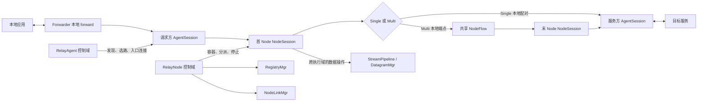

Producer 和 Consumer 是 AgentSession 的两种角色，一个 Agent 可以同时配置 services 和 forwards。
单节点双方接入同一 Node，多节点双方分别接入首末 Node；中间 Node 只有 NodeFlow 分派状态。

### 1.2 模块职责

主要模块及其边界如下：

| 模块 | 所属进程或库 | 状态所有者 | 职责与主要流程 |
|---|---|---|---|
| `RelayNode` | relayweave-node | 四个 Node executor | 直接持有 RegistryMgr，处理公共控制查询、分派两类中继命令、协调启动和停止 |
| `ControlSession` | relayweave-node | `control_io` | 接受普通客户端 mTLS 控制连接，接收命令并在断线时触发清理 |
| `ControlRouterSingle` | 单节点 NodeSession 的直接成员 | `control_io` | 本地双方接入、建立期限、ready、取消及控制通知 |
| `NodeSession` | 每个 Node 业务实例 | `control_io` | 直接持有 Single/Multi variant、本地数据句柄及唯一任务取消信号；跨域调用数据操作 |
| `ControlRouterMulti` | 多节点 NodeSession 的直接成员 | `control_io` | 首末 attached/ready/finished/close、Flow 失效与本端建立超时；不承担全局查表 |
| `RegistryMgr` | relayweave-node | `control_io` | 保存控制会话弱引用、服务注册、容量和流量统计 |
| `ClusterMgr` / `ClusterRoom` | relayweave-node | `control_io` | master 成员管理、slave 连接、广播和定向控制消息 |
| `StreamPipeline<Transport>` | relayweave-node | `transfer_tcp_io` | TCP/TLS 监听、票据校验、本地配对或端点、限速和实际 I/O |
| `DatagramMgr` | relayweave-node | `transfer_udp_io` | 共享 UDP socket、票据/session/来源校验、本地配对或端点、逐包路由 |
| `RelayAgent` | relayweave-agent | `control_io` | primary/附加节点连接池、服务注册、发现和路由控制 |
| `NodeConnection` | relayweave-agent | `control_io` | 单节点解析、连接、mTLS、识别、接收和指数退避重连 |
| `Forwarder` / `AgentSession` | relayweave-agent | `transfer_io` | Forwarder 管理本地监听和实例；AgentSession 拥有单次接入、ready 等待和业务复制 |
| `Topology` | relayweave-node | `control_io` | 成员探测、质量报告、master 拓扑汇总和不可变快照 |
| `AgentRouting` | relayweave-agent | `control_io` | 探测入口与服务节点、组装拓扑、计算推荐路径 |
| `ProbeSet` / `ICMP` | route | 所属进程的 `control_io` | DNS、IPv4 去重、原始 socket 探测、历史保留和关闭 |
| `LinkQuality` / `RouteGraph` | route | 调用方 executor | 固定内存质量统计、纯边权计算和多入口最短路径 |
| `TLSChannel` | protocol | 创建它的 executor | mTLS 握手、帧收发、bounded queue、心跳和统一关闭 |
| `WireMessage` / `CtrlMessage` / `MessageReceiver` | protocol | 值对象 / 每 TCP 连接组装状态 | 长度帧、CBOR 控制消息、透明拆分与顺序重组 |
| `RelayAttach` / `DatagramHeader` | protocol | 无状态值对象 | 数据连接角色凭据和 UDP session header 编解码 |
| `DualIndexMap` | protocol | 使用者 executor | 维护一份值及主、次两条索引 |
| `RelayIdAllocator` / `ServiceTraffic` / `TokenBucket` | node/protocol | manager 或原子计数器 | Relay 标识、方向流量与令牌桶限速 |

### 1.3 术语与文档约定

| 术语 | 本文含义 |
|---|---|
| Node / RelayNode | 公共中继节点；按集群职责分为 master 和 slave |
| Agent / RelayAgent | 部署在业务端的客户端进程，可同时承担 Producer 和 Consumer 职责 |
| Producer | 注册 `service` 并连接本地目标的一侧 |
| Consumer | 配置 `forward`、接受本地流量并发起 `relay.open` 的一侧 |
| 普通控制会话 | 通过 RelayNode `control.port` 建立的 mTLS 会话，与节点间 ClusterSession 区分 |
| Stream Relay | `tcp` 或 `tls` 字节流中继 |
| Datagram Relay | `udp` 数据报中继 |
| 推荐路径 | 按质量成本计算的真实 Node 序列；新业务提交最佳路径，单 Node 或无可用路径走单节点回退 |

类、函数、配置字段、协议字段和状态名使用代码字体，并保持与实现一致。流程描述中的“必须”表示协议或
状态机约束，“应”表示部署要求，“可以”表示可选行为。后续章节按模块展开，依次说明状态、入口、正常
流程、失败收敛和停止边界。

## 2. 设计目标与系统边界

系统把位于 NAT、防火墙或内网后的服务暴露给另一个客户端使用。服务提供方和服务使用方都主动连接公共服务器，不要求任一客户端接受公网入站连接。

以远程 SSH 为例：

1. 提供方客户端把本机 `127.0.0.1:22` 注册为 `home-ssh`；
2. 使用方客户端在本机监听 `127.0.0.1:2222`，并把该端口绑定到 `home-ssh`；
3. 用户执行 `ssh -p 2222 user@127.0.0.1`；
4. 使用方请求服务所在的服务器创建 Relay；
5. 提供方连接本地 SSH 服务，双方再分别连接该服务器的数据端口；
6. 服务器配对两条数据连接并双向转发。

同一个 RelayAgent 可以同时配置 `services` 和 `forwards`，既提供本地服务，也使用其他客户端提供的服务。一个 RelayAgent 还可以同时使用分布在多个 RelayNode 上的服务。

系统职责分成三层：

- **服务发现**回答“服务当前在哪个节点”；
- **控制面**回答“是否创建 Relay、双方应使用什么连接凭据”；
- **数据面**只负责配对和转发业务数据。

集群控制只交换注册查询、拓扑和建路消息。单节点在本机转发；多节点通过已有共享 NodeLink / NodeFlow 传输业务数据。

## 3. 进程角色与网络拓扑

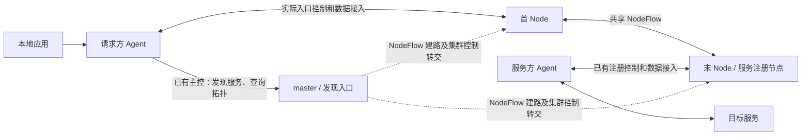

单节点路径的首末为同一个 Node，双方数据在该 Node 内配对；多节点分别接入首末 Node。
主控只发现位置、执行既有 Flow 建路和转交集群消息，不保存首末业务协调状态。
如果 master 自身被选为首/末 Node，其本地实例按普通 Node 的职责处理业务。

### 3.1 三类进程角色

| 角色 | 主要职责 | 主动连接方向 |
|---|---|---|
| RelayNode master | 接受普通客户端；接受 slave；路由集群消息；承载本机 Relay | 不主动连接 slave |
| RelayNode slave | 接受普通客户端；承载本机 Relay；连接 master 参与集群 | 主动连接 master |
| RelayAgent | 注册本地服务；建立本地监听；发现服务节点；连接一个或多个服务器 | 主动连接服务器 |

master 负责集群消息路由且不保存全局服务目录，同时也可以像任意 slave 一样承载普通客户端和 Relay。

### 3.2 RelayNode 监听端口

每个 RelayNode 配置普通 Agent 控制/数据端口和两个 Node 共享数据端口；master 额外监听集群控制端口：

| 配置 | 传输 | 用途 |
|---|---|---|
| `control.port` | TCP + mTLS | 普通 RelayAgent 控制连接 |
| `tcp.port` | TCP | 明文流式 Relay 数据 |
| `tls.port` | TCP + mTLS | 加密流式 Relay 数据 |
| `udp.port` | UDP | UDP Relay 数据 |
| `cluster.control_port` | TCP + mTLS | master 监听 slave；slave 用它连接 master |
| `cluster.tcp_port` | TCP 明文 | Node 间共享、双向、分帧的数据连接 |
| `cluster.udp_port` | UDP 明文 | Node 间固定 socket 的共享数据报通道 |

三个 cluster 端口均必填，不再接受旧 `cluster.port`。master 的 `cluster.control_port` 与本节点其他 TCP 监听端口不同；slave 不监听集群控制端口。所有 Node 的 `cluster.tcp_port/udp_port` 必须一致，分别沿用 `tcp.address/udp.address` bind，对端地址来自 `topology.members`。TCP 与 UDP 可以使用相同数字端口。防火墙应允许 Agent 访问可能的首末 Node 控制口及数据口，并允许 Node 间共享数据端口；实际接入在选路后确定。

### 3.3 核心不变量

后续所有流程都建立在几条不变量上：

1. **服务属于注册控制会话。** 会话断开，注册消失，关联业务被取消。
2. **NodeSession 是 Node 本地业务实例。** Single 管理本地双方，Multi 首末各有一个实例，关联同一 NodeFlow。
3. **服务位置与业务入口分开。** 发现只保存目的位置，选路后才连接实际入口；不因发现而连接多跳尾 Node。
4. **入口连接由业务共享并持有引用。** 附加连接无业务引用满 60 秒后停止，连接池保留对象直到后台任务退出；primary 始终保留。
5. **发送完成不等于业务成功。** 状态由 opened/offer/ready 等响应推进，send 只是提交。
6. **ClusterRoom 只传控制消息。** 多跳数据走共享 NodeFlow，master 无统一业务表。
7. **状态按执行域串行拥有。** 跨域用 post/co_spawn 传副本并等待数据操作，不直接读写其他域容器。
8. **取消后排空再释放。** Node 业务任务及 Flow 监视由实例拥有，停止先排空业务，再停止 NodeLinkMgr。

### 3.4 多节点服务的完整路径

假设 home-ssh 注册在 master-1，office-rdp 注册在 slave-1，请求方 Agent 主控连接到 master-1：

1. 启动本地监听，识别主控，查询两项服务及拓扑。
2. 主控从本机或集群查询返回服务所在 Node 的身份、地址和控制口；Agent 只保存位置。
3. 每次业务由 AgentSession 按目的 Node 读取有效 LRU 或计算最佳路径。
4. home-ssh 若走单节点，复用 master-1 控制连接，双方在同一 Node 接入。
5. office-rdp 若最佳路径为 master-1 → slave-1，请求方复用 master-1 入口控制连接，
   提交路径；服务方继续使用 slave-1 的注册控制连接，两端数据通过 NodeFlow 桥接。
6. 若 office-rdp 无可用多节点路径，按服务位置取得 slave-1 控制连接并走单节点流程。
7. 已建立业务不换路；UDP 恢复时创建新实例，重新选择路径和接入。

server.host 是长期主控制和服务发现入口；实际业务入口由所选路径决定。

## 4. 配置模型与进程启动

### 4.1 证书输入

先按 [证书制作与部署](证书制作与部署.md) 为所有服务器节点和客户端生成证书。每个服务器节点使用自己的一份 `server.pem/server.key`；普通客户端使用共享的 `shared-client.pem/shared-client.key`。

设计文档中的地址必须与证书 SAN 和实际网络路由一致。端口不属于 SAN。

### 4.2 RelayNode master 配置

完整字段以 [`node/node.example.json`](../node/node.example.json) 为准。master 的 `cluster.address` 是集群监听地址：

```json
{
  "log": {"debug_enable": false},
  "cluster": {
    "role": "master",
    "node_id": "master-1",
    "address": "0.0.0.0",
    "control_port": 18447,
    "tcp_port": 18448,
    "udp_port": 18448
  },
  "control": {
    "address": "0.0.0.0",
    "advertise_address": "203.0.113.10",
    "port": 18443,
    "max_connections": 512,
    "max_services": 256,
    "max_services_per_session": 64
  },
  "tcp": {
    "address": "0.0.0.0",
    "port": 18444,
    "max_setup_connections": 512,
    "max_relays": 128,
    "setup_timeout_ms": 10000,
    "rx_bytes_per_second": 2000000,
    "rx_max_burst_bytes": 262144,
    "tx_bytes_per_second": 2000000,
    "tx_max_burst_bytes": 262144
  },
  "tls": {
    "address": "0.0.0.0",
    "port": 18446,
    "max_setup_connections": 512,
    "max_relays": 128,
    "setup_timeout_ms": 10000,
    "rx_bytes_per_second": 2000000,
    "rx_max_burst_bytes": 262144,
    "tx_bytes_per_second": 2000000,
    "tx_max_burst_bytes": 262144
  },
  "udp": {
    "address": "0.0.0.0",
    "port": 18445,
    "max_relays": 128,
    "setup_timeout_ms": 10000,
    "rx_bytes_per_second": 2000000,
    "rx_max_burst_bytes": 262144,
    "tx_bytes_per_second": 2000000,
    "tx_max_burst_bytes": 262144
  },
  "certificate": {
    "server_ca_file": "/etc/relayweave/certs/server-ca.pem",
    "ca_file": "/etc/relayweave/certs/client-ca.pem",
    "certificate_chain": "/etc/relayweave/certs/server.pem",
    "private_key": "/etc/relayweave/certs/server.key"
  },
  "channel": {
    "handshake_timeout_ms": 5000,
    "disconnect_timeout_ms": 5000,
    "heartbeat_interval_ms": 5000,
    "heartbeat_timeout_ms": 20000,
    "max_queued_messages": 100
  }
}
```

`cluster` 是必填对象，`role` 只允许 `master` 或 `slave`，所有节点的 `node_id` 必须非空且唯一，并且不能使用为广播保留的 `all`。当前配置不提供关闭集群的角色，也不读取旧版服务器配置字段。

### 4.3 RelayNode slave 配置

slave 的控制和数据端口按本节点实际端口填写。它的 `cluster.address` 和 `cluster.control_port` 指向 master：

```json
"cluster": {
  "role": "slave",
  "node_id": "slave-1",
  "address": "203.0.113.10",
  "control_port": 18447,
    "tcp_port": 18448,
    "udp_port": 18448
}
```

slave 自己的 `control.advertise_address` 应填写 Agent 可访问的 slave 地址，例如 `203.0.113.11`，不能沿用 master 地址。slave 连接失败或连接断开后每隔 5 秒重试。master 从不主动连接 slave。集群断开不停止本节点的普通客户端监听和数据中继。

### 4.4 RelayAgent Producer 配置

RelayAgent 的 `services` 描述它提供的本地目标：

```json
{
  "server": {
    "host": "203.0.113.11",
    "port": 18443,
    "connect_timeout_ms": 5000
  },
  "certificate": {
    "ca_file": "/etc/relayweave/certs/server-ca.pem",
    "certificate_chain": "/etc/relayweave/certs/shared-client.pem",
    "private_key": "/etc/relayweave/certs/shared-client.key"
  },
  "services": [
    {
      "name": "home-ssh",
      "target_host": "127.0.0.1",
      "target_port": 22,
      "protocol": "tls"
    }
  ],
  "forwards": []
}
```

提供方只在配置的初始服务器上注册 `services`。该初始连接是客户端的 primary 连接；服务发现创建的附加连接不会重复注册这些服务。

### 4.5 RelayAgent Consumer 配置

RelayAgent 的 `forwards` 描述本地监听和目标服务：

```json
{
  "server": {
    "host": "203.0.113.10",
    "port": 18443,
    "connect_timeout_ms": 5000
  },
  "certificate": {
    "ca_file": "/etc/relayweave/certs/server-ca.pem",
    "certificate_chain": "/etc/relayweave/certs/shared-client.pem",
    "private_key": "/etc/relayweave/certs/shared-client.key"
  },
  "services": [],
  "forwards": [
    {
      "service": "home-ssh",
      "listen_address": "127.0.0.1",
      "listen_port": 2222,
      "protocol": "tls"
    },
    {
      "service": "office-rdp",
      "listen_address": "127.0.0.1",
      "listen_port": 13389,
      "protocol": "tcp"
    }
  ],
  "relay": {"open_timeout_ms": 10000},
  "reconnect": {
    "initial_delay_ms": 500,
    "max_delay_ms": 10000
  },
  "channel": {
    "handshake_timeout_ms": 5000,
    "disconnect_timeout_ms": 5000,
    "heartbeat_interval_ms": 5000,
    "heartbeat_timeout_ms": 20000,
    "max_queued_messages": 100
  }
}
```

`server.host/server.port` 只指定初始入口。客户端通过它发现 `home-ssh` 和 `office-rdp` 所在节点，然后按需建立附加控制连接。两个服务可以位于不同服务器并同时工作。

协议必须在提供方 `services[].protocol` 和使用方 `forwards[].protocol` 中一致，只允许 `tcp`、`tls`、`udp`。

本地 forward 应绑定 `127.0.0.1`，除非明确需要允许其他主机访问。绑定 `0.0.0.0` 会把该端口暴露给
所有可达网卡。

Node 和 Agent 默认进行质量探测，Agent 默认计算推荐路径，不提供 enabled 开关。Agent 可选的
`"routing": {"max_nodes": 4}` 只限制路径中的真实 Node 数，范围为 1–8；省略整个对象时也使用 4。
探测与质量参数使用固定常量。推荐路径的范围和算法见 7.7 节。

### 4.6 进程入口与启动顺序

两个进程入口只接收一个配置文件路径；配置解析或监听绑定失败会直接结束启动：

```console
relayweave-node node-config.json
relayweave-agent producer-agent-config.json
relayweave-agent consumer-agent-config.json
```

每个进程只解析一次配置文件；对应的配置加载器在返回前严格校验并应用 `log.debug_enable`。
`log` 中的未知字段或非布尔 `debug_enable` 会使启动失败，不会静默回退为默认值。

推荐启动顺序是 master、slave、服务提供方 RelayAgent、服务使用方 RelayAgent。slave 和 RelayAgent 都会重连，因此顺序不会影响最终恢复，只影响首次可用时间。

安装布局和进程托管规则由打包文档定义，本节只描述影响模块关系和运行状态的配置。

### 4.7 RelayNode 进程启动流程

进程入口先按配置准备普通客户端控制/TLS 数据使用的 TLS context；RelayNode 构造时再准备集群 TLS context、Registry 和三个 Relay manager。`start()` 按以下顺序建立可运行环境：

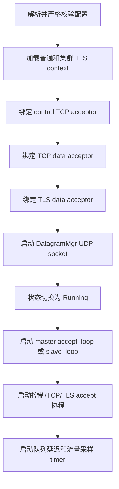

监听、UDP 或集群启动在进入 Running 前失败时，`start()` 关闭已经打开的 acceptor 并停止 DatagramMgr，然后把原异常交给 `main()`。程序不会在部分端口可用的状态下继续运行。

### 4.8 RelayAgent 进程启动流程

RelayAgent 构造时从全部 `forwards` 建立服务发现集合。启动本地监听和主控制连接后，
主连接完成 TCP、mTLS 与身份识别，注册本地 `services`、查询尚未定位的服务及拓扑。
服务发现保存目的 Node ID、地址和控制端口，投递给 Forwarder 的只有服务可用性及目的 Node ID；
发现过程不创建到服务 Node 的附加控制连接。

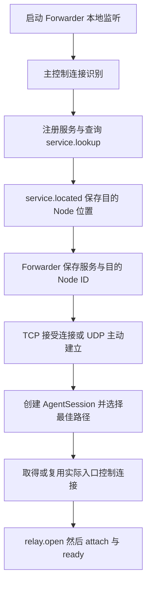

TCP/TLS 服务尚未定位时关闭当前应用连接，监听保留；UDP 此时只保留本地 forward。
服务上线由既有发现循环获知，UDP 重新选择路径后建立新业务实例。

## 5. RelayNode 核心模块

### 5.1 RelayNode 编排与执行域

RelayNode 使用四个互相独立的单线程 `asio::io_context`：

| 执行域 | 所有者 | 目的 |
|---|---|---|
| `control_io` | control acceptor、`ControlSession`、RelayNode 公共控制状态、`RegistryMgr`、`ClusterMgr`、`Topology`、服务发现 | 控制状态按顺序修改，会话、服务表和探测状态由本执行域串行访问 |
| `transfer_tcp_io` | 两个 `StreamPipeline` 的 acceptor、Relay 索引和流式数据复制 | 把高吞吐流式数据与控制消息隔离 |
| `transfer_udp_io` | `DatagramMgr`、UDP socket、UDP 路由 | UDP 报文处理与 TCP/TLS、控制面独立调度 |
| `cluster_data_io` | node 的 `LnkChannel` 监听/读写/保活、会话表和逐跳分派 | Node 通道与会话数据面同域运行，与业务服务限速隔离 |

RelayNode 在 control_io 查找服务和业务实例、分派 Agent 及 peer 消息；
NodeSession 用 std::variant 直接拥有 Single 或 Multi 控制器，两者执行域及层次相同。
控制器只推进自己的实例，数据管理器不保存控制会话引用、不发 opened/offer/ready/error/closed。

NodeSession 在控制域调用 install/wait/bind/activate/bridge/close；
install/bind/activate/close 是同步数据操作，直接投递并把结果或异常返回 control_io；
wait_attach/bridge 才通过 co_spawn 在数据 executor 执行真正的等待及复制。Single 操作本地配对，Multi 操作 RemotePair。
跨域绑定只传不可变身份、统计引用和 accessor 副本；数据 manager 不访问控制状态。
接入角色、accessor 和 Flow 身份由所选控制器明确传给 NodeSession；
NodeSession 不读取控制器私有业务状态，数据操作和 controller variant 均为实例内部实现。
数据端点直接用已保存的 stream 或 UDP source 判断是否接入，不另存 connected 标记。
业务发送通过 LnkChannel::async_send_flow 把拥有载荷的帧提交到 cluster_data_io 入队，完成后回到调用方执行器；
同步入队不另建子协程，入队状态和异常仍返回给调用方。内部池缓冲仍仅在 cluster_data_io 使用和销毁。

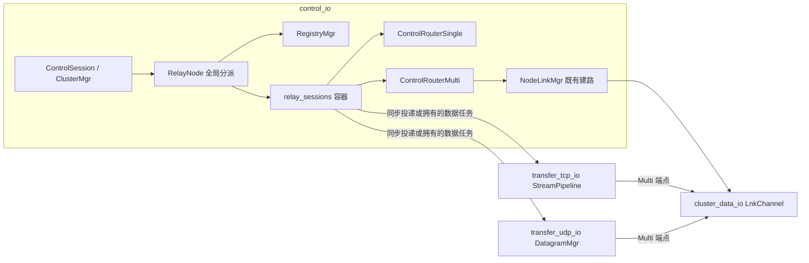

单线程执行域保证同一域内 handler 不并发执行，但不能允许同一个 socket 上出现重叠的异步读或异步写。每种 stream 的读循环和写队列仍各自保持单一所有者。

NodeLink 是相邻 Node 的物理通道，NodeFlow 是固定路径上的双向逻辑流。
NodeLinkMgr 在 control_io 协调建立，LnkChannel 在 cluster_data_io 直接拥有物理连接、逻辑流表、
发送/接收队列、内存池和监控计时器。master 只协调建路和转交消息，不保存 Agent 业务实例。
NodeSession 只存在于单节点业务所在 Node，或多节点的首末 Node；中间 Node 不保存服务或 Agent socket。
共享通道与路径事务见 5.6、5.7，Single/Multi 业务协调见 5.8，二进制格式见 10.4，热路径见 11.5。

### 5.2 ControlSession 与 RegistryMgr

每条普通客户端连接创建一个 `ControlSession`。RelayNode 为它分配非零、进程内唯一的 `session_id`，然后：

1. 在 `RegistryMgr` 中登记会话；
2. 由 `TLSChannel::start()` 完成 mTLS 握手；
3. 循环 `co_await async_receive()`；
4. 在 control executor 上同步分派控制命令；
5. 连接结束时删除该会话注册的所有服务，并取消属于该会话的 Relay。

Registry 以 session_id 保存控制会话的 weak_ptr，以 DualIndexMap 保存唯一服务名、所属 session_id、协议和统计对象。
服务名直接查主索引，断线按次索引删除该会话的全部服务；查表和容量检查不扫描过期 weak 引用。
控制任务是会话所有者，正常退出或启动失败时负责 remove(id)。注册只返回业务结果，统计对象由服务条目拥有，
实际创建 NodeSession 时通过 find_service 取得共享统计引用。

服务注册的生命周期与控制连接一致。提供方断线后服务立即从该节点消失，不保留离线注册。

服务注册流程为：

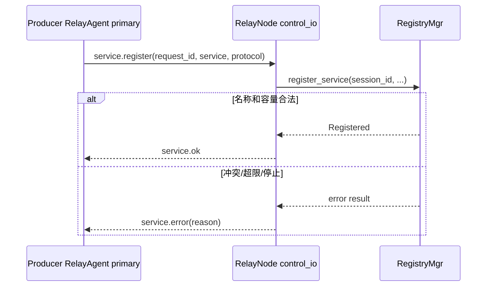

同一会话重复注册同名同协议服务是幂等成功，复用原统计对象；同一节点上其他会话注册同名服务，或同一会话改用另一协议，都会得到名称冲突。唯一性范围是单个 RelayNode，不是整个集群，因此不同节点可以同时注册同名服务，发现端采用当前请求的第一个有效响应。

所有协议在 relay.open 时从 Registry 取得 Producer。注册只更新控制域注册表，不通知数据 manager，
也不复活离线时的旧请求；服务出现后 Agent 重新发现、选路和申请实例。

### 5.3 StreamPipeline 与 DatagramMgr

服务端按传输类型分成 TCP/TLS StreamPipeline 和 UDP DatagramMgr。
每个 manager 直接拥有 LocalPair / local_pairs_ 和 RemotePair / remote_pairs_；
LocalPair 在本 Node 上配对双方 Agent，RemotePair 桥接本地接入的 Agent 与 NodeFlow。
两种资源共同消耗该协议的 max_relays 容量。资源保存票据、已接入 socket 或来源 endpoint、接入事件、
数据激活标志、限速与统计，不保存 Agent 身份、业务请求、服务等待或控制通知。

Single / Multi 分别使用 *_local_pair / *_remote_pair 操作，两者都提供 install/wait/bind/activate/run/close。
attach 只校验票据并发布接入事件，控制器完成绑定和激活后才通知 Agent ready。
TCP/TLS 的差异仍由小型 transport policy 表达；UDP 保留共享 listener、session 索引及多节点端点的有界接收队列，转发协程直接发送。
三类 manager 共享线程安全的 RelayIdAllocator，uuid 在 Node 内不冲突；单节点双方同 uuid、不同 ticket/session。

### 5.4 TLSChannel 模块

普通控制连接和集群连接都复用 TLSChannel。它把一条 TLS stream 封装成有边界、带心跳、单写队列的消息通道，状态依次为：

```text
Created -> Handshaking -> Connected -> Closing -> Closed
```

`start()` 只允许调用一次。客户端在握手前设置 peer verification、实际连接地址的主机名验证和可选 SNI；服务端要求对端提供可信证书。握手受 `channel.handshake_timeout_ms` 限制。成功后，TLSChannel 启动一个自管理的后台 `run()`，然后 `start()` 返回。

后台 `run()` 用一个 parallel group 同时等待三个长期协程及一个关闭接收操作：

- `rloop`：唯一的 TLS 读取者，读取 4 字节长度和完整 CBOR payload；
- `wloop`：唯一的 TLS 写入者，从 bounded channel 取出完整 frame 并顺序写入；
- `keepalive`：定时发 `ping`，并检查最后一次完整入站 frame 的截止时间；
- close_channel 的原生异步接收操作：等待显式断开请求，不另开包装协程。

任一分支结束会让整个通道进入关闭流程。TLS shutdown 最多等待 `disconnect_timeout_ms`，随后关闭底层 socket、发送和接收 channel，并将状态置为 Closed。

`ping/pong` 在 TLSChannel 内部消费，不进入业务接收队列。其他消息进入 bounded receive channel；接收方长期不消费导致队列满时，TLSChannel 关闭连接，接收队列的内存占用保持在配置上限内。

`send(CtrlMessage)` 可从其他 executor 调用，它先 `post` 到 TLSChannel 自己的 executor，再编码并尝试进入写队列。编码失败或写队列拒绝 frame 时，通道记录明确原因并立即进入统一关闭流程；外层接收循环随后清理 session、服务和 Relay，Agent/cluster connector 按原有策略重连。通道已在关闭时的后续 `send()` 只记录拒绝。`send()` 仍是提交接口，不表示远端已处理消息。

`async_receive()` 先切回通道 executor。默认“永不超时”时直接等待 receive channel，不套 `cancel_after`；只有调用方传入有限 timeout 时才增加取消包装。这样普通长期读循环没有额外 timer/cancellation 开销，而握手后的 `cluster.join`、`server.identified` 等有限状态转换仍能设置截止时间。

### 5.5 RelayNode 异常收敛

异常按能处理它的最小边界收敛：

| 异常位置 | 处理者 | 结果 |
|---|---|---|
| 配置字段、地址、证书/私钥加载 | `main()` / 构造或 `start()` | 启动失败并退出，不进入部分运行状态 |
| TLS 握手、解析、连接、节点识别 | 当前连接协程 | 清理本连接；RelayAgent 或 slave connector 按自己的规则重连 |
| 普通客户端发送非法控制命令 | `run_control_session` | 只关闭该控制会话并注销其服务 |
| 非法/过期 `relay.attach` | 当前数据接入协程 | 只关闭该数据 socket，等待中的 Relay 由 timer 或后续错误清理 |
| 单条集群业务消息字段非法 | `ClusterMgr::receive` / RelayNode 消息处理 | 记录该消息错误，继续接收后续集群消息 |
| TLSChannel 编码/入队失败或后台读写/心跳错误 | TLSChannel | 记录原因、进入统一关闭并让外层接收自然结束 |
| server stop 期间的取消错误 | 各停止边界 | 作为正常收敛处理，不重复记录为运行故障 |

底层使用 `asio::use_awaitable` 的操作默认通过异常传播错误。accept 循环、停止取消、UDP 逐包收发等需要按错误码继续或区分 `operation_aborted` 的位置使用无异常结果。错误表示方式在其处理边界内保持一致。

### 5.6 NodeLink 共享物理通道

NodeLinkMgr 与数据 manager 同层，由 RelayNode 直接拥有。一个无向 Node 对、一个 transport 对应一个
共享 NodeLink；TCP 和 UDP 分开建立。master 的 ensure_link 合并并发申请，成功后返回已有 ID。
控制协议只描述 Node、地址、epoch、Link ID 和凭据，不包含 service 或 Agent 状态。

| 命令 | 方向 | 作用 |
|---|---|---|
| link.prepare / prepared | master ↔ 两端 | 安装本次身份和凭据；UDP 在 prepared 前完成解析并固定 endpoint |
| link.connect | master → 两端 | 收齐 prepared 后按固定角色开始接入 |
| link.ready | 两端 → master | 两端均完成接入后，ensure_link 返回成功 |
| link.error | 端点 → master | 返回原失败阶段和原因 |
| link.close / closed | master ↔ 两端 | 清理物理连接及依赖它的 Flow |
| link.attach / attached | 相邻 Node 数据 socket | 校验 epoch、ID、Node 身份、凭据和 data_version |

每次外层尝试使用新的非零 Link ID 和凭据；建立最多 10 秒。TCP 由排序靠前的 Node 主动连接，
排序靠后的 Node 等待接入。每次只解析、连接一次，不反向尝试；UDP 双方各发送一次 attach 并响应 attached，
不增加可靠传输或重发。失败交给外层业务处理，不在物理通道内部自动重连。

NodeLink 使用 Preparing、Resolving、Prepared、WaitingForPeer、Connecting、Attaching、Ready、Closed
表达进度。attached 与 acknowledged 是 UDP 接入的两个独立事实，支持乱序到达；不能合并成单一进度。
connect 在启动任务前离开 Prepared，重复命令不会启动第二条连接链；异步恢复不能覆盖 Closed。
通知的 stage 从当前状态生成，心跳失败单独报告 keepalive。

TCP 每条 Link 拥有一个读循环和一个写循环；UDP 共用 LnkChannel 的一个接收循环和一个发送循环。
Node 数据通道为明文 TCP/UDP，其凭据来自已认证的集群控制连接；服务限速和统计不放在中间 Link 上。

每 5 秒发送 PING，20 秒未收到新的有效 PONG 则关闭 Link。PONG 序号必须大于 last_ack_ping 且不超过
已发送 PING 序号；重复、倒退或伪造未来响应不能延长存活期限。正常 DATA 不代替 PONG。
LnkChannel 的一个 monitor 等待最近的建立、心跳、准备表项或关闭身份回收期限，无待检查对象时无限等待。

### 5.7 NodeFlow 路径事务与状态

NodeLink 是可共享的物理连接，NodeFlow 是固定路径上的逻辑业务。逻辑身份为 epoch + flow_id，
不额外保存 Route ID 或路径版本。每次业务重新建立分配新 flow_id，即使路径相同也不复用旧 Flow。

open_flow 在 control_io 运行。master 本地执行事务；普通首 Node 通过 flow.open/opened 请求 master
执行同一事务。请求只携带路径、transport 和身份，master 不保存 Relay 或 Agent 的业务状态。
TLS 业务使用 TCP NodeFlow，TLS 仅位于 Agent 与 Node 的接入段。

1. 校验当前 epoch、成员在线、地址快照和无环的 2..8 Node 路径。
2. 并行 ensure 相邻 Link；任一边失败结束本次事务，共享 Link 申请仍由自身期限收尾。
3. 向全路径发送 flow.prepare；数据域确认邻接 Link Ready、身份和协议匹配，安装 Prepared 表项。
4. 收齐全路径 prepared 后发送 commit；收齐 committed 后才返回可用 Flow。
5. 建立失败向全路径发送 close，回滚已准备或已提交表项；只清理本 Flow，保留共享 Link。

每次 Link 建立最多 10 秒；随后 prepare/commit 共用 10 秒期限。ttl_ms 只用于各节点未提交表项的准备期限，
不传播 Agent 或首末 Node 的业务建立预算。提交后的 Flow 没有运行租约或续租消息。
prepare/commit/close 的确认各用一个 8 位掩码记录路径参与者；8 Node 限制不约束集群总节点数。

控制确认验证认证 source、epoch、flow_id、request_id、路径和 Link 身份。相同重复命令幂等处理，
冲突参数拒绝。关闭身份在数据域保留 10 秒的有界 retired_ 记录，避免迟到 prepare 复活已关闭表项；
commit 不创建表项。retired_ 只保存 ID 和期限，不持有 NodeFlow。

| 控制表 | 所在节点及用途 | 删除时刻 |
|---|---|---|
| link_requests_ | master：合并相邻 Link 申请，保留可复用结果 | Link 失败、关闭或成员失效 |
| link_endpoints_ | 每个端点：本地 Link 的控制授权 | 本地失败、关闭或成员失效 |
| flow_requests_ | master：建立中及活动的 Flow 事务 | 进入关闭阶段 |
| closing_flows_ | master：等待全路径关闭确认 | 确认完成、关闭超时或控制失效 |
| flow_endpoints_ | 路径节点：已授权的本地 Flow 参数及 committed 事实 | 数据域关闭通知、路径或控制失效 |
| remote_flows_ | 普通首 Node：等待 master 的 open 结果 | 本次请求返回或中止 |
| flow_watches_ | 普通节点：业务等待本地 Flow 关闭 | Flow 关闭或控制失效；共享等待者持有到收尾 |

这些表分别属于全局协调、端点授权或当前等待，不能因为都保存 flow_id 就合并所有权。
数据域只有 links_ 和 flows_ 两类活动对象。NodeFlow 保存不可变 epoch/transport、previous/next Link ID、
Prepared/Active/Closed、双向 FIN、准备期限、终点接收队列和缓存计数，不保存服务或 Agent socket。

forward 沿提交路径，reverse 沿原路径返回，与 TCP 建连方向无关。中间 Node 验证实际入边与方向后直接
移动载荷到出边队列，首末 Node 才交付本 Flow 的接收者。共享 A–B 可同时承载 A→B→C 和 A→B→D，
两个 Flow 各自关闭或失败；物理 A–B 断开才使依赖它的全部 Flow 失败。

TCP 的 DATA、FIN 在同方向保持顺序。FIN 后拒绝该方向 DATA 和重复 FIN，反方向仍能传输；RESET 仍可终止
本 Flow。两个方向均 FIN 不自动删除表项，正常完成由首末控制器排空后显式 close。UDP Flow 仅接受 DATA，
保留 datagram 边界，不提供重传、排序或分片，关闭走控制协议。

master close_flow 等待全路径 closed，最多 10 秒；普通首 Node 请求 master 关闭并等待本地关闭，最多 10 秒。
集群控制断开或心跳失败清理本地 Flow 与授权；epoch、路径成员或 Link 失效清理相关 Flow。发送队列溢出
会报告本地 ClusterError，未主动断开全部集群连接，因此不能保证远端旧 Flow 立即回收；后续依靠显式关闭、
控制失联或路径失效收敛。这是当前投递语义，不隐藏为运行租约。

### 5.8 NodeSession 的 Single / Multi 业务主线

RelayNode 拥有唯一 RegistryMgr 和 relay_sessions_ 容器，负责请求查找、实例创建、消息分派与停止排空。
NodeSession 的 variant 直接拥有一个 Single 或 Multi 控制器，两者均在 control_io 运行，只推进本实例。
数据 manager 只管理 LocalPair / RemotePair，不保存 ControlSession 或代发业务通知。

Single 从 Registry 找到 Producer，安装 LocalPair，向两端发送 opened/offer，等待双方票据接入，绑定服务
统计和 accessor，激活后发 ready，再运行双向数据复制。建立失败通知请求方 error 和已获 offer 的服务方 closed；
活动 TCP/TLS 由数据 socket 表达结束，UDP 必须发送显式关闭通知。服务离线时 open 直接失败，不占数据容量。

Multi 首 Node 先建立 NodeFlow，再向末 Node 发送 relay.peer.open；末 Node 确认自己是已提交 Flow 的终点并
找到 Producer，创建自己的 NodeSession。双方各安装一个 RemotePair，分别通知各自 Agent 接入。

| 首末消息 | 发送时机 | 对端行为 |
|---|---|---|
| relay.peer.open | 首 Node 已取得 Flow | 末 Node 验证 Flow、服务并创建业务 |
| relay.peer.attached | 末 Node 已完成 Agent 接入及 Flow 绑定 | 首 Node 可以激活 |
| relay.peer.ready | 首 Node 已绑定并激活 | 末 Node 激活自己的端点 |
| relay.peer.finished | 本端两个方向已结束并排空 | 双方均 finished 后才允许释放 Flow |
| relay.peer.close | 本端失败、取消或收尾 | 对端保留原因并关闭本端业务，不反向回声 |

首末各自激活后向自己的 Agent 发 relay.ready。TCP/TLS 本地读 EOF 转为 FIN，收到 FIN 只 shutdown_send；
真实 I/O 失败尽力发送 RESET 并走控制关闭。双方 finished 的确认防止首端抢先删除仍有尾部 DATA/FIN 的 Flow。
正常 relay.closed 不取消 Agent 的本地排空，AgentSession 仍以自己复制的结果判断是否成功。

Multi 仅有四个进度值：OpeningFlow、PeerOpened、AgentNotified、Ready。peer_prepared、peer_finished 是来自
另一端的独立事件；closed 表示终止，from_peer 防止关闭通知回声。stage 是协议错误位置，可来自对端，
不能用本地 progress 覆盖；reason 保存首次原因。它们表达不同事实，不为统一枚举而引入附加 CloseInfo。

Multi 的 establish_and_transfer 与 watch_flow 是本实例的两个结构化子任务：任一退出后取消并排空另一任务。
watch_flow 只监视实际 Flow 失效，不另建 Node 级业务容器。清理只在控制器 run 末尾关闭本地资源和本 Flow，
随后 RelayNode 的 completion 从容器删除实例。

## 6. ClusterMgr 模块

### 6.1 ClusterRoom 成员与消息分发模型

ClusterMgr 的成员与消息分发模型由四个角色组成：

- `ClusterRoom` 管理参与者集合，并按 `target` 广播或定向投递；
- `ClusterSession` 对应 master 接受的一条 slave 连接；
- `ClusterParticipant::deliver()` 是统一的写入口；
- master 本地逻辑以一个本地 participant 加入 room。

master 接受 socket 后立刻创建 session 并加入 room。session 的读协程先调用 `TLSChannel::start()`，再等待 `cluster.join`。加入成功后，读到的普通消息交给 room；room 遍历参与者并调用 `deliver()`。远端 session 的 `deliver()` 直接调用 `TLSChannel::send()`，因此握手、帧格式、心跳、发送队列和单写协程继续由 TLSChannel 管理。

`ClusterRoom` 放在 master 的 `accept_loop()` 协程栈上，只在该结构化协程存活期间存在。停止时先停止所有 session，等待参与者退出，再离开协程。room 和 session 的生命周期由同一个 accept 协程封闭管理。

### 6.2 成员加入与消息路由

| 命令 | 方向 | 参数 | 作用 |
|---|---|---|---|
| `cluster.join` | slave → master | `node_id` | TLS 握手后声明节点 ID |
| `cluster.joined` | master → slave | 无 | 确认加入成功 |
| `cluster.error` | 本地或 master → slave | `reason` | 重复 ID、未连接或本机编码错误 |
| 任意非 `cluster.*` | 任意节点 → room | 业务参数及必填 `target`；master 写入 `source` | `target=all` 广播，否则按 node_id 定向 |

`node_id` 由配置声明，master 拒绝同时在线的重复 ID，也拒绝保留值 `all`。集群 mTLS 确认对端持有 Server CA 签发的节点证书，但协议没有把证书名称与 `node_id` 绑定。

业务消息直接复用普通 `CtrlMessage {command, params}`，没有额外的“集群信封”。发送方写入 `params.target`，其中 `all` 表示广播，其他值表示目标节点 ID。master 根据已加入的 session 覆盖写入 `params.source`，调用者不能伪造来源；路由前删除 `target`，因此 RelayNode 只看到认证 `source` 和业务字段。业务消息的 `params` 必须是对象，`cluster.*` 命令、`source` 和 `target` 字段由集群层保留。

广播包含发送者。这样本地节点和远端节点走相同接收路径，业务层不需要为“本地执行”和“远端消息”维护两套分支。定向消息只投递给当前在线的目标 participant；目标不存在时按 best-effort 语义丢弃，不退化成广播。

ClusterMgr::broadcast(message) 等价于 send("all", message)；其他 target 使用 send(target, message) 定向发送。两个接口都返回 `void`，调用返回只表示消息被交给发送机制，不表示远端收到或处理成功。需要结果的业务通过响应消息和 `request_id` 关联。集群不保存历史、不补发，也不自动重发业务消息。

### 6.3 ClusterMgr::Connector 重连

slave 的 `ClusterMgr::Connector` 位于 `slave_loop()` 协程栈上。resolver、socket、retry timer 同样属于该协程栈；`ClusterMgr` 只保留一个临时裸指针用于停止时取消这些操作。

connector 对活动 `TLSChannel` 只保存 `weak_ptr`。一次连接的强引用由当前连接/接收协程持有；接收结束并清理以后弱引用自然过期。下一轮通过 `weak_ptr::expired()` 判断是否需要连接，不增加 `is_closed` 一类重复状态接口。

连接流程是：解析地址、TCP 连接、TLS 握手、发送 `cluster.join`、等待 `cluster.joined`、持续接收。解析或连接最多等待 5 秒；失败或断线后固定等待 5 秒再重试。成功不会引入另一套指数退避状态。

停止时取消 resolver、socket 和 retry timer，并断开当前 TLSChannel。master 关闭 acceptor 和出站消息队列，停止 room 内 session 并等待它们退出。RelayNode 等待 `ClusterMgr::async_stop()` 完成后才结束 control 侧停止；此时不会再有 ClusterMgr 对 RelayNode 的反向调用。

### 6.4 Master accept_loop 的结构化并发

master 的 `accept_loop()` 在栈上创建 ClusterRoom 和本地 participant，然后使用 Asio awaitable 运算符并行等待：

```cpp
co_await (accept_sessions(room) && deliver_messages(room));
```

两个分支分别承担 socket 接入和本地出站消息队列消费。它们共享同一个 control executor 和同一个栈上 room，所有成员操作均在该 executor 串行执行。任一分支异常时，组合 awaitable 结束；外层保存异常，先 `co_await room.async_stop()` 收敛所有 participant，再重新抛出。清理发生在 room 析构之前。

接受到 socket 后，session 在完成 TLS 和 join 前已经计入 room 容量。连接上限同时覆盖握手中和已加入的远端成员。room 中还有一个 master 本地 participant，所以判断远端容量时为 `max_connections + 1`。

### 6.5 ClusterSession 生命周期

一个 ClusterSession 只有一个 reader 协程：

1. `co_await channel->start({})` 完成服务端 TLS 握手；
2. 在握手超时时间内直接 `co_await channel->async_receive(timeout)` 等待 `cluster.join`；
3. 验证 node_id 非空、不是保留值 `all` 且未被 room 占用；
4. 回复 `cluster.joined`；
5. 持续直接 `co_await channel->async_receive()`，把业务消息交给 room；
6. 退出时断开 TLSChannel；completion handler 用 weak session 从 room 删除自己。

这里不为一次 receive 再 spawn 子协程。有限超时由 TLSChannel 的 `async_receive(timeout)` 提供；正常读循环直接 co_await，不增加中间 channel、竞速协程或额外生命周期。

session 的 `deliver()` 只调用 TLSChannel 的异步发送入口。ClusterRoom 只操作 participant 接口，socket、TLS 写队列和心跳由 ClusterSession 与 TLSChannel 管理。

### 6.6 广播与定向交付

master 收到 slave 消息后，不直接信任原消息中的 `source`。ClusterRoom 使用已加入 session 的 `node_id` 覆盖该字段，删除传输字段 `target`，再根据 target 把业务消息复制给所有 participant 或只投递给一个目标。master 本地发出的消息同样填入 master 的 node_id。

此机制提供的是当前在线成员间的 best-effort 投递：

- 未加入的 session 不接收业务消息；
- 广播时离线的成员不会在重连后收到历史消息；
- 定向目标不存在或已离线时消息直接丢弃，不自动改为广播；
- 某个 participant 的 `send()` 入队失败不会回滚其他 participant；
- 响应必须是新的业务消息，并携带请求协议定义的关联字段；
- `source` 仍由 master 认证并覆盖，定向投递不会降低来源身份保证。

### 6.7 ClusterMgr 与 RelayNode 接口

RelayNode 负责启动、停止和处理真实业务协议，不提供通用集群消息收件箱或 Link/Flow 调试包装接口。
业务处理器直接使用 ClusterMgr 的 `send(target, message)` 和 `broadcast(message)`。

RelayNode 独占 `ClusterMgr`，ClusterMgr 反向保存非拥有的 `RelayNode&`。ClusterMgr 在 control executor 上
验证消息来源后直接调用 RelayNode 的私有消息处理入口，该入口处理公共查询，并将中继命令交给 ControlRouterSingle/Multi。
RelayNode 消费服务、节点、集群状态和拓扑查询；NodeLink/Flow 及 `relay.peer.*` 交给各自模块处理。
`cluster.error` 清理本地 Flow 协调、端点授权及多节点业务；物理 Link 仍由成员变化和独立心跳判断失效。`cluster.joined` 及未识别的普通命令不进入额外队列。
这条直接关系与 RelayNode 控制状态位于同一串行 executor，生命周期由 RelayNode 的所有权和停止顺序保证。
发送入口拒绝业务调用使用 `cluster.*` 保留命令，并通过本地 `cluster.error` 报告。

## 7. RelayAgent 与 NodeConnection 模块

### 7.1 RelayAgent 状态与职责

RelayAgent 分开管理“入口连接”和“服务路由”，使不同服务可以分别连接其注册节点：

- 初始配置只决定 primary 入口；
- 每个 `(service, protocol)` 保存自己的目标节点；
- 每个目标节点对应一个 `NodeConnection`；
- 同一节点的多个服务复用同一连接；
- 不同节点的连接和 Relay 相互独立。

### 7.2 服务发现流程

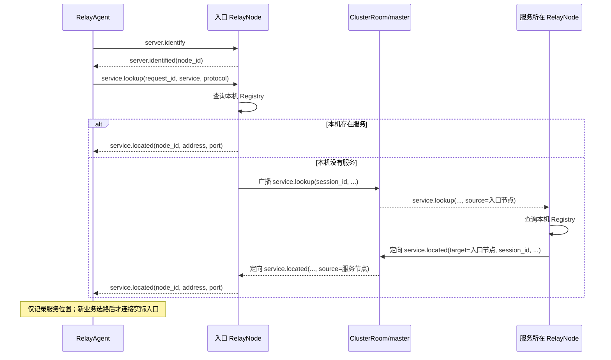

服务端不保存 pending 查询、不创建查询 timer，也不持有等待结果的客户端会话。跨集群查询携带原控制会话的 `session_id` 和入口 `requester_node`。响应回到入口节点时再查 Registry；原会话已经消失就直接丢弃。

转发给普通客户端前，入口节点：

1. 用经过 ClusterSession 认证的 `source` 填写 `node_id`；
2. 删除内部的 `source`、`requester_node`、`session_id`；
3. 保留客户端原始 `request_id`。

因此超时和过期响应全部由客户端处理。每个服务只接受当前 `request_id` 对应的位置结果；后到的旧响应被忽略。多个节点同时提供同名同协议服务时，当前请求收到的第一个有效位置会把 request 置零，后续响应不再匹配。

跨节点时同一查询的参数演变如下：

| 阶段 | 消息 | 参数 |
|---|---|---|
| RelayAgent 发给入口 | `service.lookup` | `request_id`, `service`, `protocol` |
| 入口广播 | `service.lookup` | `target=all`；上述字段 + 入口普通会话的 `session_id`；ClusterRoom 写入 `source=入口 node_id` |
| 服务节点定向响应 | `service.located` | `target=requester_node`；`requester_node`, `session_id`, `request_id`, `service`, `protocol`, `address`, `port`；ClusterRoom 写入 `source=服务节点 node_id` |
| 入口发给 RelayAgent | `service.located` | `request_id`, `service`, `protocol`, `node_id=source`, `address`, `port` |

`session_id` 只在一次 RelayNode 进程生命周期内标识普通控制会话；它不是公开客户端身份，也不会交给最终 RelayAgent。`requester_node` 用作响应的定向目标，并让入口再次确认消息属于本节点。最终 `node_id` 必须从 ClusterRoom 认证过的 `source` 生成，不能采用业务消息自己携带的 node_id。

如果服务在入口本机，RelayNode 直接构造最终 `service.located`，不经过 ClusterRoom。两条路径最后给 RelayAgent 的字段完全一致，所以客户端不需要区分本地命中和远端命中。

### 7.3 集群状态查询

Dashboard 等普通客户端只需连接任意一个在线节点，每轮发送一次 `server.cluster {request_id}`。入口先直接返回自己的完整 `server.status.reported` 消息，再以 `target=all` 广播 `server.status.query {session_id, request_id}`。其他节点各生成完整状态，通过 `target=requester_node` 将 `server.status.report` 定向发回入口；入口节点对本机查询不再生成第二份报告。

查询和响应复用服务发现的路由字段与安全边界：`requester_node + session_id + request_id` 标识原请求，最终 `node_id` 只取定向响应中由 ClusterMgr 认证并覆盖的 `source`，转发前删除全部内部路由字段。不同普通控制会话即使使用相同 `request_id` 也不会串流；会话断开后迟到响应因目标节点或原 session 不存在而直接丢弃。

每条 `server.status.reported` 包含 `request_id`、`node_id`、真实服务器 uptime 和按服务名排序的完整流量报告；地址和三类队列延迟由 `topology.snapshot` 提供。业务字段不再包含 `page_index/page_count`。协议层在完整 CBOR 消息超过 64 KiB 时自动拆分，在每条 TCP 连接上顺序重组，只把完整消息交给客户端，单个 service 或 accessor map 也可以跨帧。客户端按 `request_id` 和 `node_id` 发布一次节点快照和写入一次历史记录。服务端不保存成员快照、不聚合不同节点的结果，也不发送集群完成消息。

### 7.4 节点地址发布

`service.located.address` 也是客户端下一条控制连接和数据连接使用的主机地址。服务节点始终发布必填的 `control.advertise_address`；该值应填写请求方可以访问的公网 IP 或 DNS 名称，并且必须在节点证书 SAN 中。`control.address` 只用于绑定本地监听接口，可以填写 `0.0.0.0` 或 `::`，不再参与服务地址发布。

### 7.5 NodeConnection 连接池

每条控制连接在可用前都执行 `server.identify/server.identified`。客户端校验服务器返回的 `node_id`：已知位置指定了节点 ID 时，实际连接到其他节点会使该次连接失败。

连接池先按 `node_id` 复用，再按 `host:port` 复用。每个 `NodeConnection` 自己运行连接、接收、清理和重连循环：

- 初始重连延迟由 `reconnect.initial_delay_ms` 指定；
- 失败后翻倍，最多到 `reconnect.max_delay_ms`；
- 连接成功后恢复初始延迟；
- 已知附加节点独立重连，不依赖 primary 在线。

`NodeConnection` 不长期保存强 TLSChannel 引用。每次 `run()` 使用成员中的
`optional<Operations>` 原位拥有 resolver、socket 和 retry timer；运行开始时构造，连接循环退出时由
scope guard 清空，`stop()` 因而可以直接取消这些对象而不引用协程栈地址。当前通道仍只保存
`weak_ptr<TLSChannel>`。协程 completion handler 在任务期间持有 RelayAgent；连接池强持有 NodeConnection，运行协程及其 completion handler 只借用连接。

连接池直接保存普通 `shared_ptr<NodeConnection>`，每个连接只有一个 shared_ptr 控制块。
EntryWait 和活动的请求方 AgentSession 保存同一连接的共享引用，EntryWait 只在入口选择期间存在。
复用现有 5 秒维护周期：附加连接只剩池内引用时开始计时，连续空闲 60 秒后调用 `stop()`；
有会话或等待者持有时不回收，短暂复用也会重新计时，primary 不参与空闲回收。
停止后连接不再 ready，但池内索引与对象保留到 `run()` 完成，随后由 Agent 的 completion handler 移除。
同节点新请求遇到停止中的连接时等待其任务退出，再使用原地址重建，整个过程仍受原建立截止时间约束。
入口查询结果只保存地址与端口，不长期保留 JSON 回复；DNS 和控制接收恢复时检查停止状态，避免启动下一阶段。
附加节点断线只结束使用它的业务实例；主控制连接恢复后重新注册和发现服务，不设计离线定位。

单条 NodeConnection 的状态转换可以表示为：

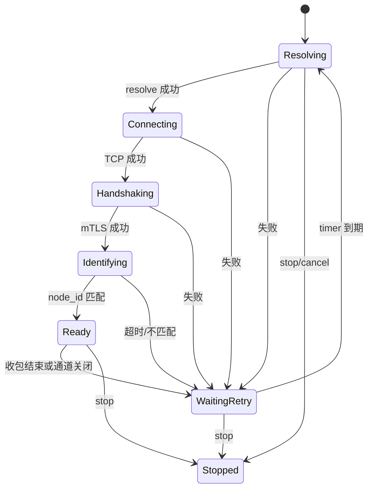

Ready 只表示 mTLS 和 `server.identified` 都成功。TCP 已连接或 TLS 已握手但尚未识别节点时，不会注册服务、安装 Forwarder 路由或发送业务请求。

每轮失败都按“当前 stage + 原异常”形成一条连接失败日志。清理顺序固定为：清除 weak channel、通知 owner 结束使用该控制连接的业务、等待 TLSChannel 断开、等待重连 timer。stop 会同时取消 resolver、socket 和 timer，使协程从任何阶段退出。

### 7.6 路由失效与重新发现

客户端每 5 秒通过主控制连接查询尚未定位的服务；定位结果与入口控制连接独立。
主控制恢复后重新注册和发现，不增加主控离线位置缓存或备用发现通道。
只有配置了本地转发的 Agent 才运行发现及探测循环；只发布服务的 Agent 保留主控制连接和服务注册流程。
附加入口断线只清理使用它的业务，不触发服务补查；主控制连接恢复和既有轮询负责发现重试。

relay.error 的 service unavailable / service protocol mismatch 若仍对应当前目的 Node，
会清除该次服务位置并通知 Forwarder 清除可用性，再经主控查询。
单节点控制接入超时也重新发现；多节点首 Node 查询失败不删除有效的服务目的位置。
无人使用的附加入口连接在连续空闲 60 秒后停止，任务退出后从连接池移除。服务迁移后新业务重新选路，不重放旧数据或沿用旧票据。
入口失效通知只处理 control 侧等待者；服务丢失由 transfer 侧 clear_service 一次完成可用性清除、
待建立会话及 UDP 会话取消。拓扑变化和服务迁移则分别取消仍在建立的请求方会话。

发现请求和 Relay 请求使用各自执行域内的 `request_id` 分配器。它们的数值可能相同，但由命令类型、连接和对应 pending 容器共同限定，不会把服务查询响应误配到 Relay 打开请求。计数器越过 `uint64_t` 最大值后跳过零。

### 7.7 链路质量与推荐路径

Node 和 Agent 共用 route 模块。Node 探测其他成员并上报质量；Agent 测量本地接入成本，合并集群有向边，
计算到服务注册 Node 的最佳路径。AgentSession 建立 TCP/TLS/UDP 新实例时使用最佳路径选择入口，
多节点提交路径和当前 epoch，由首 Node 使用已有 NodeLinkMgr 建立 NodeFlow；单节点或无路径使用服务位置回退。

#### 7.7.1 探测管理与状态所有权

```text
Node 成员 / Agent 配置入口、服务发现与拓扑
  → ProbeSet：DNS、IPv4 去重、身份映射与历史管理
  → ICMP / LinkQuality：探测完成样本与三尺度统计
  → Node 报告 → master 拓扑汇总
  → Agent：筛选远端边，合并本地接入成本
  → AgentRouting::candidate_paths：共用路由图，逐入口搜索所有目的 Node，再按成本与节点序列排序
```

`ProbeSet` 直接拥有 DNS resolver、IP 到 Node ID 的映射、ICMP 实例和重建历史。先解析完整目标集合，
再决定是否重建；IP 集合未变且探测器正常时，只更新身份映射。多个身份指向相同 IPv4 时共用一次探测。
部分 DNS 失败在下一次五秒轮询重试，不中断正常目标；等待期间目标变化时丢弃旧 revision 的解析结果。
删除或改变地址的身份立即隐藏旧测量，其他目标保持可读；重建时仅为未变 IP 保留内存历史，新 IP 从空历史开始。

`LinkQuality` 内部的 `Ema` 保存衰减累计量；`Summary` 只包含 `{cost, confidence, usable}`。
`assess(now)` 返回 `Assessment`，显式包含 quality 摘要、三尺度指标 `scales`、完成/成功计数及
`last_success_age`。`ICMP::Metrics` 使用 IP 身份，`ProbeSet::Metric` 使用 Node ID，二者携带相同的评估结果。
`ICMP::ProbeState` 保存质量统计和真实发送计数；`Session` 另拥有定时器、序列号及在途状态。
取消后的发送仍计入 transmitted，但不计入完成样本或丢包，重建不会用完成数替代发送数。

可变状态留在现有单线程 `control_io`，不新增线程、strand 或 PImpl。跨执行器异步入口使用 C++20
`co_spawn` 在所属执行器运行；调用路径可控的内部协程通过注释约束执行器并直接 `co_await`。
`stop()` 取消解析并阻止新工作，`close()` 等待刷新及全部 ICMP 协程退出，支持重复、并发关闭及调用方取消；
拥有者必须在销毁前等待关闭完成。

#### 7.7.2 质量模型与边权

ICMP 每秒探测一次，超时 800 ms。完成样本按实际间隔衰减；只保存固定数量的聚合量，不保存样本队列。
三个尺度的半衰期为 30 秒、5 分钟、30 分钟，权重为 0.15、0.35、0.50。统计 RTT 均值、相邻成功
RTT 差绝对值的均值作为抖动、RTT 标准差及丢包率。失败样本计入完成数和丢包统计，不参与 RTT 与抖动统计；失败后不跨失败样本计算
抖动，相邻成功样本间隔达到 30 秒也不计入抖动。各尺度基础成本为：

`scale_cost = RTT + 0.5 × 抖动 + 0.25 × 标准差 − 400 × ln(1 − 丢包率)`

RTT、抖动和标准差使用毫秒，丢包率使用 0–1 的比例，`ln` 为自然对数。丢包率是各尺度衰减后的
`1 − 成功样本权重 / 完成样本权重`。丢包惩罚系数由 `LinkQuality::LOSS_PENALTY` 定义为 400，
相同丢包率的惩罚为原系数 200 时的两倍，且随丢包率增加而加速增长：

| 丢包率 | 该尺度增加的成本 |
|---|---:|
| 1% | 4.02 |
| 5% | 20.52 |
| 10% | 42.14 |
| 20% | 89.26 |
| 30% | 142.67 |

对有成功证据且丢包率小于 100% 的尺度，按其权重归一化得到摘要中的基础成本：

`quality.cost = Σ(weight × scale_cost) / Σ(weight)`

没有抖动样本时抖动项为 0；没有成功证据的尺度不参与加权。成本越低越好，没有固定上限或优良等级，
是以毫秒为基准的比较值，不能当作业务实际 RTT。例如三个尺度都稳定在 RTT 80 ms、无抖动和丢包时，
基础成本为 80；相同 RTT 且各尺度均为 10% 丢包时，基础成本约为 122.14。

信心由时间覆盖和有效证据共同约束：`confidence = min(clamp(覆盖秒数 / 1800, 0, 1),
min(1, 长尺度有效完成样本权重 / evidence_target))`，其中 `evidence_target = 0.8 × 0.5 × 1800 / ln(2)`，
约为 1039；覆盖时间为首末完成样本的间隔，有效样本权重包含截至评估时刻的衰减。
连续 30 分钟没有完成样本后重新积累统计和信心。下列任一条件
使链路不可选路：连续失败达到 5 次、短尺度丢包率达到 50%、最后成功达到 45 秒、最后完成样本达到 15 秒。
没有成功证据时 `cost=null`、`usable=false`。ICMP 反映主机往返质量，不测量业务端口、带宽或单向时延。

基础质量成本与最终边权分开。纯函数 `routing_cost(quality, age)` 对可用摘要应用新鲜度及冷启动惩罚：

`edge_cost = quality.cost × freshness + 5 × (1 − confidence)`

`age` 为最后成功测量的年龄；消费远端摘要时还要累加快照经过时间。25 秒内 `freshness = 1`；
25–45 秒为 `1 + 0.5 × ((age_seconds − 25) / 20)²`。信心为 1 时无额外成本，为 0 时增加 5。
45 秒起或摘要不可用时无边权。`RouteGraph` 只接收最终非负成本。

#### 7.7.3 图算法与 Agent 接口

| 类型或接口 | 含义 |
|---|---|
| `RouteGraph::Link {from, to, cost}` | 有向边；过滤非法成本，重复边取最低成本 |
| `RouteGraph::Entry {node, access_cost}` | 真实入口及本地接入成本，不需要虚拟 Agent 节点 |
| `RouteGraph::Path {nodes, cost}` | 真实 Node 序列与总代价 |
| `shortest_paths(entries, max_nodes)` | 一次多入口搜索全部目的地，每个服务终点之前的 Node 增加成本 2 |
| `AgentRouting::candidate_paths(now)` | 返回各目的 Node 的候选路径，按成本与节点序列排序 |

服务候选路径包含 `N` 个真实 Node 时，日志中的总代价为：

`path.cost = Agent 到入口的 edge_cost + Σ(Node 间有向边的 edge_cost) + 2 × (N − 1)`

每个终点之前的 Node 增加中继成本 2。单 Node 直达路径只有 Agent 到目的 Node 的接入成本；
三 Node 路径有一条接入链路、两条 Node 间链路，并额外增加 4。当前质量基于 ICMP，因此服务协议名称
TCP、TLS 或 UDP 不改变上述公式。

shortest_paths 使用按“节点、已用节点数”分层的算法，同成本按完整节点序列排序。节点预算只计算真实
Node；孤立入口仍能给出单 Node 直达路径。后台轮询只维护探测目标和拓扑，不计算服务候选路径，
不维护路径切换状态或独立备用路径。`candidate_paths()` 为每个可用入口分别保留到各终点的一条最优路径，
不是同一入口下的全部路径枚举，也不保证候选之间节点或链路不相交。候选缓存由 RelayAgent 拥有。

TCP/TLS 每个本地连接、UDP 每个新业务实例均由 AgentSession 跨到 control_io 调用 select_relay。
calculate_service_paths 返回最佳 Node 序列；命中有效 LRU 时直接取第一候选，未命中才计算并记录候选。
该函数是 control_io 上的同步计算，不创建协程；入口定位及控制连接等待仍由 select_relay 协程负责。
随后附当前 epoch 并取得实际入口，返回路径、入口 ServerRoute 及共享连接引用。
后台探测不触发业务选路，活动业务也不重新计算或换路；服务发现不提前建立尾 Node 控制连接。

候选按目的 Node 缓存 15 秒，LRU 容量 16，TCP/TLS/UDP 共享，空候选也缓存。
命中只更新次序，不续期、不打印重复候选；必需探测目标变化、主控制断开或拓扑 epoch 改变时清空。
同 epoch 的指标及普通快照版本变化不直接清空缓存；TTL 到期后的下一次业务使用当前测量重新计算。
有效候选只用于选择最佳路径，不复用之前的接入票据或 Flow。
候选计算属于 DEB：`Routes service=lly-http/tls -> llyun-1 candidates=3 max_nodes=4`，
随后每条候选独立记录日志级别和服务上下文，例如
`Route #1 cost=109.285 service=lly-http/tls: agent -> llyun-1 *`。
每个目的地保留全部入口候选，仅日志展示前三名；无测量结果时在汇总中标记 `candidates=0 ... cost=unavailable`。
`cost` 放在候选排名之后，固定小数点后三位；行末的 `*` 表示推荐候选，其他候选不加标记。
`cost` 是含质量、新鲜度、冷启动及中继惩罚的路由成本，不等同于 RTT。
路径为空或仅一个 Node 时按目的服务位置走 Single；多节点首 Node 定位或连接失败结束当前实例，
不在原实例内重新选路或回退。日志的完整候选 Node 序列用于核对选择，业务实例以服务名、uuid 及 Flow 身份关联。

日志形式与级别遵循 [编码风格约束中的日志规范](../README.md#日志规范)。
Forwarder 仍使用已有 `ServerRoute::id`（host:port）管理连接与 Relay，不为日志另外保存 Node ID 或统计状态。
底层转发在 I/O 结束处直接记录端点、操作和原始错误，不更改转发函数接口或收发流程。
普通权限下无法提高实时线程优先级属于 DEB，并保留系统调度策略；其他调度错误仍为 ERR。

```text
[INF] ... Control [+] node=llyun-1 peer=192.229.85.177:18443
[INF] ... Service located service=lly-http/tls -> llyun-1@192.229.85.177:18443
[DEB] ... Routes service=lly-http/tls -> llyun-1 candidates=2 max_nodes=4
[DEB] ... Route #1 cost=109.285 service=lly-http/tls: agent -> llyun-1 *
[DEB] ... Route #2 cost=119.403 service=lly-http/tls: agent -> txyun-1 -> awsyun-1 -> llyun-1
[INF] ... Relay [+] tls consumer service=lly-http uuid=659
[INF] ... Relay [x] tls consumer service=lly-http uuid=659 reason=I/O ended
```

Agent 启动即探测配置入口，身份确认后关联 Node ID，服务发现后加入服务目标。有 forwards 时查询完整
拓扑并比较全部 Node 入口，候选探测不额外建立业务连接。服务 Node 本身可作入口；本地有效直达测量
不依赖远端拓扑。本轮不增加 Agent 推荐路径上报或业务会话迁移。

#### 7.7.4 拓扑消费与 Dashboard

Node 每五秒上报聚合质量及控制/TCP/UDP 排队延迟，master 汇总成员和有效来源报告，提供不可变完整快照，
不集中保存原始样本。远端边参与选路必须同时满足：

- 拓扑结果年龄小于 15 秒；
- 来源 Node 报告年龄加经过时间小于 15 秒；
- 链路年龄加经过时间小于 45 秒；
- 来源发布的质量摘要 usable。

Agent 和 Dashboard 使用相同规则，以单调时钟的“请求开始时间减服务端 created_age_ms”为保守原点，
将请求和协议组装时间计入年龄。协议层丢弃缺页消息，上层只接受完整快照并保留尚有效的旧结果。
校验 request_id、epoch、版本和业务字段，请求期限为 10 秒，最多 65536 条目、1024 Node。
没有匹配请求身份的非法回复不终止当前请求。Dashboard 还保存最高已接受请求编号，同版本的
完整回复也推进水位，防止迟到回复恢复旧 epoch。断线使当前结果失效，历史记录与 HTTP 游标继续使用墙钟。

Dashboard 页面先展示集群状态，再展示所选 Node 的五项健康指标和自适应排队/带宽图表，最后展示集群服务；移除 Node 间
拓扑图和链路列表，不展示 Agent 或服务路径。拓扑采集仍提供成员、当前排队值和 API 链路质量；API 根据成本生成展示分数
`100 × exp(−cost / 100)`，线协议不发送 score，Python 不重新计算质量模型。

## 8. Agent 本地转发与业务接入

### 8.1 所有权和执行域

RelayAgent 的 control_io 拥有控制连接、服务位置、拓扑和路径缓存；Forwarder 的 transfer_io
拥有本地 forward 与 AgentSession。数据域只保存 `(service, protocol) -> 目的 Node ID`，
不保存用于选路的另一份控制连接表或服务地址。控制域通过 post 分派可用性和协议消息。

| 对象 | 生命周期与职责 |
|---|---|
| StreamForward | 配置产生的长期 acceptor；每条应用连接独立建立业务 |
| DatagramForward | 配置产生的长期 UDP socket、固定来源 IP/可更新端口、当前会话强引用、重试退避 |
| AgentSession | 一次请求方或服务方接入；独占协议 socket、接入等待、取消和实际数据复制 |
| Forwarder::relays_ | 以本地 request_id 拥有所有业务实例；按控制来源、协议、请求或 UUID 分派消息 |
| RelayAgent::entry_waits_ | 只保存尚未完成的入口定位/连接等待；建立成功、失败或取消后立即移除 |
| RelaySelection::connection | 请求方 session 强持有共享入口连接引用；业务清理后释放 |
| RelayAgent::connections_ | 强持有所有连接直至后台任务完成；按 endpoint/node_id 复用，primary 不参与空闲回收 |

Agent 通过普通共享引用判断附加连接是否仍在使用，不维护 session 使用计数或数字 lease。
只剩池内引用满 60 秒后停止；后台控制协程借用连接，Agent 等任务完成后才移除池内引用。
停止中的索引保留，因此同端点不会同时运行新旧两个连接任务。Session 释放引用无需自定义 deleter 或投递停止任务。

AgentSession 的数据资源使用 StreamData / DatagramData variant，只持有所需协议的资源。
StreamData 拥有应用/目标 TCP socket、Node TCP socket 和可选 TLS stream；
DatagramData 拥有 Node UDP socket，服务方才创建目标 UDP socket；接入时缓存二进制 session 头和路径载荷上限。
UDP 请求方的本地监听仍由 DatagramForward 拥有。

AgentSession 只保存两个控制事件标记 ready、node_closed，以及中止原因 reason。
ready 表明已收到 relay.ready，node_closed 只表示 Node 已结束业务；reason 为空表示没有中止，
非空表示已经中止并包含具体原因。cancel 保留首次原因并关闭 I/O，空原因补为默认取消文本，
后续通知或取消不覆盖原原因。fail 在首次失败发生时调用 cancel 并记录错误日志，无需保存失败类别。
活动实例处理关闭/错误通知时先验证 reason、stage，再设置 node_closed，字段错误不留下半更新状态。
UDP 的 Node 关闭始终中止实例，因此本地发送只检查 ready 和 reason，发送错误统一交给幂等 fail 处理。
建立日志在收到 relay.ready 时记录，与 ready 对应的断开日志配对；建立期限耗尽的错误仍保留原始异常原因。
relay.open 是否提交只由 run 协程使用，因此 submitted 留在协程内。
收到 Node 的正常 stream complete 通知只唤醒等待，不中断本地数据复制，也不判定本地复制成功。
本地完成由 run 中的复制正常返回且没有中止表示，不额外保存 Completed 状态或完成标记。
即使 Node 已正常结束，本地排空的真实错误仍保留原因并记录失败；预期取消保留原取消原因。
run 末尾统一清理，在本地中止、Node 未关闭且已提交请求或接受 offer 时通知 Node；
多跳流正常结束须排空本地双向数据并收到 Node 完成通知，之后才能释放入口引用。
TCP/TLS/UDP 共用 ready 等待；UDP 只在其中补充 attach 重发。
取消和资源回收共用幂等 close_io；Node 已关闭时不反向发送 cancel/reject，不再接受该实例的迟到通知。
中止时已由 cancel/fail 关闭 I/O，run 收尾仅在正常完成时执行 close_io，避免重复取消和关闭。
AgentSession 不再绑定协程取消信号；close_io 取消自己的定时器和 resolver、关闭自己的 socket，
异步接入步骤开始前检查 reason 与剩余建立预算，已中止时不再发起下一步操作。
select_relay 的入口等待只由 RelayAgent 的状态、连接/失效事件和原建立截止时间决定。
单个 Session 中止不会打断入口等待；它返回后 run 再检查 reason，释放已取得的入口引用并清理。
因此此阶段的回收可能延迟至剩余建立期限，默认总预算 10 秒，取消不重新计时。
Agent 整体停止仍由 invalidate_entries 设置入口等待原因并唤醒，排空业务后再释放全局资源。

业务任务独立启动并由 Forwarder 计数；运行协程持有实例直到清理结束。
Forwarder 停机同步取消全部已登记实例；Session 建立流程以 reason 检查取消，不重复读取 Forwarder 状态。
AgentSession 只引用其拥有者 Forwarder；关闭流程保活 Agent，取消并排空全部业务任务后再完成关闭。
UDP 本地发送临时保留当前实例，避免业务退出时销毁尚在发送的 socket；不保留额外弱索引或 pending 表。
DatagramForward 保存当前会话的 shared_ptr；会话仍统一登记在 relays_，清理时按对象身份解除 forward 的引用。
本地接收协程每包复制一次当前强引用并直接 async_send，不再查 relays_、读取 JSON 元数据或创建发送子协程。
发送和返回路径复用缓存的二进制头与载荷上限，接收缓冲区仍保留完整 UDP 容量。
UDP 重试由 Forwarder 拥有的独立协程执行并计入停机排空；服务失效将重试期限提前到当前时刻，
使尚未开始等待的任务也能看到唤醒，重试协程退出等待时才清除标记，
避免旧取消结果覆盖新重试。若服务已恢复，按当前服务位置建立新实例。

### 8.2 服务发现、选路与入口连接

service.lookup/located 返回服务所在 Node 的身份和位置，位置记录不意味着已连接该 Node。
AgentSession 在 control_io 调用 select_relay，按目的 Node 读取有效 LRU 或计算最佳路径。
无可用路径或只有一个 Node 时，入口就是服务 Node；多节点入口是路径首 Node。

服务 Node 作为入口时直接使用已发现的位置；其他入口需要时通过主控制连接查询 node.lookup/located。
同一入口复用控制连接表中的现有连接，已经在连接的入口也共享连接任务，不重复查询或连接。
主控制连接始终保留，活动业务各自保留一个入口引用；附加控制连接无业务引用满 60 秒后停止，后台任务完成后从池中移除。
发现服务不会为多跳请求方额外保留尾 Node 控制连接。

路径确定以后才发送 relay.open：单节点只携带原有 request_id/service/protocol；
多节点另带最佳 path 和当前 epoch，不传递建立超时预算。有效缓存不重新计算，仍使用当前 epoch。
入口定位失败结束当前建立，不偷偷换路径；UDP 后续重试会重新执行选择。

### 8.3 单次接入、ready 与数据复制

请求方接受本地 TCP/TLS 连接或在 UDP 服务可用后创建 AgentSession；服务方收到 relay.offer 创建 AgentSession。
两种角色使用相同 run/attach 及 run 末尾的统一收尾：

1. 请求方选择入口并发送 relay.open，等待 relay.opened；服务方复用注册服务的控制连接和 offer。
2. 服务方先连接配置的目标，随后双方连接各自 Node 的 data_port。
3. TLS 接入继续使用 mTLS、主机名验证和既有握手超时。
4. 发送带 role/uuid/ticket 的 relay.attach，双方均等待 relay.ready 后开始业务。
5. 控制通知同时匹配控制来源和协议；响应按 request_id 关联请求方，活动通知按本地 UUID 关联。
   同一个 Agent 的 Single 请求方和服务方可以共用一个 UUID，ready/closed/error 必须作用于两种角色。
6. 结束时注销实例、关闭拥有的 socket，释放入口引用；UDP forward 保留并按服务状态决定重试。

Node 现有单节点 TCP/TLS 复制语义保持不变；多节点继续使用 relay_halfclose，允许单向 FIN 后反向排空。
Multi 复制结束后等待 Node 的 stream complete 通知，再释放入口引用，避免控制关闭抢在最后 DATA/FIN 之前。
该正常通知只记录完成，不提前取消数据读取；真实错误仍保存原始原因并收敛当前实例。

relay.open_timeout_ms 是 Agent 本端 TCP/TLS/UDP 共同的建立超时，默认 10 秒。
请求方从创建 AgentSession 开始计时，包含选择入口、连接、opened、attach 和 ready；
服务方从收到 relay.offer 创建 AgentSession 开始，使用自己的配置计时。
首末 Node 各自从创建 NodeSession 开始，使用本地协议对应的 setup_timeout_ms，不跨端传递剩余预算。
各端内部阶段切换不重新计时；Agent 的 connect 和 TLS handshake 同时遵守单步超时与本端剩余建立时间。
任一端失败或超时，通过既有 cancel/close 通知其他端清理；Flow 建路超时和未提交表项的过期回收独立保留。
建立以后不再计时，不给活动业务添加租约、续期或定时结束。

### 8.4 UDP 本地等待与重试

服务未定位时不创建 AgentSession，也不向 Node 申请资源。UDP listener 继续接收并丢弃无法转发的报文，
服务上线后重新选择路径并申请新实例，不复用旧票据或 Flow。服务丢失时取消当前 UDP 实例，等待重新发现。
服务在发现后、open 前消失时，Node 立即返回 service unavailable；Agent 清除该次发现并重新查询。

等待 ready 时每 500 毫秒重发 UDP attach，所有等待受同一建立预算限制。
失败后的 retry_timer 只控制新实例的退避：从 500 毫秒增加到最多 10 秒，ready 后恢复初始退避。
每次新实例重新执行选路与入口连接；已知服务位置仍有效时不重复发现。

UDP payload 沿用 session 头：单节点保留原最大载荷，多节点为 0..4096 字节，无分片。
本地首次报文固定来源 IP，同一 IP 更换端口会更新返回地址；其他 IP 报文丢弃。
来源地址属于长期 forward，业务结束不重置；返回 payload 在尚无本地来源时丢弃。

### 8.5 控制失效、数据端点与停止

clear_server 只取消使用该控制连接的 AgentSession，不删除服务位置。
主控制失效会清空已发现服务位置，使拓扑和未完成建立失效；恢复连接后按原流程重新发现服务。
当前不设计主控断线后的服务定位，不增加位置缓存或备用发现通道。附加入口断开只结束相关实例。
Topology epoch 变化使路径缓存及未完成建立失效，不在原实例中换路。

relay.opened/offer 仍只返回 data_port；数据主机取对应已识别控制连接的 ServerRoute.host。
首末分别拥有本地端点和票据，服务发现位置只用于目的身份及直接入口定位，不充当多跳数据目的地。
ServerRoute 的 weak TLSChannel 由业务入口引用保障存活，发送投递不能替代 opened/ready 确认。

Agent 停止先取消控制任务和探测，再关闭 Forwarder 监听、重试与业务实例，排空跨域选择及数据任务。
每个实例先完成数据取消/清理再释放入口引用，全部业务任务退出以后才销毁 Forwarder 与 Agent。

## 9. CtrlMessage 控制协议模块

控制通道使用 `WireMessage` 长度帧承载 CBOR 编码的 `CtrlMessage`。消息结构为：

```text
{
  "command": "命令名",
  "params": { ... }
}
```

共享协议库使用 `CtrlCommand` 集中表示所有保留命令。发送方可用枚举构造 `CtrlMessage`，
接收方通过 `type()` 得到枚举并分派，避免在消息构造和分派中散落 command 字面量。`params` 仍是 JSON，
各业务分支只校验自己需要的字段，不建立消息结构、`variant` 或通用 schema/codec 层。

集群 wire 继续把 `source/target` 放在 `params` 中。非保留的普通 cluster command 仍以字符串透传，
`type()` 对它们返回 `Unknown`；`cluster.*` 命令仍由集群握手保留。这一内部收口没有改变
小消息的长度帧、CBOR 或 `{command, params}` wire 格式。

大消息分页统一在 `protocol/inc/message.h` 和 `protocol/src/message.cpp` 中实现：

- `WireMessage::pack` 对不超过 64 KiB 的消息保持原单帧编码；较大消息先完整编码为 CBOR，再按最多 65472 字节拆分。
- 分片帧的 CBOR 根对象为 `{"__fragment": [page_index, page_count, bytes]}`，`bytes` 是 CBOR byte string；每帧仍使用四字节大端长度头，payload 不超过 64 KiB，逻辑消息上限为 16 MiB。
- `TLSChannel::send` 将一条消息的全部帧作为一个队列项连续写入 TCP；每条连接的 `MessageReceiver` 只维护一个组装缓冲和页序计数，无消息 ID、乱序缓存或分页超时。
- 收到第 0 页时开始新组；后续页必须连续且总页数一致。末页到达时仍缺页则丢弃整条消息，保持连接。业务处理器只接收重组后的完整 `CtrlMessage`。
- Node 间转发也先接收完整消息，再修改路由字段并自动重新拆分，不需要业务模块预估内部路由开销。

Node、Agent、Dashboard 需要同步升级；不兼容旧的业务分页字段和大消息解码方式。

### 9.1 身份、服务与查询消息

| 命令 | 方向 | 主要字段 | 含义 |
|---|---|---|---|
| `server.identify` | client → server | 空对象 | 请求节点身份 |
| `server.identified` | server → client | `node_id` | 返回当前节点 ID |
| `service.register` | client → server | `request_id`, `service`, `protocol` | 注册本地服务 |
| `service.ok` | server → client | `request_id`, `service`, `protocol` | 注册成功 |
| `service.error` | server → client | `request_id`, `service`, `protocol`, `reason` | 注册失败 |
| `service.lookup` | client → server | `request_id`, `service`, `protocol` | 从当前集群定位服务 |
| `service.located` | server → client | `request_id`, `service`, `protocol`, `node_id`, `address`, `port` | 返回服务节点控制端点 |
| `service.list` | client → server | `request_id` | 查询本节点注册服务 |
| `service.listed` | server → client | `request_id`, `services` | 返回服务名数组 |
| `server.cluster` | client → server | `request_id` | 从当前节点发起一轮集群状态查询 |
| `server.status.reported` | server → client | `request_id`, `node_id`, `uptime_ms`, `services` | 每个在线节点独立返回完整状态报告 |

服务名长度为 1～64 字节，只允许 `A-Z`、`a-z`、`0-9`、`.`、`_`、`-`。服务名在单个 RelayNode Registry 内唯一；注册和使用的协议必须一致。

### 9.2 Relay 控制消息

| 命令 | 方向 | 主要字段 | 含义 |
|---|---|---|---|
| `relay.open` | Consumer → server | `request_id`, `service`, `protocol` | 请求创建 Relay |
| `relay.opened` | server → Consumer | `request_id`, `service`, `protocol`, `uuid`, `data_port`, `ticket`；UDP 另含 `session_id` | 下发 Consumer 数据连接参数 |
| `relay.offer` | server → Producer | `service`, `protocol`, `uuid`, `data_port`, `ticket`；UDP 另含 `session_id` | 要求 Producer 建立数据连接 |
| `relay.ready` | server → 双方 | `uuid`, `protocol` | 双方 attach 完成 |
| `relay.reject` | Producer → server | `uuid`, `reason` | Producer 无法连接本地目标或数据端口 |
| `relay.cancel` | client → server | `uuid` 或 `request_id` | 取消 Relay 或尚未完成的打开请求 |
| `relay.closed` | server → UDP 双方 | `request_id`, `uuid`, `service`, `protocol`, `reason` | UDP Relay 已关闭；未完成 ready 时也用于释放已收到 offer 的 Producer |
| `relay.error` | server → client | `request_id`, `service`, `protocol`，可选 `uuid`, `reason` | 打开、配对或对端处理失败 |

`request_id` 关联一项请求及响应；`uuid` 标识已创建的 Relay。两者都是非零无符号整数。发送成功不由函数返回值表示，业务状态只由这些协议消息推进。

### 9.3 运行状态查询消息

| 命令 | 响应 | 说明 |
|---|---|---|
| `server.load` | `server.loaded` | 返回 `control_queue_delay_us`、`transfer_tcp_queue_delay_us`、`transfer_udp_queue_delay_us` |
| `server.traffic` | `server.traffic.reported` | 返回本节点当前注册服务的累计流量和实时带宽 |
| `server.cluster` | 每节点一条完整 `server.status.reported` | 通过任意入口按需查询整个集群；协议层透明组装，不发送全局完成消息 |

排队延迟是周期 timer 从计划到期时间到 handler 实际开始执行的延迟。第一次采样前为 `UINT32_MAX`，有效值最大饱和到 `UINT32_MAX - 1`。查询只读已保存快照，不跨 executor 等待实时采样。

流量数组的每项包含 `service`、`protocol`、`rx_bytes`、`tx_bytes`、`rx_bytes_per_second`、`tx_bytes_per_second`。Accessor 端点中 IPv4 使用 `address:port`，IPv6 使用 `[address]:port`。RX 表示 Producer/service 到 Consumer，TX 表示反方向。只统计成功写到对端的应用 payload；不包含控制帧、TLS record、attach 和 UDP 8 字节 session header。带宽按实际采样间隔换算，并以系数 0.5 做 EMA。

`server.load` 和 `server.traffic` 只报告当前节点；`server.cluster` 广播查询，各在线节点把独立完整报告定向发回入口，入口只转发、不聚合或缓存结果。当前所有普通客户端共用客户端证书，因此任意通过 mTLS 的客户端都能请求这些信息，它们不是独立管理员接口。

### 9.4 拓扑与质量消息

| 命令 | 方向 | 主要字段 |
|---|---|---|
| `topology.report` | Node → master（master 本机处理） | `epoch`, `members_version`, `sequence`、三类排队延迟、`links`；来源身份取集群认证 source |
| `topology.query` | client → 入口 → master | `request_id`；入口附加内部会话路由字段 |
| `topology.snapshot` | master → 入口 → client | `request_id`, `epoch`, `snapshot_version`, `created_age_ms`, `nodes`, `links` |

节点条目包含 `node_id`、`address`、`report_age_ms` 和三类排队延迟；缺失或过期报告的年龄和排队值为 null。
有向链路条目包含 `source`、`destination`、长期 `rtt_ms`、`jitter_ms`、`loss_rate`、
`transmitted/received/completed`、`age_ms` 及质量摘要，例如：

```json
"quality": {"cost": 20.0, "confidence": 0.8, "usable": true}
```

摘要严格使用这三个字段。Node、Agent、Dashboard 应统一升级；不维护新旧质量格式混用分支。
`server.status.reported` 的服务状态结构保持独立，拓扑汇总不会改变该报文。大消息由 protocol 在 TCP 连接上透明拆分重组；master 回复经入口转发前校验来源并移除内部路由字段。有效性规则见 7.7.4 节。

## 10. 数据帧与 attach 协议模块

### 10.1 RelayAttach 首帧

TCP、TLS、UDP 使用同一个逻辑首帧：

```text
[4 字节大端 payload 长度][CBOR CtrlMessage payload]
```

payload 是：

```text
{
  "command": "relay.attach",
  "params": {
    "role": 1 | 2,
    "uuid": <non-zero uint64>,
    "ticket": <non-zero uint64>
  }
}
```

`role=1` 是 Producer，`role=2` 是 Consumer。payload 长度必须在 1～64 KiB。TCP/TLS 在 stream 上精确读取一帧；UDP 的一个 datagram 必须完整包含一帧，而且长度字段必须与剩余长度完全一致。

TLS 数据通道先完成 mTLS 握手，再在加密流内发送 attach。TCP 和 UDP 的 attach 位于明文数据通道，但 ticket 只通过已认证控制连接下发。

manager 按 `uuid` 查找 Relay，再验证 ticket 是否属于声明的 role。以下情况会被拒绝：帧或 CBOR 非法、命令错误、Relay 不存在或过期、ticket/role 不匹配、同一 role 重复接入、超过 setup timeout 或容量上限。

`uuid` 是索引，不是认证凭据。每个 role 的 64 位非零 ticket 由 OpenSSL `RAND_bytes` 生成，并在 Relay 销毁时失效。

### 10.2 单节点 TCP/TLS 建立流程

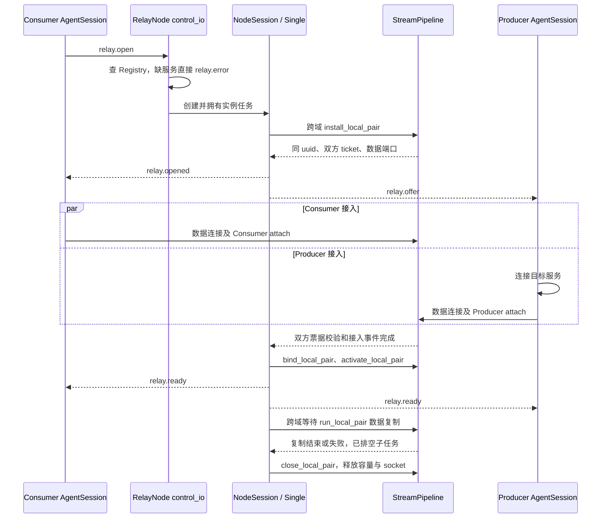

业务建立期限由 control_io 的 Single 控制器持有；数据 listener 对尚未解析出合法 attach 的 socket
另有 setup 期限和 max_setup_connections 限制。前者约束已创建业务，后者约束未识别接入。
attach 顺序不限，无效票据或重复角色只拒绝该 socket；Agent 收到 ready 后才开始传输。
建立失败通知请求方 relay.error 和已获 offer 的服务方 relay.closed，双方立即结束 ready 等待；
单节点活动 TCP/TLS 仍通过 socket 结束。
多节点流程由 Multi 协调首末，见 5.1；正常 FIN 排空和 peer.finished 保留。

### 10.3 DatagramHeader 与 UDP 路由流程

UDP attach 完成后，公网数据报格式为：

```text
[session_id: 8 字节大端序][用户 payload: 0..65499 字节]
```

单节点双方获得不同非零 session_id 和 ticket，uuid 相同；多节点首末各有本地端点。
DatagramMgr 的 bindings_ 将 session_id 关联到 uuid 和方向，再查本地配对或端点并验证已固定的来源。
ready 前 payload、未知 session、短报文、错来源和超长报文丢弃；不缓存，也不替换已绑定来源。
单节点改写对端 session 头并转发，多节点剥离本地头送入 NodeFlow，返回时写回本地头。
单节点保留原载荷范围，多节点上限 4096 字节，无分片。

服务离线时只有 Agent 本地 forward。Node 收到无服务的 open 立即返回 unavailable，
不创建 waiting Relay、timer、binding 或 Flow。注册服务不接管旧请求；新的业务必须重新选路及申请。
服务存在时 Single 的 udp.setup_timeout_ms 限制从业务创建到双方 attach、绑定和激活，默认 10 秒。
建立完成后无运行期租约；取消、控制失效或 stop 结束业务并清除双方 binding。

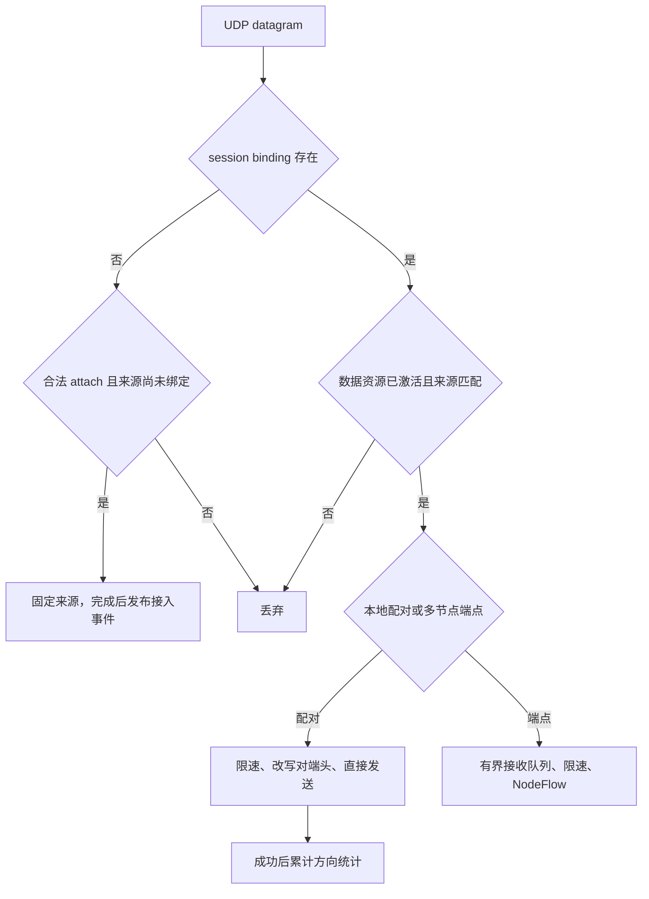

共享 UDP socket 可有不同端点的发送同时等待完成，每次发送都是完整报文，各端点自身保持串行。
单节点接收循环在发送完成前不复用接收缓冲；多节点返回协程持有帧载荷直到发送完成，取消或关闭 socket 后也等待 I/O 完成再释放。
多节点接收队列或限速压力只丢当前报文；移除共享发送队列后，不再存在该队列满时的丢包。
关闭配对/端点后 session 与旧票据立即失效，迟到 attach 不能复活资源。

### 10.4 Node 数据通道固定二进制帧

NodeLink 接入完成后，业务 DATA/FIN/RESET 与 PING/PONG 都使用固定 32 字节 LnkFrameHeader。
整数以大端逐字段编码，不传输 C++ struct 内存布局；没有 JSON/CBOR 业务载荷封装。

| 偏移 | 字节数 | 字段 |
|---|---|---|
| 0 | 1 | magic = 0x4e |
| 1 | 1 | version = 1 |
| 2 | 1 | DATA=1、FIN=2、RESET=3、PING=4、PONG=5、ATTACH=7、ATTACHED=8；6 未使用 |
| 3 | 1 | bit0 为 reverse，其余位为零 |
| 4 | 4 | body_length |
| 8 | 8 | 非零 master epoch |
| 16 | 8 | 非零 flow_id；接入与保活帧为零 |
| 24 | 8 | PING/PONG 非零 sequence；其他帧为零 |

DATA 为 0..4096 字节原始载荷，FIN 无帧体，RESET 为最多 512 字节原因。PING/PONG 无帧体。
这是当前 Node 协议上限，由 LnkFrameHeader::maximum_payload 定义；Agent 与本地 UDP 的大接收缓冲仍保留，
后续提高 Node 协议上限需要同步修改编解码、队列预算、接入校验和协议测试。

TCP 的首帧 attach/attached 继续采用 WireMessage/CBOR 并校验 data_version=1，之后只接受 Node 二进制帧。
TCP socket 已绑定相邻 Link 身份，后续帧不重复发送 Node 字符串和凭据。
UDP 每包为 8 字节相邻 NodeLink ID + 32 字节头 + 帧体，精确验证报文长度、epoch 和固定 source endpoint；
只有 ATTACH/ATTACHED 的帧体是 WireMessage/CBOR。Agent→Node 的 UDP 接入同样只有 attach 需要控制解码，
正常 session 报文仅解码二进制头。

本地 FlowFrame 注入和每跳网络解码各验证一次格式；内部 Frame 分派及编码直接使用已校验字段。
普通逻辑流错误只关闭本 Flow，畸形物理帧或真实 Link I/O 失败才关闭物理通道。来源、epoch、方向、预期入边
和 FIN 状态校验是业务隔离边界，不能因内部转发优化删除。
已删除诊断 DATA 类型及直接发帧的测试专用接口，测试序号属于测试 payload。

## 11. TCP、TLS 与 UDP 传输实现

`xfr_channel` 是 Agent 和 Node 共用的数据复制模块。它接收已经完成连接、握手和 attach 的 socket，
负责双向复制、限速、流量计数和关闭传播。调用方仍拥有 socket，并负责 Relay 索引和控制消息生命周期。

| 协议 | 公网数据保护 | 转发对象 | 限速行为 | 关闭特点 |
|---|---|---|---|---|
| `tcp` | 明文，attach ticket 鉴权 | TCP byte stream | 等待令牌，形成背压 | 支持 TCP 半关闭排空 |
| `tls` | client 到 server 的 mTLS；server 可见明文 | TLS 解密后的 byte stream | 等待令牌，形成背压 | 任一方向结束后整体关闭 |
| `udp` | 明文，`session_id` 路由 | 完整 datagram | 令牌不足时整包丢弃 | 随控制会话或显式取消释放 |

### 11.1 XfrChannel 复制入口

| 函数 | 使用模块 | 两端类型 | 责任 |
|---|---|---|---|
| `relay_tcp()` | AgentSession、StreamPipeline | TCP ↔ TCP | 双向复制、等待式限速、流量计数和半关闭 |
| `relay_tls(TCP, TLS)` | AgentSession | 本地 TCP ↔ 公网 TLS | 本地明文与数据 TLS stream 双向复制 |
| `relay_tls(TLS, TLS)` | StreamPipeline | Producer TLS ↔ Consumer TLS | 解密后的 payload 复制、限速和流量计数 |
| `relay_udp_connected()` | AgentSession | 本地 UDP ↔ 公网 UDP | 增删 session header，并在两个 connected socket 间逐包转发 |

流式函数内部同时运行两个复制方向。任一方向发生致命错误时取消配对方向；正常 EOF 按对应 transport 的
关闭规则收敛（`relay_tcp()` 的异常退出待修正，见下一节）。UDP Node 的逐包路由由 DatagramMgr 直接实现，
`relay_udp_connected()` 只用于 Agent 本地目标与 Node session 之间的转换。

### 11.2 TCP Pipeline

双方和服务器都运行两个异步复制方向。每个方向使用 64 KiB 缓冲区，一次读取后等待对应写入完成，再开始下一次读取，因此不会建立无限增长的用户态缓存。

普通 EOF 使用半关闭：A 读到 EOF 后只对 B 执行 `shutdown(send)`，B 到 A 的方向继续运行并排空。两个方向都结束后再关闭 socket。显式取消由调用方清理双方。

待修正（本轮只记录）：`transfer_tcp()` 当前把读写错误记录后正常返回，`relay_tcp()` 的 `&&` 因而可能继续
等待另一个仍阻塞读取的方向，例如单侧 RST、对向空闲。后续应让真实 I/O 错误传播，并复用现有
`await_transfers()` 取消、排空另一方向，同时保留正常 EOF 后的半关闭与回传；需以真实 socket 验证该场景。
TLS 的整体退出策略独立审核，不直接套用 TCP 半关闭规则。

RemotePair 的两个复制方向分别持有一个可复用定时器，启动时选择该方向的令牌桶；每块数据同步预留令牌，
仅在需要等待时执行 async_wait，不再逐块调用限速子协程或重新创建定时器。

### 11.3 TLS Pipeline

TLS 的复制同样按应用明文字节背压和统计。加密在 RelayAgent 与 RelayNode 之间终止，服务器能看到业务 payload，因此它不是两个客户端之间的端到端加密。需要防止服务器读取内容时，应在业务层继续使用 SSH、HTTPS 等端到端协议。

单节点 relay_tls 任一方向 EOF 或错误后取消另一方向，排空并发 read/write 后由数据所有者关闭 socket。
多节点 Agent↔Node 的 TLS 接入使用 relay_halfclose，首末桥接通过 Flow FIN 保留业务双向排空，见 5.8。
控制连接的 TLS shutdown 则由 TLSChannel 自己完成，不与数据复制的结束策略混用。

### 11.4 UDP Datagram

Consumer 在路由可用后主动打开 UDP Relay，不等待首个本地报文。双方各自创建 connected UDP transfer socket，发送 attach，收到 ready 后转发。

Agent 服务方的 relay_udp_connected 使用现有 await_transfers 拥有两个方向。单侧 socket I/O 失败抛出原始异常，
取消并排空对向；message_size 仍只丢弃当前包，不把正常超长报文升级为会话失败。调用方主动取消已经记录 reason，
关闭 socket 产生的异常不会覆盖首次中止原因。实际发送长度也校验，避免截断报文被当作成功。

DatagramMgr 逐包完成接收、路由、校验、头部改写和发送。限速只计算 session header 后的用户 payload，令牌不足直接丢弃整包。服务等待只在 Agent 本地进行；Node 的 `udp.setup_timeout_ms` 限制实际接入，ready 后不再计时。

### 11.5 数据热路径、内存与协程开销

| 路径 | 每包/每块执行过程 | 内存及调度边界 |
|---|---|---|
| Agent UDP 请求方 | listener 接收 → 取得当前 session → ready/原因/长度检查 → 二进制头和 payload 两个 buffer 发送 | 不查 relays_、不读 JSON、不逐包 co_spawn；跨发送等待保留一次 shared_ptr，防止 socket 被销毁 |
| Agent UDP 返回方 | session 长期接收循环 → 校验缓存头 → 发往 forward 当前 local_peer | 复用大接收缓冲，发送完成后再复用；无逐包发送对象 |
| Node 单节点 UDP | 共享 socket 接收 → bindings_ 与 LocalPair 索引 → source/激活/令牌检查 → 原地改头并直接发送 | 复用收到的完整报文；没有逐包协程、共享发送队列或 payload 副本 |
| Node 多节点 UDP 入 Flow | listener 校验 RemotePair → 有界 received 队列 → 一个长期 read_remote_pair → Flow 入队 | 为队列拥有载荷复制为 BytesBuf，跨数据域再复制到池；队列满丢包，不增加 detached 任务 |
| Node 多节点 UDP 回 Agent | 一个长期 write_remote_pair → receive_flow → 缓存 session 头与 payload 分散发送 | 每个端点串行；socket 可承载不同端点的发送，帧存活到该次发送完成 |
| Node TCP/TLS 首末 | read_remote_pair 读当前缓冲 → 令牌不足才等待 → 借用缓冲提交 Flow；反向循环取帧写 socket | DATA 提交省去中间 vector；数据域完成池内复制和入队后才回复，之后复用读缓冲 |
| Node 中间转发 | 固定头解码 → 查 Flow/方向/入边 → Frame 移到出边队列 → 长期物理写循环 | typed 字段取代 JSON，PooledBuffer 移动和切片不复制载荷；每跳不启动业务协程 |

LnkChannel 内部 Frame 只包含头和独占可移动的 PooledBuffer。存储来自 cluster_data_io 中的
unsynchronized_pool_resource；不增加 strand 或锁。TCP 直接读入池缓冲；UDP 直接接收后剥离头部视图，
再转交下一个队列。缓冲保存原始地址、大小及 span 视图，移动或切片不改变原始释放地址。
空载荷不分配字节块，新字节不做无用的初始化写入。

PMR 池及所有缓冲只在数据 executor 上访问和释放；池声明早于持有缓冲的队列，析构顺序保证缓冲先释放。
receive_flow 的跨域异步操作在数据域更新队列计费、把结果复制为公开 FlowFrame 的 vector/string，并归还池块，
再把完成结果送回 transfer executor。它比 receive_event 复杂的原因是数据域内存和计费的所属约束，
不能直接用跨线程 channel 传出池化载荷。取消接收唤醒该 Flow 的等待者，最终关闭仍由业务所有者执行。

UDP 物理写队列只保存 Frame 和 link_id。出队时按 ID/epoch 查目标，复制 endpoint 后跨越发送等待，
不保留表迭代器或 NodeLink 引用；发送失败重新查身份再关闭。关闭过程中已排队旧帧不会创建新 Link 或 Flow。
发送使用固定头与载荷的 scatter/gather buffers，不额外拼接完整帧副本。

剩余开销主要是 socket I/O、Asio 异步操作及完成投递、查表、队列拥有载荷的分配/复制、公开 FlowFrame 接收复制、
跨等待的 shared_ptr 保活、TLS 加解密和首末统计。PMR 可复用上游块，但不保证零动态分配；
功能回归不能用于宣称确定的吞吐或功耗提升。当前未执行跨机器吞吐和能耗基准。

### 11.6 协程启动与保留理由

| 协程链 | 启动频率 | 原因 |
|---|---|---|
| RelayAgent discovery / NodeConnection | 每个 Agent / 每个实际入口连接一次 | 长期发现、连接接收及重连；由 Agent 计数排空 |
| Forwarder listener / retry / AgentSession | 每个监听 / 每次建立失败 / 每次业务 | listener 长期运行，retry 独立退避，Session 独占业务 I/O |
| AgentSession select_relay | 每个新业务一次 | 跨到控制域访问拓扑、位置和共享连接，完成后回到 transfer_io |
| RelayNode control accept / ControlSession | 每个 Node / 每条控制连接一次 | 接入和独立会话生命周期 |
| StreamPipeline accept / setup | 每个 TCP/TLS 监听 / 每个接入 socket 一次 | setup 做 TLS 和 attach，之后 stream 移交配对，不另启复制任务 |
| NodeSession run / wait_attach / bridge | 每次业务 / 接入阶段 / 复制阶段 | 控制任务拥有真实数据等待并排空；同步数据操作不 co_spawn |
| Multi 建立转发 + Flow 监视 | 每个多节点首末实例一组 | 业务和 Flow 失效并行，任一退出后排空另一任务 |
| RemotePair 双向循环 | 每个业务启动一次 | 每帧直接等待现有异步发送/接收，无逐帧 co_spawn |
| NodeLinkMgr receive_events | 每个 manager 一次 | concurrent_channel 绑定 control_io，跨域事件直接收发 |
| ensure_link 并行边任务 | 每次 Flow 建立、每条相邻边 | 并行准备并复用共享 Link，避免串行累计建立延迟 |
| LnkChannel accept / UDP read/write / monitor | 每个 channel 一组 | 共享 I/O、最近期限和停止排空 |
| LnkChannel TCP read/write | 每条 TCP Link 一组 | 保持唯一读写链及有界队列顺序 |
| TLSChannel run 及读/写/心跳 | 每条控制连接一组 | 结构化并行关闭；关闭信号本身是原生接收操作 |

为某次真正等待附加超时的 co_spawn 保留，如 open_flow 的建立预算、远端 Flow 结果和关闭确认。
已经在所属执行器运行的内部调用直接 co_await；返回现有 awaitable 的函数无需另外形成协程帧。
限速先在循环中 try_consume，足额或未限速时不进入等待；不足才预约令牌并等待长期循环中的 timer。

## 12. 容量、超时与背压模块

### 12.1 DualIndexMap 状态索引

`DualIndexMap<PrimaryKey, SecondaryKey, Value>` 为控制面和 Forwarder 提供一份值、两条查找路径。主键始终
唯一，次键可配置为唯一或非唯一，并可在对象生命周期的 pending 阶段安装或清除。主要使用关系为：

| 使用者 | 主键 | 次键 | 用途 |
|---|---|---|---|
| RelayAgent `connections_` | connection ID | `node_id` | 强持有连接，按内部连接或已识别节点复用，任务完成后删除 |
| RelayAgent `service_locations_` | `(service, protocol)` | 目的 Node ID | 保存服务位置及发现请求，独立于控制连接 |
| RegistryMgr `services_` | `(service, protocol)` | `session_id` | 服务查询，并在控制会话断开时批量注销 |

唯一次键查询使用 `find_secondary()` 返回值指针。容器中的 Node 独立分配，rehash 只重建 bucket
链，因此 Value 地址在 erase 前保持稳定；erase 和 `clear()` 同步解除两条索引。每个实例由所属 executor
串行访问，容器本身不承担跨线程同步。

### 12.2 Relay 标识、流量统计与令牌桶

Node 的 TCP、TLS 和 UDP manager 共享线程安全的 `RelayIdAllocator`。分配器记录活动 ID，并在释放后允许
编号复用；三类 manager 因而可以用统一的非零 `uuid` 命名空间处理控制消息。

RegistryMgr 为每项服务创建共享 `ServiceTraffic`。Relay 只保留该统计对象的共享引用，服务注销与正在结束
的 Relay 可以安全交错。`TrafficCounter` 使用原子饱和累加，周期采样把区间字节数换算为速率并计算 EMA。
RX 固定表示 Producer 到 Consumer，TX 表示 Consumer 到 Producer。

`TokenBucket` 按方向独立配置。TCP/TLS 在读到 payload 后等待预约时刻再写入，背压沿 socket 传播；UDP
使用 `try_consume()` 判定整包发送，令牌不足时丢弃该 payload。统计只在成功写入对端后累计。

### 12.3 容量与超时配置

| 配置 | 作用范围 |
|---|---|
| `control.max_connections` | 普通控制会话上限；同时作为 master 集群连接的独立上限 |
| `control.max_services` | 本节点全部注册服务上限 |
| `control.max_services_per_session` | 一条普通控制连接可注册的服务上限 |
| `tcp/tls.max_setup_connections` | 正在读取 attach 的未归属 TCP/TLS socket 上限 |
| `tcp/tls/udp.max_relays` | 对应 manager 的等待和活动 Relay 上限 |
| `tcp/tls.setup_timeout_ms` | 从创建/接受到合法 attach 完成的时间限制 |
| `udp.setup_timeout_ms` | 单节点 UDP 从创建到双方接入、绑定和激活的建立期限；默认 10000 毫秒，不限制运行期 |
| `channel.max_queued_messages` | 单条 TLSChannel 的发送队列、ClusterMgr 出站消息队列和 RelayNode 对外集群消息队列容量 |
| `relay.open_timeout_ms` | Agent 本端 TCP/TLS/UDP 的建立超时；请求方从入口选择前、服务方从收到 offer 开始计时，不传递给其他端；不限制运行期 |
| `server.connect_timeout_ms` | RelayAgent 的解析/连接和数据连接超时 |

TCP/TLS 的 `rx/tx_bytes_per_second` 为 0 时不限制；非零时配合对应 burst 值使用等待式令牌桶。UDP 使用同样方向定义，但无法对 datagram 做部分等待，令牌不足就丢包。

TLSChannel 的发送队列满时拒绝本帧、记录原因并直接关闭通道；编码失败、底层 TLS 写失败或业务接收队列满也进入同一关闭边界。系统没有可靠消息队列，不重试单条控制消息，也不会把 `send()` 调用当成成功确认。

### 12.4 Node 共享数据面容量

| 状态或队列 | 当前上限 | 超限处理 |
|---|---|---|
| Link 申请 / 端点授权 | 各 1000 条 | 拒绝新申请 |
| master 活动及关闭中 Flow | 合计 1000 条 | 拒绝新事务 |
| LnkChannel Flow + retired_ | 合计 1000 条 | 拒绝 prepare，避免关闭身份无界增长 |
| 每 Flow 终点接收队列 | 16 帧 | 关闭拥塞 Flow，保留物理 Link |
| 全 channel 终点缓存 | 8 MiB | 按原分配大小 + 每帧 128 字节计费，超限关闭本 Flow |
| 每 TCP Link / 共享 UDP 发送队列 | 100 项；其中业务最多 96 项 | 为保活留 4 项；业务超限使本 Flow 失败 |
| LnkChannel 控制事件 | 4096 条 | 记录溢出并关闭事件队列，接收任务使本地协调失效并排空通道 |
| DatagramMgr 每 RemotePair 入站队列 | 16 包 | 丢弃本包 |
| Node 数据 TCP 握手接入 | 100 个 | 拒绝新 socket |

FlowSendStatus 区分 Queued、CapacityExceeded、Closed、Invalid。Queued 仅表示本地准入成功，
不表示 socket 写完或终点已消费；CapacityExceeded 表示未入队且本 Flow 已关闭，调用方不能原帧重试。
共享队列有界不等于公平调度或信用流控；慢 Flow 仍可能影响同 Link 的延迟。
PMR 会缓存上游分配块，8 MiB 是终点队列计费预算，并非整个进程或整个池的内存硬上限。

## 13. 故障与恢复流程

| 故障 | 当前行为 |
|---|---|
| RelayAgent 初始服务器不可达 | primary 按配置指数退避重连；连接恢复后注册和发现服务 |
| 某个附加服务器断线 | 只结束使用该入口的 AgentSession；其他节点继续工作 |
| 服务尚未发现 | 每 5 秒经 primary 查询；TCP/TLS 新本地连接直接关闭 |
| 服务从节点 A 迁移到 B | A 返回 unavailable/mismatch 后清路由并重新发现 B |
| master 集群端口断线 | slave 每 5 秒重连；各节点已有控制会话和 Relay 继续运行 |
| 重复 `node_id` 或保留值 `all` | master 返回 `cluster.error`，拒绝加入 |
| 普通客户端控制连接断开 | 注销该会话服务，取消相关 Relay |
| 数据一侧未按时 attach | setup timer 清理 Relay 和已到达的一侧 |
| 业务消息发送后断线 | 不保存、不补发、不自动重试；由协议响应和业务超时判断 |
| RelayNode/RelayAgent 停止 | 取消监听、解析、连接、timer 和 Relay，等待所属协程退出 |

系统不包含 master 选举、备用 master、全局服务目录同步、历史消息或恰好一次投递保证。
Agent 业务通过首末端点接入显式 Node 路径；已有业务保持建路时的路径，不做存量换路。

## 14. 安全边界

- control 和 cluster 通道强制 mTLS；TLS 数据通道也强制 mTLS；
- TCP、UDP 数据 payload 在公网为明文；
- ticket 把数据连接绑定到具体 Relay 和 role，但不替代 TLS 身份认证；
- UDP `session_id` 和固定来源 endpoint 只能阻止简单误路由，不能抵御能监听并伪造同源报文的攻击者；
- 共享客户端证书只证明连接方属于受信任客户端集合，不提供单客户端身份、服务所有者身份或细粒度 ACL；
- 集群成员身份信任 Server CA，`node_id` 是协议声明，不与证书主题绑定；
- `server.load`、`server.traffic`、`server.cluster` 等控制查询对所有通过普通客户端 mTLS 的连接可用。

证书角色、信任根、SAN 和私钥保护措施见 [证书制作与部署](证书制作与部署.md)。

## 15. 生命周期与所有权

实现遵循以下原则：

1. executor 拥有状态，跨域只投递消息；
2. 只被单个协程使用的资源放在协程帧内；需要 stop、查表或独立异步操作访问的资源由对象拥有；
3. 所有者明确持有资源，观察者使用引用或 weak_ptr；NodeConnection 的连接池与 LnkChannel 的表是实际所有者；
4. `shared_ptr` 只在异步操作确实需要对象存活时按值跨越 `co_await`；
5. session 的退出负责从 room/registry 移除自身，manager 不额外延长其生命周期；
6. 需要对外提供完成语义的 stop 等待结构化协程结束；StreamPipeline 内部 detached 任务则只在执行期间
   自持对象，取消或超时后自然释放，不另建一套任务状态机。

这些约束让“连接是否仍存在”由实际异步对象生命周期表达，减少重复状态、回调链和悬空引用。

### 15.1 RelayNode 停止流程

`RelayNode::stop()` 是同步收敛接口，由 `control_io`、`transfer_tcp_io`、`transfer_udp_io`、`cluster_data_io` 之外的线程调用。
它通过一次性状态保护执行以下流程：

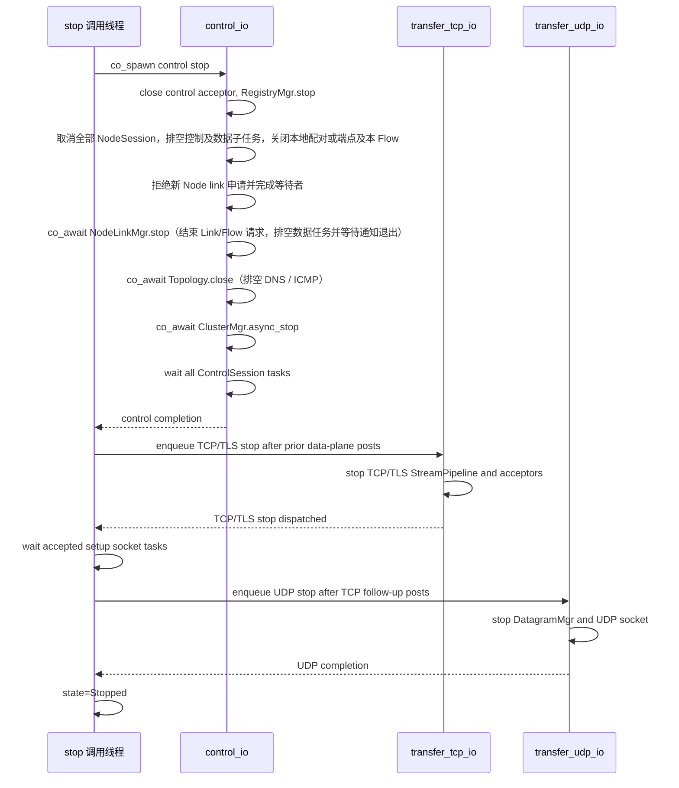

Node 先取消并排空所有单节点及多节点 NodeSession；该过程仍需 NodeLinkMgr 和集群控制处理关闭确认及失效通知。
随后共享数据任务在独立 cluster_data_io 中取消并等待退出，再关闭集群控制连接；最后主程序 join 数据线程。其余三个停止阶段分别由对应 executor 执行，外部同步 `stop()` 通过 `use_future` 逐阶段等待。control 侧先让
Registry 停止接受新状态并断开现有普通会话，等待 ClusterMgr 和全部 ControlSession 结束，确保
RelayNode 的控制命令不会再创建新业务。业务复制子任务已由实例排空，随后各数据 manager 关闭监听。
ClusterMgr 首先把自身置为非运行状态，再取消 master accept/slave connect、关闭出站消息队列和全部成员
session 并等待退出。ClusterMgr 不维护额外的业务收件箱；停止返回后不再调用 RelayNode。

TCP/TLS accept 后、首帧解析前的 socket 由各 StreamPipeline 的独立 setup 协程暂时持有，不能只关闭
acceptor 就假定它们消失。每个实例自己的 `pending_sockets_` 记录这部分协程；TCP/TLS 停止阶段在进入
UDP 停止前使用原子 wait 等待它们归零。accept/setup 协程按值捕获 Pipeline 的 shared_ptr，
业务复制由 NodeSession 的控制任务跨域拥有并排空，不再由 manager detached 启动。

### 15.2 RelayAgent 停止流程

`RelayAgent::async_stop()` 是唯一的公开停止接口，调用方必须保证它完成后才销毁 Agent 或结束 executor。
一般调用方直接等待该 awaitable；Agent 进程的信号回调则在 `control_io` 上 detached 启动它，避免阻塞
`signal_io` 线程，随后由 `main()` join control/transfer 线程间接等待停止收敛。`main()` 持有的 Agent
`shared_ptr` 在 join 完成前保持有效。重复调用在 `StoppingControl` 或 `StoppingForwarder` 状态等待同一个完成
信号，在 `Stopped` 状态立即返回。尚未启动的 Agent 也走完整停止路径，以释放已构造 Forwarder 持有的
transfer work guard。
停止顺序固定为：

1. control executor 把 Agent 切换为 `StoppingControl`，取消 discovery timer、停止 AgentRouting 探测，并停止所有 NodeConnection；
2. NodeConnection 取消其拥有的 resolver/socket/retry timer，并要求当前 TLSChannel 断开；
3. discovery 协程等待 `AgentRouting::close()` 排空 DNS / ICMP；discovery 和连接协程共用任务启动、计数回滚与 completion handler，递减 control `active_tasks`；
4. control `active_tasks==0` 后，把 Agent 切换为 `StoppingForwarder`，并向 transfer executor 队列尾部启动
   `Forwarder::async_stop()`；
5. Forwarder 切换为 `Stopping`，关闭本地 acceptor 和 UDP socket，取消重试等待和全部 AgentSession；
   接受新业务及安排重试的入口在非 Running 状态拒绝新工作；
6. 监听、业务和重试任务的 completion handler 递减 transfer `active_tasks`；归零后释放
   transfer work guard、切换为 `Stopped`，通过一次性 `stopped_event`（AsyncEvent）唤醒全部停止等待者；
7. control executor 清空连接池和 service routes，把 Agent 切换为 `Stopped`，通过一次性 `stopped_event`（AsyncEvent）唤醒所有停止等待者。

RelayAgent 不靠固定延迟等待关闭。control 任务先完全退出，保证不会再产生新的 transfer 投递，然后才在
transfer 队列尾部关闭 Forwarder；两个 executor 的实际协程计数决定停止完成时刻。

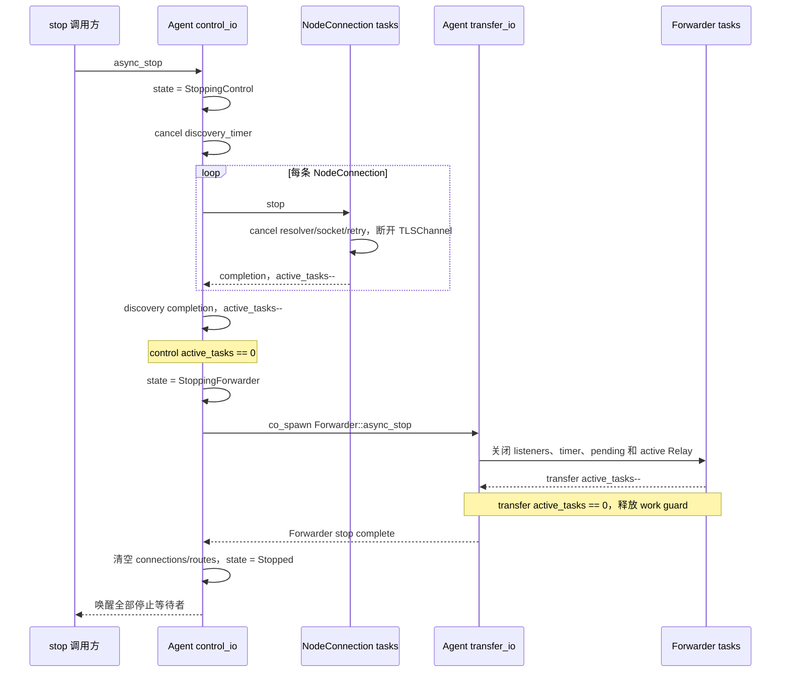

### 15.3 对象所有权关系

| 对象 | 主要所有者 | 对外引用方式 | 结束条件 |
|---|---|---|---|
| RelayNode / RelayAgent | `main()` 的 `shared_ptr` 和必要 completion | 按值跨越顶层异步任务 | stop 完成且线程退出 |
| ClusterMgr | RelayNode 的 `shared_ptr` 成员 | 非拥有的 `RelayNode&` 反向引用 | `async_stop()` 已等待主循环和成员会话退出 |
| RegistryMgr | RelayNode 的直接成员 | 会话使用 weak 引用，两类控制入口借用同一注册表 | Registry 停止并清理会话后销毁 |
| ControlRouterSingle | NodeSession 的 variant 成员 | 只推进本地双方业务协调，无全局查表或数据 I/O | 随实例任务排空后销毁 |
| NodeSession / ControlRouterMulti | RelayNode 的唯一业务容器及实例任务；实例直接拥有控制器和本地数据句柄 | 借用 NodeLinkMgr、ClusterMgr 和共享数据 manager | 取消并排空数据任务与 Flow 监视，再释放本地资源及本 Flow；不关闭共享 NodeLink |
| StreamPipeline / DatagramMgr | RelayNode 的 shared_ptr 成员，监听任务按需自持 | NodeSession 跨域操作本地配对或端点，无 Agent 控制引用 | 业务由实例排空，stop 关闭监听和剩余数据资源 |
| NodeLinkMgr / LnkChannel | RelayNode 直接拥有管理器；管理器持有通道 | 控制参数按值跨域；数据任务 completion 保留通道 | 停止申请、清空表并等待数据任务和通知任务退出；接收等待者收尾后释放通道 |
| lnk::NodeLink | LnkChannel 的 links_ 表及运行中的解析、连接、读写协程 | 同步函数借用 const shared_ptr&；协程按值持有 | close 置 Closed、取消 I/O 并删除表项，最后一个异步持有者退出后销毁 |
| lnk::NodeFlow | LnkChannel 的 flows_ 表及挂起的 receive_flow 异步操作 | 同步函数借用 const shared_ptr&；接收完成回调保留副本 | 关闭队列并删除表项后，等待接收者收尾；retired_ 只保存 ID/期限，不拥有 Flow |
| TLSChannel | 自己的 run 协程和当前连接协程 | manager/route 使用 `weak_ptr` | 任一读写、心跳、关闭分支结束 |
| ControlSession | 当前 session 协程 | Registry 和 Relay 使用 weak 引用 | 接收循环结束并完成 disconnect |
| ClusterRoom | master accept_loop 协程栈 | ClusterSession 保存引用，且必须先于 room 退出 | accept/delivery 停止并等待 participant 清空 |
| ClusterMgr::Connector | slave_loop 协程栈 | ClusterMgr 仅存停止用临时指针 | running=false 且当前操作取消 |
| NodeConnection | RelayAgent::connections_ 强持有；primary 始终保留 | EntryWait / 请求方 AgentSession 保存同一普通 shared_ptr，后台 run 只借用 | 附加连接连续空闲 60 秒或 Agent stop 时停止，run 完成后移出池，最后引用释放时销毁 |
| NodeConnection Operations | NodeConnection 的 `optional` 成员在 run 期间原位拥有 | stop 直接访问同 executor 上的拥有型状态 | 连接循环退出时 scope guard 清空 |
| Topology / AgentRouting | RelayNode / RelayAgent 直接拥有 | 同一 control executor 内调用 | close 已排空刷新与探测任务 |
| ProbeSet / ICMP Session | Topology 或 AgentRouting / ProbeSet 中的 ICMP 实例 | 按值读取评估结果；历史只复制 ProbeState | close 等待 DNS、探测和接收协程退出 |
| Node 本地配对 / 端点 | 对应数据 manager 的表及运行数据协程 | NodeSession 保存不透明数据句柄；数据侧无控制会话引用 | 控制器排空数据任务后 close，或 manager stop |
| AgentSession | Forwarder::relays_、运行协程与 UDP forward 的当前强引用；UDP 发送期间临时保活 | 反向引用 Forwarder、可选 forward ID；请求方持有入口连接共享句柄 | 建立失败、数据结束、控制失效或 stop，清理后释放入口句柄并解除 forward 的强引用 |
| RelayAgent DatagramForward | datagram_forwards_ 按值拥有 | 稳定 ID 定位；本地来源、当前会话强引用和重试归 forward | 当前会话引用由会话清理解除；forward 在 Forwarder 销毁时释放 |

ClusterMgr::Connector 仍使用同一 executor 上的非拥有临时指针执行取消，并在栈对象退出前清空；
NodeConnection 已不再保存指向协程栈的裸指针。这样既不悬空引用，也不无条件延长短生命周期异步对象。

Node 的控制协程持有 ControlSession，断开时按 session ID 删除注册记录和对应服务；启动协程失败时也按 ID 回滚。
RegistryMgr 不在接入或删除时扫描全部 weak 引用。数据 manager 关闭配对或端点时先从表中移除，
再通知仍持有该对象的等待者；表内同步操作只需验证接入或激活条件，跨异步等待的代码仍检查关闭状态。
NodeSession 的 install/bind/activate/close 同步数据操作通过投递及完成回调跨域，不启动子协程；
wait_attach 和 bridge 保留真正等待的 co_spawn，接入截止时间直接附加在数据侧等待上，不再在控制侧套一层。
LnkChannel 的控制通知使用绑定 control_io 的 concurrent_channel，数据侧直接发送、控制侧直接等待，由 Asio 处理线程安全、取消及完成调度，不逐通知 co_spawn；队列超限用原子标记传递，receive_event 仅保活、等待并检查错误。
TLSChannel 的 disconnect 只请求关闭，连接所有者在原有运行协程中等待排空；关闭信号直接参与并行等待，
不单独启动等待关闭信号的协程。ProbeSet/ICMP 内部已绑定执行器的协程不再重复 dispatch。
Node 同步 stop 通过 post
投递数据 manager 的同步关闭，并使用 future.get() 等待结果，再等待尚未完成的 TCP/TLS 接入任务，
无需为同步关闭启动协程，也无需先对同一个 future 调用 wait()。

### 15.4 取消、唤醒与排空的边界

AgentSession 使用 reason 与自己的 I/O 关闭表达中止；没有业务取消信号。入口等待由 control_io 的
EntryWait、连接和期限管理。changed timer 保留为已有状态变化的唤醒机制，不在本次整理中更换。
EntryWait 由 entry_waits_ 和 select_relay 共同持有，scope guard 删除索引，普通 shared_ptr 自动释放入口连接引用。

NodeSession 的 Single/Multi cancel 会发送真实 cancellation_signal，打断正在等待的 attach、桥接或并行子任务。
Multi 的 parallel group 也会取消未完成的子任务。控制器只在 run 的统一清理入口屏蔽一次取消，保证同步投递的
资源关闭和 Flow 清理仍能完成；不在每个内部函数重复 reset_cancellation_state。
LnkChannel 停止先清表、关闭队列和 socket，再等待所有数据任务退出；池和通道不能在排空前销毁。

AsyncEvent 用于一次性的多等待者完成通知，提前 notify 不丢失，单个等待者取消不取消整个对象。
可重复变化的 changed/done timer 与一次性完成事件职责不同；不把所有 timer 都替换成同一种队列。
concurrent_channel 用于跨执行器 Link/Flow 通知，普通 channel 用于单执行器的帧队列和结果交付。
这些机制分别满足状态唤醒、广播完成和有界消息传输，不增加应用层回调注册或额外包装协程。

NodeConnection 在解析、连接、TLS、节点识别恢复时检查 running。停止后的恢复统一进入连接收尾，
清除弱通道引用并等待 TLSChannel::async_disconnect 后才让任务完成；不能直接 break 绕过通道排空。
后台 run 只借用连接，连接池必须持有它直到 completion，随后移除表项；这是池强所有权的实际用途。

### 15.5 冗余审查与测试边界

沿配置启动 → 注册/发现 → 选路与建连 → 接入/激活 → 数据转发 → 失败/停止审查生产调用关系：

- RelayNode 公开入口仅保留构造、start、stop；没有通用集群收件箱、LinkStatus、测试专用 Link/Flow 包装。
- 生产类不声明测试友元；需要检查私有状态的访问夹具完全位于 test/，不改变生产类型定义或所有权。
- Registry 注册不返回无人使用的统计引用，统计对象从服务查询取得；transport 不保留无人读取的协议常量。
- 服务位置与连接池分离，只有新业务取得实际入口；附加入口断开不触发重复服务查询。
- Session 退出从唯一业务容器删除；clear_service 仅标记受影响实例中止，实际协程收尾删除表项，避免挂起 I/O 悬空。
- LocalPair 与 RemotePair 是并列资源，共用容量预算；数据域不保留旧的服务等待、控制器或业务请求状态。
- 同步数据操作不形成子协程，逐包发送和逐帧 Flow 接收不 co_spawn；限速足额时直接继续复制。
- 重复身份、来源和跨等待后的存活检查仍承担实际业务边界，按值跨 co_await 的资源引用用于安全排空。
- UDP 服务方双向复制在单侧 I/O 失败时传播原异常并排空对向，避免一侧退出而实例仍挂在业务容器。
- 路由只使用实际测量入口；ICMP 持续运行至关闭，测试自己控制结束时刻，不给生产探测增加有限次数模式。

Dashboard 的 HistoryStore 由应用创建和关闭，采集客户端只使用传入的存储；IP 查询和 UN/LOCODE 下载直接
调用真实函数，测试在测试层 mock，生产构造函数不保留测试注入分支。
未使用的容器扩展接口及独立路由查询已移除；保留实际服务容量、批量删除、拓扑和多目的地选路所需接口。

本审查不把存在的功能差异强行合并：NodeFlow 的控制授权与数据状态、peer 错误位置与本地进度、
本地 EOF 与对端 finished、单次取消与完成通知都不能互相替代。已知暂缓项见 11.2，未实现扩展见 18。

## 16. 构建与验证

Debug 构建和完整测试：

```console
cmake -S . -B build -DCMAKE_BUILD_TYPE=Debug -DBUILD_TESTING=ON
cmake --build build --config Debug --parallel 1
ctest --test-dir build -C Debug --output-on-failure
```

路由模块测试集中在 `test/route/`；Agent 路由组装与 Node 拓扑测试分别保留在
`test/agent_routing_test.cpp` 和 `test/topology_test.cpp`。所有相关 CTest 使用 routing 标签，
普通权限和 ICMP 集成可以分别运行：

```console
ctest --test-dir build -C Debug -L routing -LE icmp --output-on-failure
ctest --test-dir build -C Debug -L icmp --output-on-failure
```

| 测试 | 覆盖范围 | 运行条件 |
|---|---|---|
| `link_quality` | 人工时间、三个半衰期、冷启动、稀疏样本、尖峰、失败/恢复、长期运行及摘要解析 | 无网络需求 |
| `routing` | 有向边、多入口、真实节点预算、同成本、孤立入口，随机小图与穷举对拍 | 无网络需求 |
| `probe_set` | DNS 失败重试、目标 revision、解析取消、重复/并发关闭及取消后排空 | 普通 DNS/socket 权限 |
| `agent_routing` | 请求关联、过期/乱序/非法快照、epoch、质量变化及“来源报告 14 秒旧，再过 2 秒失效” | 不需要原始 socket 权限 |
| `topology` | Node 报告解析、来源与成员校验、三字段质量和完整快照 | 不需要原始 socket 权限 |
| `probe_integration` | 真实 ICMP、共享 IP、DNS 失败不中断正常目标、历史/发送计数保留、目标变化、推荐路径及关闭 | Linux CAP_NET_RAW / Windows 管理员 |

`probe_integration` 仅在原始 socket 权限不足时返回 77，由 CTest 标为跳过；其他初始化或网络错误必须失败。
人工质量用例验证推荐路径随成本变化；真实测量需在具备上述权限的环境验证，跳过不能替代这部分验收。
`test_icmp` 是手动诊断程序，不注册为 CTest，构建后可运行 `build/test/route/test_icmp 127.0.0.1 4`。
`routing` 生成的图示报告位于 `build/test/route/routing_test_report.html`，测试产物不进入源码或安装包。

主要测试覆盖：

- `tls_channel_mtls`：双向证书、主机名校验、握手失败与通道生命周期；
- `cluster_integration`：ClusterRoom 广播与定向发送、来源、保留/重复 ID、非法命令、成员证书、固定 5 秒重连、无历史回放和停止；
- `node_links`：共享 TCP/UDP、并发复用、握手乱序、单次失败与外层重试、凭据/旧 ID、有效 PONG、epoch/离线、超长 UDP、过期发送项、监听回滚及并发/取消停止；
- `node_flows`、`lnk_channel_flows`、`lnk_flow_receive`：双向及分叉转发、方向/epoch/FIN、RESET 与满队列、容量隔离、准备期限、控制失效、接收者唤醒及停止后公开载荷有效性；
- `lnk_frame`、`pooled_buffer`：固定二进制头和非抛异常的本地帧校验；独占缓冲移动、偏移归还、队列转移及池预热后的上游分配复用；
- `agent_cluster`：两个节点上的服务同时转发、主控在线时从节点恢复、服务迁移、首次目标失败、过期发现响应；
- `relay_protocol`：控制命令枚举映射、自定义命令、三种协议 attach、帧校验、UDP session header
  和限速基础逻辑；
- `relay_integration`：TCP/TLS Relay、ticket/role、半关闭、RelayAgent/RelayNode 完整往返；
- `udp_relay_integration`、`udp_session_routing`：UDP 单侧 I/O 失败排空、attach、路由、endpoint 固定、丢包边界、重建和统计，
  以及离线不分配资源、注册不复活旧请求、半接入超时、过期票据丢弃、ready 后无运行超时和容量恢复；
- `agent_lifecycle`、`agent_reconnect`：重复启动/停止、可等待停止、断线重连取消以及停止后的对象释放。

`benchmark_udp_node` 是独立容量基准，不注册为 CTest。它建立真实 mTLS 控制会话和 UDP Relay，再以原始 UDP socket 测量服务器数据路径。

Dashboard 与部署验证使用 Python 环境中的 Flask、cbor2、Waitress；部署测试仅使用临时目录和 dry-run，
不会修改主机配置或服务。双 Node smoke 启动真实 Node、发布/消费 Agent 与 Dashboard，验证 TCP/TLS、
Slave 入口重启恢复及历史保留；具备 CAP_NET_RAW 时也验证有向质量和推荐路径日志，否则明确跳过相关断言。

```console
python -m unittest discover -s dashboard -p 'test_*.py'
python -m unittest discover -s test -p 'provision_*_test.py'
python -m unittest discover -s test -p 'packaging_test.py'
python test/dashboard_service_smoke.py --build-dir build --two-nodes
```

### 16.1 当前整理的验证范围

2026-10-11 最终整理验证：

| 检查 | 结果 | 证据 |
|---|---|---|
| Debug 全目标构建 | 通过，无编译警告 | build/final-audit-build.log、build/final-audit-udp-build.log |
| 完整 CTest | 29 项通过，1 项原始 ICMP 权限跳过，0 失败；176.38 秒 | build/final-audit-tests.log |
| Dashboard 单元与集成测试 | 46 项通过 | build/final-audit-dashboard-tests.log |
| 文档本地链接与本页章节锚点 | 75 个目标有效 | 对 README、设计、部署及 Dashboard 文档逐项检查 |
| 修改格式 | git diff --check 通过 | 无空白错误 |

新增 UDP 回归使用真实 socket 分别关闭目标侧与 Node 接入侧，确认对向仍在等待时也能排空，原始错误仍向调用方传播。
已有测试覆盖 NodeConnection 停止、重复停止、建立失败、对象释放，以及单/多节点 TCP/TLS/UDP、FIN 排空、
共享 Flow 隔离、服务恢复和路由失效。生产测试接口已删除；集群测试使用真实协议对端，路由测量夹具及私有访问仅在 test/。

验证基于单机 Linux 的 loopback socket 和 mTLS。原始 ICMP 需要 CAP_NET_RAW，本机权限不足而明确跳过；
不将跳过、历史阶段结果或功能测试作为原始 ICMP、跨机器吞吐与功耗验证。此前明确暂缓的 TCP 异常退出项见 11.2。

## 17. 模块源码索引

- [`node/src/main.cpp`](../node/src/main.cpp)：RelayNode 配置入口、TLS context、执行线程和进程信号；
- [`node/src/node_config.cpp`](../node/src/node_config.cpp)：Node 配置解析与字段校验；
- [`node/src/relay_node.cpp`](../node/src/relay_node.cpp)：子系统构造、控制连接接入、执行域协调和停止；
- [`node/src/relay_node_control.cpp`](../node/src/relay_node_control.cpp)：Node 公共控制入口、服务发现和状态报告；
- [`node/src/control_router_single.cpp`](../node/src/control_router_single.cpp)：控制域内的本地双方接入、建立期限、ready、取消和通知；
- [`node/src/control_router_multi.cpp`](../node/src/control_router_multi.cpp)：首末协调、实例内 Flow 监视及清理；
- [`node/src/node_session.cpp`](../node/src/node_session.cpp)：直接拥有 Single/Multi 控制器和本地数据句柄，跨域操作数据 manager；
- [`node/src/relay_node_relays.cpp`](../node/src/relay_node_relays.cpp)：Node 全局业务创建、实例及 peer 分派、取消和停止排空；
- [`node/src/pipeline_mgr.cpp`](../node/src/pipeline_mgr.cpp)：TCP/TLS StreamPipeline 模板、transport policy、Relay 配对和流式转发；
- [`node/src/cluster_mgr.cpp`](../node/src/cluster_mgr.cpp)：ClusterRoom、ClusterSession、slave connector 和集群消息路由；
- [`node/src/nodelink_mgr.cpp`](../node/src/nodelink_mgr.cpp)：共享 NodeLink 建连与复用、NodeFlow 路径准备/提交/关闭及数据通知消费；
- [`node/src/topology.cpp`](../node/src/topology.cpp)：成员探测、报告校验、master 汇总与完整拓扑快照；
- [`node/src/registry_mgr.cpp`](../node/src/registry_mgr.cpp)：控制会话和本机服务注册；
- [`node/src/datagram_mgr.cpp`](../node/src/datagram_mgr.cpp)：UDP Relay、session 路由和 endpoint 校验；
- [`node/src/app_common.cpp`](../node/src/app_common.cpp)：Relay 标识、服务流量采样和共享 Node 数据结构；
- [`agent/src/main.cpp`](../agent/src/main.cpp)：RelayAgent 配置入口、双执行域线程和进程信号；
- [`agent/src/relay_agent.cpp`](../agent/src/relay_agent.cpp)：服务器连接池、节点身份、重连和服务发现；
- [`agent/src/agent_routing.cpp`](../agent/src/agent_routing.cpp)：拓扑组装、入口探测目标及推荐路径计算；
- [`agent/src/forwarder.cpp`](../agent/src/forwarder.cpp)：本地 forward 监听、业务容器和消息分派；
- [`agent/src/agent_session.cpp`](../agent/src/agent_session.cpp)：统一单次 Agent 入口选择、目标连接、TCP/TLS/UDP 接入、复制和清理；
- [`route/src/link_quality.cpp`](../route/src/link_quality.cpp)：三尺度聚合统计、Assessment 与最终边权；
- [`route/src/probe_set.cpp`](../route/src/probe_set.cpp)：DNS、身份映射、ICMP 管理与内存历史；
- [`route/src/icmp.cpp`](../route/src/icmp.cpp)：共享原始 IPv4 socket、探测/接收协程及安全关闭；
- [`route/src/route_graph.cpp`](../route/src/route_graph.cpp)：纯成本图和按真实节点数量分层的多入口搜索；
- [`protocol/src/tls_channel.cpp`](../protocol/src/tls_channel.cpp)：mTLS 握手、收发队列、心跳和通道关闭；
- [`protocol/inc/lnk_channel.h`](../protocol/inc/lnk_channel.h)：NodeLink/NodeFlow、统一 Frame、独占池化缓冲与通道状态；
- [`protocol/src/lnk_channel.cpp`](../protocol/src/lnk_channel.cpp)：Node TCP/UDP 接入、物理收发、心跳与任务排空；
- [`protocol/src/lnk_channel_flows.cpp`](../protocol/src/lnk_channel_flows.cpp)：逻辑流安装、分派、容量计费和接收等待；
- [`protocol/src/message.cpp`](../protocol/src/message.cpp)：控制命令映射、WireMessage、CtrlMessage、RelayAttach 和
  DatagramHeader、Node 二进制帧头及公开 FlowFrame 校验；
- [`protocol/src/xfr_channel.cpp`](../protocol/src/xfr_channel.cpp)：TCP/TLS/UDP 双向复制、限速和流量计数；
- [`protocol/inc/dualindex_map.h`](../protocol/inc/dualindex_map.h)：主次索引查找、次键调整与按次键批量删除。

## 18. 已知限制与后续扩展位置

11.2 记录的单节点 relay_tcp 异常退出问题按此前要求暂缓：单侧读写错误被转成正常返回时，双向 `&&` 可能
继续等待空闲的反方向。后续需要让真实 I/O 错误传播并触发对向取消，同时保留正常 EOF 的半关闭排空。
该项不是本次清理冗余的修改内容，也不能由正常往返与 FIN 测试通过推断已修复。

| 扩展 | 合理位置 | 必须明确的语义 |
|---|---|---|
| 每流信用与可写等待 | LnkChannel 的 Flow/方向与发送准入 | 准入、socket 写完和终点消费是不同事件，按真实消费归还信用 |
| 公平调度 | NodeLink 物理写链之前 | 在有界逻辑流队列中选择下一帧，保持同方向 DATA/FIN 顺序 |
| 多物理通道或连接池 | NodeLinkMgr 建连策略与 LnkChannel 安装映射 | 安装 Flow 时固定选中 Link，不能每帧任意换 socket |
| 存量换路 | NodeLinkMgr 路径事务与 LnkChannel 分段映射 | 需要路径代次、旧数据排空、确认和顺序保证，不能仅改目的索引 |
| 更大 Node DATA / UDP 载荷 | LnkFrameHeader 与相关接入/队列预算 | 协调升级节点格式及上限、内存计费和超长报文测试，不缩小本地接收缓冲 |

服务限速是字节每秒速率控制，信用/背压是内存和消费能力控制，两者不合并。
当前只对新业务选路，不迁移活动连接，不自动切换备用路径；不提前增加这些扩展的字段、空状态或占位类。
