# RelayWeave 设计

本文说明 RelayWeave 的设计目标、进程结构、服务器集群、Agent 多节点连接、控制协议、TCP/TLS/UDP
数据中继、链路质量、推荐路径和生命周期。文档覆盖 `relayweave-node`、`relayweave-agent`、共享协议与
route 模块，以及 Dashboard 的拓扑消费规则；接入 RelayAgent 本地端口的应用属于系统外部。

证书生成、信任链、SAN 与 TLS 排错见 [证书制作与部署](证书制作与部署.md)；Debian 打包、安装、升级和
卸载见 [RelayWeave 打包与安装](RelayWeave打包与安装.md)。

本文描述当前已实现的行为。中心指挥 Node 建立共享明文 TCP/UDP 数据通道，再按 Agent 选择路径转发的
后续工作见 [Node 共享数据通道与按路径转发实施计划](Node共享数据通道与按路径转发实施计划.md)。

## 1. 总体设计

### 1.1 模块关系

RelayWeave 由 RelayAgent、RelayNode 和共享协议模块组成。控制面负责服务注册、
节点发现和 Relay 状态推进；数据面让 Producer 与 Consumer 分别连接承载服务的 RelayNode，并在该节点内
完成配对和转发。

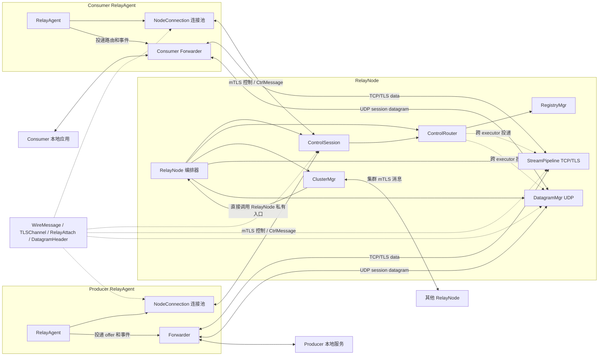

Producer 和 Consumer 表示同一套 RelayAgent 代码的两种运行职责；一个 Agent 可以同时配置 `services` 和
`forwards`。RelayNode 的 ClusterMgr 只交换控制消息，StreamPipeline 和 DatagramMgr 始终在服务所在节点
转发数据。

### 1.2 模块职责

主要模块及其边界如下：

| 模块 | 所属进程或库 | 状态所有者 | 职责与主要流程 |
|---|---|---|---|
| `RelayNode` | relayweave-node | 三个 Node executor | 构造子模块、接入控制连接、协调启动和停止 |
| `ControlSession` | relayweave-node | `control_io` | 接受普通客户端 mTLS 控制连接，接收命令并在断线时触发清理 |
| `ControlRouter` | relayweave-node | `control_io` | 拥有 RegistryMgr，分派客户端与集群业务命令，投递数据面操作 |
| `RegistryMgr` | relayweave-node | `control_io` | 保存控制会话弱引用、服务注册、容量和流量统计 |
| `ClusterMgr` / `ClusterRoom` | relayweave-node | `control_io` | master 成员管理、slave 连接、广播和定向控制消息 |
| `StreamPipeline<Transport>` | relayweave-node | `transfer_tcp_io` | TCP/TLS 监听、attach 配对、Relay 索引、限速、复制和关闭 |
| `DatagramMgr` | relayweave-node | `transfer_udp_io` | UDP Relay 状态机、session binding、endpoint 固定和逐包路由 |
| `RelayAgent` | relayweave-agent | `control_io` | primary/附加节点连接池、服务注册、发现和路由控制 |
| `NodeConnection` | relayweave-agent | `control_io` | 单节点解析、连接、mTLS、识别、接收和指数退避重连 |
| `Forwarder` | relayweave-agent | `transfer_io` | 本地监听、ServerRoute、StreamRelay、DatagramRelay 和重试 |
| `Topology` | relayweave-node | `control_io` | 成员探测、质量报告、master 拓扑汇总和不可变快照 |
| `AgentRouting` | relayweave-agent | `control_io` | 探测入口与服务节点、组装拓扑、计算推荐路径 |
| `ProbeSet` / `ICMP` | route | 所属进程的 `control_io` | DNS、IPv4 去重、原始 socket 探测、历史保留和关闭 |
| `LinkQuality` / `RouteGraph` | route | 调用方 executor | 固定内存质量统计、纯边权计算和多入口最短路径 |
| `TLSChannel` | protocol | 创建它的 executor | mTLS 握手、帧收发、bounded queue、心跳和统一关闭 |
| `WireMessage` / `CtrlMessage` / `MessageReceiver` | protocol | 值对象 / 每 TCP 连接组装状态 | 长度帧、CBOR 控制消息、透明拆分与顺序重组 |
| `RelayAttach` / `DatagramHeader` | protocol | 无状态值对象 | 数据连接角色凭据和 UDP session header 编解码 |
| `DualIndexMap` | protocol | 使用者 executor | 维护一份值及主、次两条索引 |
| `RelayIdAllocator` / `ServiceTraffic` / `TokenBucket` | node/protocol | manager 或原子计数器 | Relay 标识、方向流量与令牌桶限速 |

### 1.3 术语与文档约定

| 术语 | 本文含义 |
|---|---|
| Node / RelayNode | 公共中继节点；按集群职责分为 master 和 slave |
| Agent / RelayAgent | 部署在业务端的客户端进程，可同时承担 Producer 和 Consumer 职责 |
| Producer | 注册 `service` 并连接本地目标的一侧 |
| Consumer | 配置 `forward`、接受本地流量并发起 `relay.open` 的一侧 |
| 普通控制会话 | 通过 RelayNode `control.port` 建立的 mTLS 会话，与节点间 ClusterSession 区分 |
| Stream Relay | `tcp` 或 `tls` 字节流中继 |
| Datagram Relay | `udp` 数据报中继 |
| 推荐路径 | 按质量成本计算的真实 Node 序列；当前业务仍直连服务注册节点 |

类、函数、配置字段、协议字段和状态名使用代码字体，并保持与实现一致。流程描述中的“必须”表示协议或
状态机约束，“应”表示部署要求，“可以”表示可选行为。后续章节按模块展开，依次说明状态、入口、正常
流程、失败收敛和停止边界。

## 2. 设计目标与系统边界

系统把位于 NAT、防火墙或内网后的服务暴露给另一个客户端使用。服务提供方和服务使用方都主动连接公共服务器，不要求任一客户端接受公网入站连接。

以远程 SSH 为例：

1. 提供方客户端把本机 `127.0.0.1:22` 注册为 `home-ssh`；
2. 使用方客户端在本机监听 `127.0.0.1:2222`，并把该端口绑定到 `home-ssh`；
3. 用户执行 `ssh -p 2222 user@127.0.0.1`；
4. 使用方请求服务所在的服务器创建 Relay；
5. 提供方连接本地 SSH 服务，双方再分别连接该服务器的数据端口；
6. 服务器配对两条数据连接并双向转发。

同一个 RelayAgent 可以同时配置 `services` 和 `forwards`，既提供本地服务，也使用其他客户端提供的服务。一个 RelayAgent 还可以同时使用分布在多个 RelayNode 上的服务。

系统职责分成三层：

- **服务发现**回答“服务当前在哪个节点”；
- **控制面**回答“是否创建 Relay、双方应使用什么连接凭据”；
- **数据面**只负责配对和转发业务数据。

集群只共享少量控制消息。业务数据直接进入服务所在节点，服务器之间不建立数据隧道。

## 3. 进程角色与网络拓扑

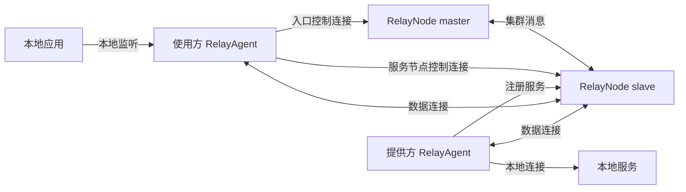

图中服务注册在 slave，因此 master 只帮助客户端找到 slave。找到以后：

- `relay.open` 发给 slave；
- `relay.offer` 由 slave 发给提供方；
- 双方数据连接也进入 slave；
- master 不参与该 Relay 的数据转发。

如果另一个服务注册在 master，客户端会继续保留到 master 的连接。于是一个客户端可以同时维护多条服务器控制连接，每项服务始终绑定到实际承载它的节点。

### 3.1 三类进程角色

| 角色 | 主要职责 | 主动连接方向 |
|---|---|---|
| RelayNode master | 接受普通客户端；接受 slave；路由集群消息；承载本机 Relay | 不主动连接 slave |
| RelayNode slave | 接受普通客户端；承载本机 Relay；连接 master 参与集群 | 主动连接 master |
| RelayAgent | 注册本地服务；建立本地监听；发现服务节点；连接一个或多个服务器 | 主动连接服务器 |

master 负责集群消息路由且不保存全局服务目录，同时也可以像任意 slave 一样承载普通客户端和 Relay。

### 3.2 RelayNode 监听端口

每个 RelayNode 配置普通 Agent 控制/数据端口和两个 Node 共享数据端口；master 额外监听集群控制端口：

| 配置 | 传输 | 用途 |
|---|---|---|
| `control.port` | TCP + mTLS | 普通 RelayAgent 控制连接 |
| `tcp.port` | TCP | 明文流式 Relay 数据 |
| `tls.port` | TCP + mTLS | 加密流式 Relay 数据 |
| `udp.port` | UDP | UDP Relay 数据 |
| `cluster.control_port` | TCP + mTLS | master 监听 slave；slave 用它连接 master |
| `cluster.tcp_port` | TCP 明文 | Node 间共享、双向、分帧的数据连接 |
| `cluster.udp_port` | UDP 明文 | Node 间固定 socket 的共享数据报通道 |

三个 cluster 端口均必填，不再接受旧 `cluster.port`。master 的 `cluster.control_port` 与本节点其他 TCP 监听端口不同；slave 不监听集群控制端口。所有 Node 的 `cluster.tcp_port/udp_port` 必须一致，分别沿用 `tcp.address/udp.address` bind，对端地址来自 `topology.members`。TCP 与 UDP 可以使用相同数字端口。防火墙应允许客户端访问每个可能承载服务的节点，而不只是 master，因为服务发现后客户端会直接连接目标节点的控制端口和数据端口。

### 3.3 核心不变量

后续所有流程都建立在几条不变量上：

1. **服务属于注册它的控制会话。** 会话断开，服务立即消失，相关 Relay 被取消。
2. **Relay 属于创建它的服务器。** 控制请求、Producer/Consumer 数据连接和 Relay manager 必须位于同一 RelayNode。
3. **一个服务路由只指向一个节点连接。** 路由变化时先清除旧节点状态，再接受新位置。
4. **一条节点连接可以服务多个 service。** 连接池按节点复用，同一节点的服务共享一条 TLSChannel。
5. **网络操作的完成不等于业务成功。** `send()` 不返回业务结果，状态只由响应消息推进。
6. **集群只路由控制消息。** 数据不经过 ClusterRoom，master 不成为所有流量的瓶颈。
7. **执行域内串行拥有状态。** control 与 transfer 之间通过 `asio::post` 传递副本，不跨线程直接操作对方容器。
8. **连接存活由对象生命周期表达。** manager 使用弱引用观察 TLSChannel，不维护另一套容易失真的 closed 标志。

### 3.4 多节点服务的完整路径

假设 `home-ssh` 注册在 `master-1`，`office-rdp` 注册在 `slave-1`，使用方 RelayAgent 的入口是 `master-1`：

1. RelayAgent 启动两个本地监听，并建立到 `master-1` 的 primary 控制连接；
2. primary 通过 `server.identify` 确认对端是 `master-1`；
3. RelayAgent 分别查询 `home-ssh/tls` 和 `office-rdp/tcp`；
4. `home-ssh` 在 master 本机 Registry 命中，直接返回 master 地址；
5. `office-rdp` 未命中，master 把查询广播到 ClusterRoom；
6. `slave-1` 命中本机 Registry，把位置响应定向发给入口节点；入口把响应交回原普通客户端会话；
7. RelayAgent 为 `office-rdp` 建立到 `slave-1` 的附加控制连接，同时保留 primary；
8. 打开 `home-ssh` 时，`relay.open` 和两侧数据连接都进入 `master-1`；
9. 打开 `office-rdp` 时，同样的流程全部进入 `slave-1`；
10. 两个 Relay 在两个服务器上独立运行。任一节点断线只影响绑定它的服务。

这条路径说明 `server.host` 只是首次发现入口。客户端运行期间的真实拓扑由服务路由和节点连接池共同决定。

## 4. 配置模型与进程启动

### 4.1 证书输入

先按 [证书制作与部署](证书制作与部署.md) 为所有服务器节点和客户端生成证书。每个服务器节点使用自己的一份 `server.pem/server.key`；普通客户端使用共享的 `shared-client.pem/shared-client.key`。

设计文档中的地址必须与证书 SAN 和实际网络路由一致。端口不属于 SAN。

### 4.2 RelayNode master 配置

完整字段以 [`node/node.example.json`](../node/node.example.json) 为准。master 的 `cluster.address` 是集群监听地址：

```json
{
  "log": {"debug_enable": false},
  "cluster": {
    "role": "master",
    "node_id": "master-1",
    "address": "0.0.0.0",
    "control_port": 18447,
    "tcp_port": 18448,
    "udp_port": 18448
  },
  "control": {
    "address": "0.0.0.0",
    "advertise_address": "203.0.113.10",
    "port": 18443,
    "max_connections": 512,
    "max_services": 256,
    "max_services_per_session": 64
  },
  "tcp": {
    "address": "0.0.0.0",
    "port": 18444,
    "max_setup_connections": 512,
    "max_relays": 128,
    "setup_timeout_ms": 10000,
    "rx_bytes_per_second": 2000000,
    "rx_max_burst_bytes": 262144,
    "tx_bytes_per_second": 2000000,
    "tx_max_burst_bytes": 262144
  },
  "tls": {
    "address": "0.0.0.0",
    "port": 18446,
    "max_setup_connections": 512,
    "max_relays": 128,
    "setup_timeout_ms": 10000,
    "rx_bytes_per_second": 2000000,
    "rx_max_burst_bytes": 262144,
    "tx_bytes_per_second": 2000000,
    "tx_max_burst_bytes": 262144
  },
  "udp": {
    "address": "0.0.0.0",
    "port": 18445,
    "max_relays": 128,
    "service_wait_timeout_ms": 300000,
    "rx_bytes_per_second": 2000000,
    "rx_max_burst_bytes": 262144,
    "tx_bytes_per_second": 2000000,
    "tx_max_burst_bytes": 262144
  },
  "certificate": {
    "server_ca_file": "/etc/relayweave/certs/server-ca.pem",
    "ca_file": "/etc/relayweave/certs/client-ca.pem",
    "certificate_chain": "/etc/relayweave/certs/server.pem",
    "private_key": "/etc/relayweave/certs/server.key"
  },
  "channel": {
    "handshake_timeout_ms": 5000,
    "disconnect_timeout_ms": 5000,
    "heartbeat_interval_ms": 5000,
    "heartbeat_timeout_ms": 20000,
    "max_queued_messages": 100
  }
}
```

`cluster` 是必填对象，`role` 只允许 `master` 或 `slave`，所有节点的 `node_id` 必须非空且唯一，并且不能使用为广播保留的 `all`。当前配置不提供关闭集群的角色，也不读取旧版服务器配置字段。

### 4.3 RelayNode slave 配置

slave 的控制和数据端口按本节点实际端口填写。它的 `cluster.address` 和 `cluster.control_port` 指向 master：

```json
"cluster": {
  "role": "slave",
  "node_id": "slave-1",
  "address": "203.0.113.10",
  "control_port": 18447,
    "tcp_port": 18448,
    "udp_port": 18448
}
```

slave 自己的 `control.advertise_address` 应填写 Agent 可访问的 slave 地址，例如 `203.0.113.11`，不能沿用 master 地址。slave 连接失败或连接断开后每隔 5 秒重试。master 从不主动连接 slave。集群断开不停止本节点的普通客户端监听和数据中继。

### 4.4 RelayAgent Producer 配置

RelayAgent 的 `services` 描述它提供的本地目标：

```json
{
  "server": {
    "host": "203.0.113.11",
    "port": 18443,
    "connect_timeout_ms": 5000
  },
  "certificate": {
    "ca_file": "/etc/relayweave/certs/server-ca.pem",
    "certificate_chain": "/etc/relayweave/certs/shared-client.pem",
    "private_key": "/etc/relayweave/certs/shared-client.key"
  },
  "services": [
    {
      "name": "home-ssh",
      "target_host": "127.0.0.1",
      "target_port": 22,
      "protocol": "tls"
    }
  ],
  "forwards": []
}
```

提供方只在配置的初始服务器上注册 `services`。该初始连接是客户端的 primary 连接；服务发现创建的附加连接不会重复注册这些服务。

### 4.5 RelayAgent Consumer 配置

RelayAgent 的 `forwards` 描述本地监听和目标服务：

```json
{
  "server": {
    "host": "203.0.113.10",
    "port": 18443,
    "connect_timeout_ms": 5000
  },
  "certificate": {
    "ca_file": "/etc/relayweave/certs/server-ca.pem",
    "certificate_chain": "/etc/relayweave/certs/shared-client.pem",
    "private_key": "/etc/relayweave/certs/shared-client.key"
  },
  "services": [],
  "forwards": [
    {
      "service": "home-ssh",
      "listen_address": "127.0.0.1",
      "listen_port": 2222,
      "protocol": "tls"
    },
    {
      "service": "office-rdp",
      "listen_address": "127.0.0.1",
      "listen_port": 13389,
      "protocol": "tcp"
    }
  ],
  "relay": {"open_timeout_ms": 10000},
  "reconnect": {
    "initial_delay_ms": 500,
    "max_delay_ms": 10000
  },
  "channel": {
    "handshake_timeout_ms": 5000,
    "disconnect_timeout_ms": 5000,
    "heartbeat_interval_ms": 5000,
    "heartbeat_timeout_ms": 20000,
    "max_queued_messages": 100
  }
}
```

`server.host/server.port` 只指定初始入口。客户端通过它发现 `home-ssh` 和 `office-rdp` 所在节点，然后按需建立附加控制连接。两个服务可以位于不同服务器并同时工作。

协议必须在提供方 `services[].protocol` 和使用方 `forwards[].protocol` 中一致，只允许 `tcp`、`tls`、`udp`。

本地 forward 应绑定 `127.0.0.1`，除非明确需要允许其他主机访问。绑定 `0.0.0.0` 会把该端口暴露给
所有可达网卡。

Node 和 Agent 默认进行质量探测，Agent 默认计算推荐路径，不提供 enabled 开关。Agent 可选的
`"routing": {"max_nodes": 4}` 只限制路径中的真实 Node 数，范围为 1–16；省略整个对象时也使用 4。
探测与质量参数使用固定常量。推荐路径的范围和算法见 7.7 节。

### 4.6 进程入口与启动顺序

两个进程入口只接收一个配置文件路径；配置解析或监听绑定失败会直接结束启动：

```console
relayweave-node node-config.json
relayweave-agent producer-agent-config.json
relayweave-agent consumer-agent-config.json
```

每个进程只解析一次配置文件；对应的配置加载器在返回前严格校验并应用 `log.debug_enable`。
`log` 中的未知字段或非布尔 `debug_enable` 会使启动失败，不会静默回退为默认值。

推荐启动顺序是 master、slave、服务提供方 RelayAgent、服务使用方 RelayAgent。slave 和 RelayAgent 都会重连，因此顺序不会影响最终恢复，只影响首次可用时间。

安装布局和进程托管规则由打包文档定义，本节只描述影响模块关系和运行状态的配置。

### 4.7 RelayNode 进程启动流程

进程入口先按配置准备普通客户端控制/TLS 数据使用的 TLS context；RelayNode 构造时再准备集群 TLS context、Registry 和三个 Relay manager。`start()` 按以下顺序建立可运行环境：

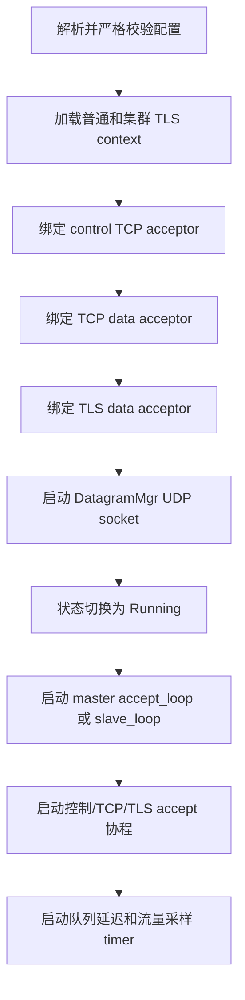

监听、UDP 或集群启动在进入 Running 前失败时，`start()` 关闭已经打开的 acceptor 并停止 DatagramMgr，然后把原异常交给 `main()`。程序不会在部分端口可用的状态下继续运行。

### 4.8 RelayAgent 进程启动流程

RelayAgent 构造时先从全部 `forwards` 建立待解析的 `(service, protocol)` 集合。`start()` 随后：

1. 在 transfer executor 上启动 Forwarder 和本地监听；
2. 把状态切换为 Running；
3. 创建唯一的 primary `NodeConnection`；
4. 启动 5 秒周期的发现协程；
5. primary 完成 TCP、mTLS 和节点识别后注册本客户端的 `services`；
6. 对所有尚无 ready 路由的 `forwards` 发送查询；
7. 收到位置后建立或复用附加连接，并把路由投递给 Forwarder。

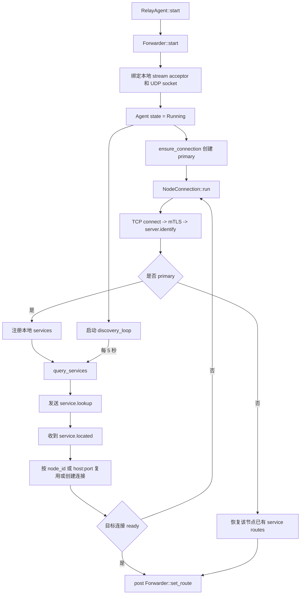

本地监听可以早于服务路由就绪，但不会把本地连接无限排队。TCP/TLS 在无路由时快速关闭，UDP 在路由恢复后主动建立新 Relay。

## 5. RelayNode 核心模块

### 5.1 RelayNode 编排与执行域

RelayNode 使用四个互相独立的单线程 `asio::io_context`：

| 执行域 | 所有者 | 目的 |
|---|---|---|
| `control_io` | control acceptor、`ControlSession`、`ControlRouter`、`RegistryMgr`、`ClusterMgr`、`Topology`、服务发现 | 控制状态按顺序修改，会话、服务表和探测状态由本执行域串行访问 |
| `transfer_tcp_io` | 两个 `StreamPipeline` 的 acceptor、Relay 索引和流式数据复制 | 把高吞吐流式数据与控制消息隔离 |
| `transfer_udp_io` | `DatagramMgr`、UDP socket、UDP 路由 | UDP 报文处理与 TCP/TLS、控制面独立调度 |
| `cluster_data_io` | node 的 `LnkChannel` 监听/读写/保活、会话表和逐跳分派 | Node 通道与会话数据面同域运行，与业务服务限速隔离 |

跨执行域操作使用 `asio::post`。例如 RelayNode 的 ControlRouter 收到 `relay.open/reject/cancel` 后，把操作
投递给相应 StreamPipeline 或 DatagramMgr；注册 UDP 服务后，也把对应统计与控制会话投递给
DatagramMgr。数据面 manager 只由所属 transfer executor 修改。

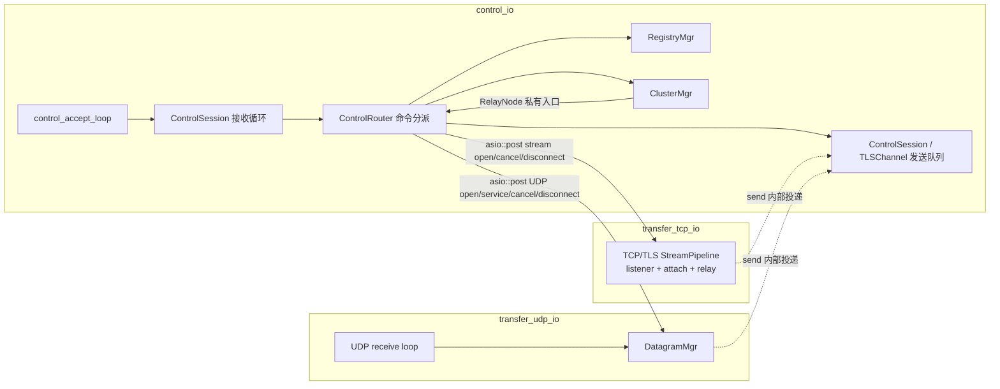

单线程执行域保证同一域内 handler 不并发执行，但不能允许同一个 socket 上出现重叠的异步读或异步写。每种 stream 的读循环和写队列仍各自保持单一所有者。

NodeLink 指相邻 Node 的物理通道，NodeFlow 指跨完整路径的逻辑流，FlowFrame 是其载荷帧；原有 ControlSession 保持控制连接会话含义。
NodeLinkMgr 与 Pipeline/DatagramMgr 同层，由 RelayNode 直接持有，其建连和路径协调状态留在 control_io。master 通过平级 link.prepare/prepared/connect/ready/error/close/closed/status
指挥端点；单次建立期限 10 秒，TCP 固定 Node ID 顺序发起，只解析一次、connect 一次；UDP 双方各发送一次
link.attach，并互相响应 link.attached。只有双方 ready 才完成 ensure。成功按 Node 对及 transport 复用，
并发申请合并，失败由外层处理，不反向尝试、不重发接入、不自动重连。
数据接入绑定 master epoch、唯一 NodeLink ID 和控制通道下发凭据。NodeFlow 的 DATA 使用原始二进制
payload，共享连接按 flow_id 分派。每 5 秒保活、20 秒无匹配响应失效。Node 数据不应用服务限速或统计。
`LnkChannel` 位于 node/lnk_channel，直接拥有物理通道和逻辑流分派状态；
protocol/message 定义固定 32 字节 Node 帧头，DATA/FIN/RESET 与保活不经过 JSON/CBOR。
TCP 首帧接入沿用 CBOR 并校验 data_version；UDP 使用 8 字节 NodeLink ID + 同一二进制帧头，接入帧体才承载 CBOR。原有回调注册与独立 Forwarder 已移除，数据域共用一个监控计时器。
NodeLinkMgr 的一个控制协程等待有界通知队列并直接处理 Link/Flow 状态；通知任务由管理器启动、停止和等待，业务帧不经过该队列。
第二阶段由 control_io 中的 NodeLinkMgr 统一协调，直接持有 cluster_data_io 中的 LnkChannel：
master 使用 async_open_flow 提交显式路径，先 ensure 相邻边，再通过 flow.prepare/commit
安装全路径 NodeFlow；所有 committed 后返回 epoch + flow_id。中间 Node 按逻辑流和方向校验入边并逐跳分派。
路径必须无环且包含 2..8 个 Node；prepare/commit/close 确认使用 8 位掩码，此限制不约束集群总节点数。
TCP 使用 DATA/FIN/RESET；FIN 仅结束一个方向，RESET 只释放该逻辑流；UDP 只转发 DATA 并由控制面关闭。
prepare/commit 共用 10 秒建立期限，各端仅对未提交表项检查准备超时；已提交 Flow 不做周期续租。
控制连接断开或心跳超时清理本节点全部 Flow 和端点授权；epoch/路径成员失效、NodeLink 断链或显式 close 清理相关 Flow。
集群控制发送队列溢出沿用原处理：报告本地错误，不主动断开全部控制连接；因此不保证远端旧 Flow 立即回收。
close 等待全路径确认，最多 10 秒；关闭与拥塞不会关闭共享 NodeLink，重连须重新申请 Flow。
首末 Node 的内部收发接口已支持分叉、回程和失败验证，不依赖 Agent/服务对象。
Agent 路径提交、首末 socket 桥接和真实业务背压仍待第三、第四阶段实现，现有业务连接仍直达服务所在 Node。
物理通道、逻辑流协调/分派和首末业务保持独立；信用、调度、池化和换路在这些边界内后续扩展，
现有 Pipeline/DatagramMgr 不承担中间节点状态。
数据格式在本地 NodeFlow 注入或每跳网络解码时校验一次；内部转发直接编码，不重复校验/查出边。
数据域使用不可变类型化身份与协议字段，热路径不查 JSON；测试专用 Diagnostic/直接发帧接口已删除。
详细接口及后续步骤见 [共享数据通道与按路径转发计划](Node共享数据通道与按路径转发实施计划.md)。

### 5.2 ControlSession 与 RegistryMgr

每条普通客户端连接创建一个 `ControlSession`。ControlRouter 为它分配非零、进程内唯一的 `session_id`，然后：

1. 在 `RegistryMgr` 中登记会话；
2. 由 `TLSChannel::start()` 完成 mTLS 握手；
3. 循环 `co_await async_receive()`；
4. 在 control executor 上同步分派控制命令；
5. 连接结束时删除该会话注册的所有服务，并取消属于该会话的 Relay。

Registry 条目保存整数 `session_id`、会话的 `weak_ptr` 和该会话注册的服务集合。Registry 不拥有控制会话；只有实际发送消息或停止时才锁定弱引用。服务名查询保持简单的线性会话表，容量检查和查询会顺便清理过期引用。

服务注册的生命周期与控制连接一致。提供方断线后服务立即从该节点消失，不保留离线注册。

服务注册流程为：

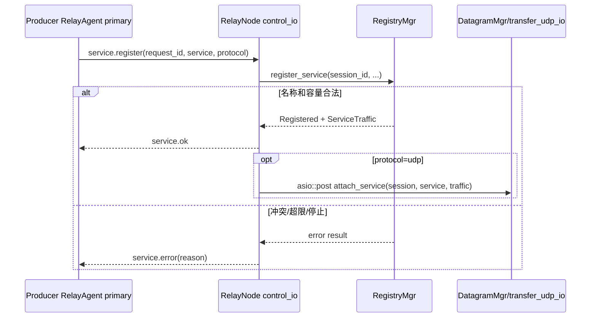

同一会话重复注册同名同协议服务是幂等成功，复用原统计对象；同一节点上其他会话注册同名服务，或同一会话改用另一协议，都会得到名称冲突。唯一性范围是单个 RelayNode，不是整个集群，因此不同节点可以同时注册同名服务，发现端采用当前请求的第一个有效响应。

TCP/TLS 在 `relay.open` 时直接从 Registry 取得 Producer 会话。UDP manager 位于另一个 executor，所以注册成功后异步投递 `attach_service`；DatagramMgr 能处理 Consumer 打开与该投递短暂交错的情况。

### 5.3 StreamPipeline 与 DatagramMgr

服务端按传输类型分成三个 manager：

- `StreamPipeline<TcpTransport>`：监听 TCP 数据端口，保存两侧 socket、ticket、setup timer、限速器和流量统计；
- `StreamPipeline<TlsTransport>`：复用同一套 Relay 状态与索引逻辑，在接入阶段完成服务端 TLS 握手，并保存
  两侧 TLS stream；
- `DatagramMgr`：保存单个 UDP socket、Relay、双方 `session_id`、固定 endpoint 和路由索引。

两个 StreamPipeline 和 DatagramMgr 共享线程安全的 `RelayIdAllocator`，因此同一 RelayNode 进程内
TCP、TLS、UDP 的 `uuid` 不冲突。它们的 Relay 表、容量、setup timer 和限速配置互不共享。TCP/TLS 的
差异由两个小型 transport policy 表达，没有公共继承层，也没有运行时 stream variant 或协议分支。

### 5.4 TLSChannel 模块

普通控制连接和集群连接都复用 TLSChannel。它把一条 TLS stream 封装成有边界、带心跳、单写队列的消息通道，状态依次为：

```text
Created -> Handshaking -> Connected -> Closing -> Closed
```

`start()` 只允许调用一次。客户端在握手前设置 peer verification、实际连接地址的主机名验证和可选 SNI；服务端要求对端提供可信证书。握手受 `channel.handshake_timeout_ms` 限制。成功后，TLSChannel 启动一个自管理的后台 `run()`，然后 `start()` 返回。

后台 `run()` 使用一个 structured parallel group 同时运行：

- `rloop`：唯一的 TLS 读取者，读取 4 字节长度和完整 CBOR payload；
- `wloop`：唯一的 TLS 写入者，从 bounded channel 取出完整 frame 并顺序写入；
- `keepalive`：定时发 `ping`，并检查最后一次完整入站 frame 的截止时间；
- `wait_close_request`：等待显式断开请求。

任一分支结束会让整个通道进入关闭流程。TLS shutdown 最多等待 `disconnect_timeout_ms`，随后关闭底层 socket、发送和接收 channel，并将状态置为 Closed。

`ping/pong` 在 TLSChannel 内部消费，不进入业务接收队列。其他消息进入 bounded receive channel；接收方长期不消费导致队列满时，TLSChannel 关闭连接，接收队列的内存占用保持在配置上限内。

`send(CtrlMessage)` 可从其他 executor 调用，它先 `post` 到 TLSChannel 自己的 executor，再编码并尝试进入写队列。编码失败或写队列拒绝 frame 时，通道记录明确原因并立即进入统一关闭流程；外层接收循环随后清理 session、服务和 Relay，Agent/cluster connector 按原有策略重连。通道已在关闭时的后续 `send()` 只记录拒绝。`send()` 仍是提交接口，不表示远端已处理消息。

`async_receive()` 先切回通道 executor。默认“永不超时”时直接等待 receive channel，不套 `cancel_after`；只有调用方传入有限 timeout 时才增加取消包装。这样普通长期读循环没有额外 timer/cancellation 开销，而握手后的 `cluster.join`、`server.identified` 等有限状态转换仍能设置截止时间。

### 5.5 RelayNode 异常收敛

异常按能处理它的最小边界收敛：

| 异常位置 | 处理者 | 结果 |
|---|---|---|
| 配置字段、地址、证书/私钥加载 | `main()` / 构造或 `start()` | 启动失败并退出，不进入部分运行状态 |
| TLS 握手、解析、连接、节点识别 | 当前连接协程 | 清理本连接；RelayAgent 或 slave connector 按自己的规则重连 |
| 普通客户端发送非法控制命令 | `run_control_session` | 只关闭该控制会话并注销其服务 |
| 非法/过期 `relay.attach` | 当前数据接入协程 | 只关闭该数据 socket，等待中的 Relay 由 timer 或后续错误清理 |
| 单条集群业务消息字段非法 | `ClusterMgr::receive` / RelayNode 消息处理 | 记录该消息错误，继续接收后续集群消息 |
| TLSChannel 编码/入队失败或后台读写/心跳错误 | TLSChannel | 记录原因、进入统一关闭并让外层接收自然结束 |
| server stop 期间的取消错误 | 各停止边界 | 作为正常收敛处理，不重复记录为运行故障 |

底层使用 `asio::use_awaitable` 的操作默认通过异常传播错误。accept 循环、停止取消、UDP 逐包收发等需要按错误码继续或区分 `operation_aborted` 的位置使用无异常结果。错误表示方式在其处理边界内保持一致。

## 6. ClusterMgr 模块

### 6.1 ClusterRoom 成员与消息分发模型

ClusterMgr 的成员与消息分发模型由四个角色组成：

- `ClusterRoom` 管理参与者集合，并按 `target` 广播或定向投递；
- `ClusterSession` 对应 master 接受的一条 slave 连接；
- `ClusterParticipant::deliver()` 是统一的写入口；
- master 本地逻辑以一个本地 participant 加入 room。

master 接受 socket 后立刻创建 session 并加入 room。session 的读协程先调用 `TLSChannel::start()`，再等待 `cluster.join`。加入成功后，读到的普通消息交给 room；room 遍历参与者并调用 `deliver()`。远端 session 的 `deliver()` 直接调用 `TLSChannel::send()`，因此握手、帧格式、心跳、发送队列和单写协程继续由 TLSChannel 管理。

`ClusterRoom` 放在 master 的 `accept_loop()` 协程栈上，只在该结构化协程存活期间存在。停止时先停止所有 session，等待参与者退出，再离开协程。room 和 session 的生命周期由同一个 accept 协程封闭管理。

### 6.2 成员加入与消息路由

| 命令 | 方向 | 参数 | 作用 |
|---|---|---|---|
| `cluster.join` | slave → master | `node_id` | TLS 握手后声明节点 ID |
| `cluster.joined` | master → slave | 无 | 确认加入成功 |
| `cluster.error` | 本地或 master → slave | `reason` | 重复 ID、未连接或本机编码错误 |
| 任意非 `cluster.*` | 任意节点 → room | 业务参数及必填 `target`；master 写入 `source` | `target=all` 广播，否则按 node_id 定向 |

`node_id` 由配置声明，master 拒绝同时在线的重复 ID，也拒绝保留值 `all`。集群 mTLS 确认对端持有 Server CA 签发的节点证书，但协议没有把证书名称与 `node_id` 绑定。

业务消息直接复用普通 `CtrlMessage {command, params}`，没有额外的“集群信封”。发送方写入 `params.target`，其中 `all` 表示广播，其他值表示目标节点 ID。master 根据已加入的 session 覆盖写入 `params.source`，调用者不能伪造来源；路由前删除 `target`，因此 RelayNode 只看到认证 `source` 和业务字段。业务消息的 `params` 必须是对象，`cluster.*` 命令、`source` 和 `target` 字段由集群层保留。

广播包含发送者。这样本地节点和远端节点走相同接收路径，业务层不需要为“本地执行”和“远端消息”维护两套分支。定向消息只投递给当前在线的目标 participant；目标不存在时按 best-effort 语义丢弃，不退化成广播。

`broadcast_cluster(message)` 等价于 `send_cluster("all", message)`；其他 target 使用 `send_cluster(target, message)` 定向发送。两个接口都返回 `void`，调用返回只表示消息被交给发送机制，不表示远端收到或处理成功。需要结果的业务通过响应消息和 `request_id` 关联。集群不保存历史、不补发，也不自动重发业务消息。

### 6.3 ClusterConnector 重连

slave 的 `ClusterConnector` 位于 `slave_loop()` 协程栈上。resolver、socket、retry timer 同样属于该协程栈；`ClusterMgr` 只保留一个临时裸指针用于停止时取消这些操作。

connector 对活动 `TLSChannel` 只保存 `weak_ptr`。一次连接的强引用由当前连接/接收协程持有；接收结束并清理以后弱引用自然过期。下一轮通过 `weak_ptr::expired()` 判断是否需要连接，不增加 `is_closed` 一类重复状态接口。

连接流程是：解析地址、TCP 连接、TLS 握手、发送 `cluster.join`、等待 `cluster.joined`、持续接收。解析或连接最多等待 5 秒；失败或断线后固定等待 5 秒再重试。成功不会引入另一套指数退避状态。

停止时取消 resolver、socket 和 retry timer，并断开当前 TLSChannel。master 关闭 acceptor 和出站消息队列，停止 room 内 session 并等待它们退出。RelayNode 等待 `ClusterMgr::async_stop()` 完成后才结束 control 侧停止；此时不会再有 ClusterMgr 对 RelayNode 的反向调用。

### 6.4 Master accept_loop 的结构化并发

master 的 `accept_loop()` 在栈上创建 ClusterRoom 和本地 participant，然后使用 Asio awaitable 运算符并行等待：

```cpp
co_await (accept_sessions(room) && deliver_messages(room));
```

两个分支分别承担 socket 接入和本地出站消息队列消费。它们共享同一个 control executor 和同一个栈上 room，所有成员操作均在该 executor 串行执行。任一分支异常时，组合 awaitable 结束；外层保存异常，先 `co_await room.async_stop()` 收敛所有 participant，再重新抛出。清理发生在 room 析构之前。

接受到 socket 后，session 在完成 TLS 和 join 前已经计入 room 容量。连接上限同时覆盖握手中和已加入的远端成员。room 中还有一个 master 本地 participant，所以判断远端容量时为 `max_connections + 1`。

### 6.5 ClusterSession 生命周期

一个 ClusterSession 只有一个 reader 协程：

1. `co_await channel->start({})` 完成服务端 TLS 握手；
2. 在握手超时时间内直接 `co_await channel->async_receive(timeout)` 等待 `cluster.join`；
3. 验证 node_id 非空、不是保留值 `all` 且未被 room 占用；
4. 回复 `cluster.joined`；
5. 持续直接 `co_await channel->async_receive()`，把业务消息交给 room；
6. 退出时断开 TLSChannel；completion handler 用 weak session 从 room 删除自己。

这里不为一次 receive 再 spawn 子协程。有限超时由 TLSChannel 的 `async_receive(timeout)` 提供；正常读循环直接 co_await，不增加中间 channel、竞速协程或额外生命周期。

session 的 `deliver()` 只调用 TLSChannel 的异步发送入口。ClusterRoom 只操作 participant 接口，socket、TLS 写队列和心跳由 ClusterSession 与 TLSChannel 管理。

### 6.6 广播与定向交付

master 收到 slave 消息后，不直接信任原消息中的 `source`。ClusterRoom 使用已加入 session 的 `node_id` 覆盖该字段，删除传输字段 `target`，再根据 target 把业务消息复制给所有 participant 或只投递给一个目标。master 本地发出的消息同样填入 master 的 node_id。

此机制提供的是当前在线成员间的 best-effort 投递：

- 未加入的 session 不接收业务消息；
- 广播时离线的成员不会在重连后收到历史消息；
- 定向目标不存在或已离线时消息直接丢弃，不自动改为广播；
- 某个 participant 的 `send()` 入队失败不会回滚其他 participant；
- 响应必须是新的业务消息，并携带请求协议定义的关联字段；
- `source` 仍由 master 认证并覆盖，定向投递不会降低来源身份保证。

### 6.7 ClusterMgr 与 RelayNode 接口

RelayNode 向上层暴露广播、定向发送和接收接口：

```cpp
void send_cluster(std::string target, CtrlMessage message);
void broadcast_cluster(CtrlMessage message);
asio::awaitable<CtrlMessage> async_receive_cluster();
```

发送保持与 TLSChannel 一致的 `void` 语义。接收是协程接口，调用方在接收循环中直接 `co_await`。`async_receive_cluster()` 会先 dispatch 到 control executor，再等待 RelayNode 自己的 bounded channel；RelayNode 停止时 channel 关闭，等待者以取消/关闭异常退出。

RelayNode 独占 `ClusterMgr`，ClusterMgr 反向保存非拥有的 `RelayNode&`。ClusterMgr 在 control executor 上
验证消息来源后直接调用 RelayNode 的私有消息处理入口，该入口把业务分派交给 ControlRouter。
ControlRouter 消费 `service.lookup`、`service.located`、`server.status.query` 和 `server.status.report`；其他普通
业务消息以及 `cluster.joined/cluster.error` 进入对外的 `cluster_messages` channel。这条直接关系与 RelayNode
控制状态位于同一串行 executor，生命周期由 RelayNode 的所有权和停止顺序保证，因此不增加消息
sink/callback 间接层。发送入口拒绝业务调用使用 `cluster.*` 保留命令，并通过本地 `cluster.error` 报告。

## 7. RelayAgent 与 NodeConnection 模块

### 7.1 RelayAgent 状态与职责

RelayAgent 分开管理“入口连接”和“服务路由”，使不同服务可以分别连接其注册节点：

- 初始配置只决定 primary 入口；
- 每个 `(service, protocol)` 保存自己的目标节点；
- 每个目标节点对应一个 `NodeConnection`；
- 同一节点的多个服务复用同一连接；
- 不同节点的连接和 Relay 相互独立。

### 7.2 服务发现流程

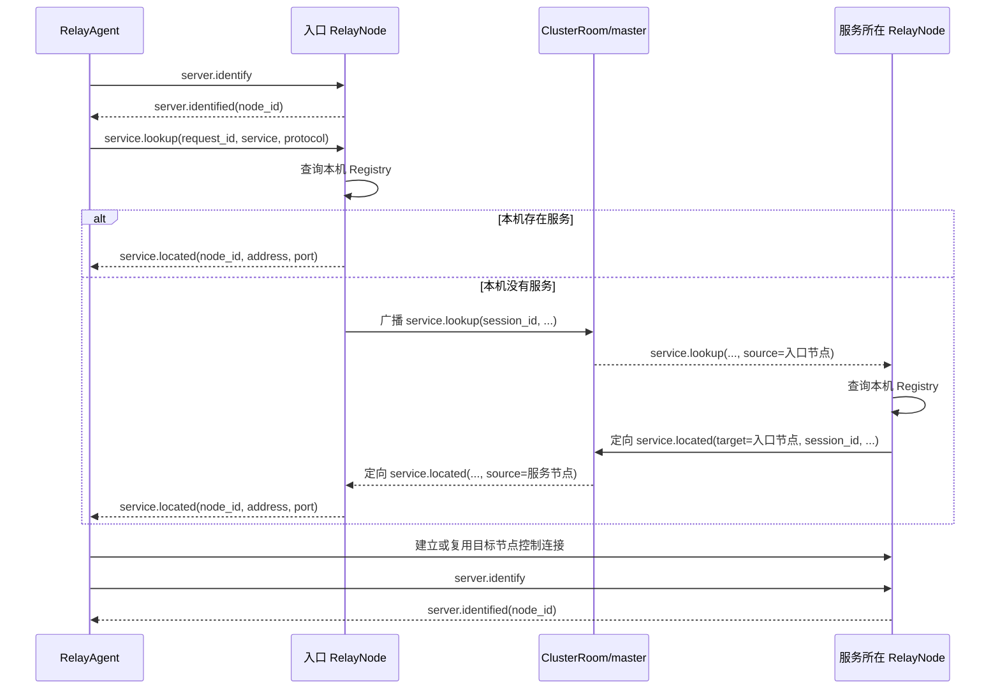

服务端不保存 pending 查询、不创建查询 timer，也不持有等待结果的客户端会话。跨集群查询携带原控制会话的 `session_id` 和入口 `requester_node`。响应回到入口节点时再查 Registry；原会话已经消失就直接丢弃。

转发给普通客户端前，入口节点：

1. 用经过 ClusterSession 认证的 `source` 填写 `node_id`；
2. 删除内部的 `source`、`requester_node`、`session_id`；
3. 保留客户端原始 `request_id`。

因此超时和过期响应全部由客户端处理。每个服务只接受当前 `request_id` 对应的位置结果；后到的旧响应被忽略。多个节点同时提供同名同协议服务时，当前请求收到的第一个有效位置会把 request 置零，后续响应不再匹配。

跨节点时同一查询的参数演变如下：

| 阶段 | 消息 | 参数 |
|---|---|---|
| RelayAgent 发给入口 | `service.lookup` | `request_id`, `service`, `protocol` |
| 入口广播 | `service.lookup` | `target=all`；上述字段 + 入口普通会话的 `session_id`；ClusterRoom 写入 `source=入口 node_id` |
| 服务节点定向响应 | `service.located` | `target=requester_node`；`requester_node`, `session_id`, `request_id`, `service`, `protocol`, `address`, `port`；ClusterRoom 写入 `source=服务节点 node_id` |
| 入口发给 RelayAgent | `service.located` | `request_id`, `service`, `protocol`, `node_id=source`, `address`, `port` |

`session_id` 只在一次 RelayNode 进程生命周期内标识普通控制会话；它不是公开客户端身份，也不会交给最终 RelayAgent。`requester_node` 用作响应的定向目标，并让入口再次确认消息属于本节点。最终 `node_id` 必须从 ClusterRoom 认证过的 `source` 生成，不能采用业务消息自己携带的 node_id。

如果服务在入口本机，RelayNode 直接构造最终 `service.located`，不经过 ClusterRoom。两条路径最后给 RelayAgent 的字段完全一致，所以客户端不需要区分本地命中和远端命中。

### 7.3 集群状态查询

Dashboard 等普通客户端只需连接任意一个在线节点，每轮发送一次 `server.cluster {request_id}`。入口先直接返回自己的完整 `server.status.reported` 消息，再以 `target=all` 广播 `server.status.query {session_id, request_id}`。其他节点各生成完整状态，通过 `target=requester_node` 将 `server.status.report` 定向发回入口；入口节点对本机查询不再生成第二份报告。

查询和响应复用服务发现的路由字段与安全边界：`requester_node + session_id + request_id` 标识原请求，最终 `node_id` 只取定向响应中由 ClusterMgr 认证并覆盖的 `source`，转发前删除全部内部路由字段。不同普通控制会话即使使用相同 `request_id` 也不会串流；会话断开后迟到响应因目标节点或原 session 不存在而直接丢弃。

每条 `server.status.reported` 包含 `request_id`、`node_id`、真实服务器 uptime 和按服务名排序的完整流量报告；地址和三类队列延迟由 `topology.snapshot` 提供。业务字段不再包含 `page_index/page_count`。协议层在完整 CBOR 消息超过 64 KiB 时自动拆分，在每条 TCP 连接上顺序重组，只把完整消息交给客户端，单个 service 或 accessor map 也可以跨帧。客户端按 `request_id` 和 `node_id` 发布一次节点快照和写入一次历史记录。服务端不保存成员快照、不聚合不同节点的结果，也不发送集群完成消息。

### 7.4 节点地址发布

`service.located.address` 也是客户端下一条控制连接和数据连接使用的主机地址。服务节点始终发布必填的 `control.advertise_address`；该值应填写请求方可以访问的公网 IP 或 DNS 名称，并且必须在节点证书 SAN 中。`control.address` 只用于绑定本地监听接口，可以填写 `0.0.0.0` 或 `::`，不再参与服务地址发布。

### 7.5 NodeConnection 连接池

每条控制连接在可用前都执行 `server.identify/server.identified`。客户端校验服务器返回的 `node_id`：已知位置指定了节点 ID 时，实际连接到其他节点会使该次连接失败。

连接池先按 `node_id` 复用，再按 `host:port` 复用。每个 `NodeConnection` 自己运行连接、接收、清理和重连循环：

- 初始重连延迟由 `reconnect.initial_delay_ms` 指定；
- 失败后翻倍，最多到 `reconnect.max_delay_ms`；
- 连接成功后恢复初始延迟；
- 已知附加节点独立重连，不依赖 primary 在线。

`NodeConnection` 不长期保存强 TLSChannel 引用。每次 `run()` 使用成员中的
`optional<Operations>` 原位拥有 resolver、socket 和 retry timer；运行开始时构造，连接循环退出时由
scope guard 清空，`stop()` 因而可以直接取消这些对象而不引用协程栈地址。当前通道仍只保存
`weak_ptr<TLSChannel>`。协程 completion handler 在任务期间持有 RelayAgent 和 connection，任务结束后自然释放。

primary 始终保留。附加连接在不再被任何服务路由引用时停止并移除。一个节点断线只清理该节点对应的 Forwarder 路由、pending Relay 和 active Relay，其他节点继续工作。

单条 NodeConnection 的状态转换可以表示为：

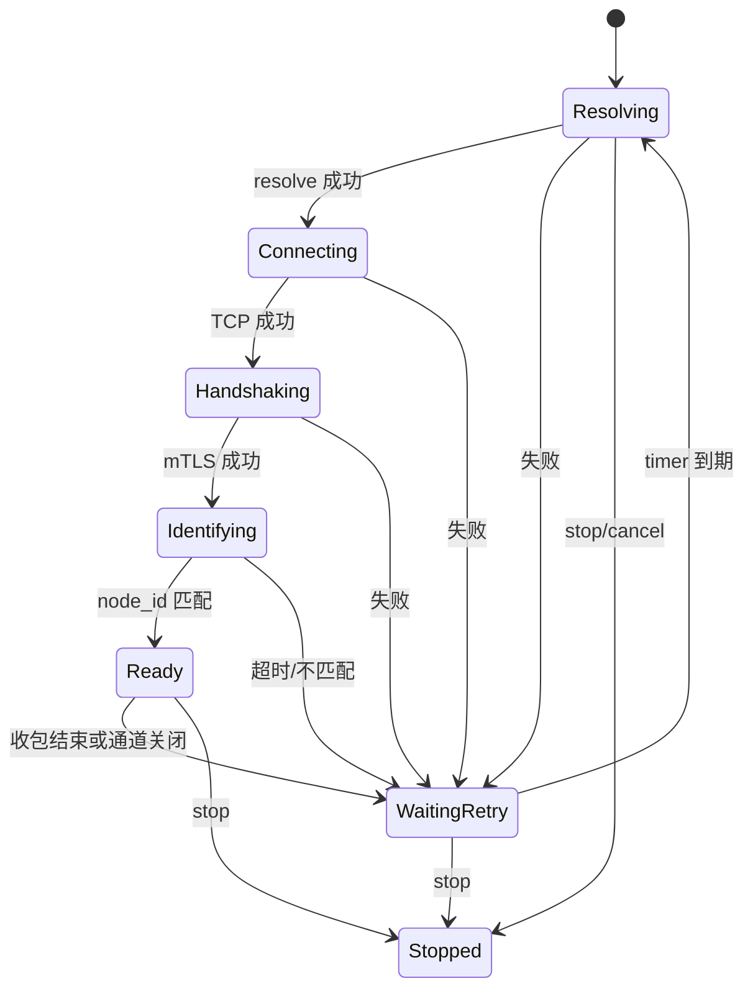

Ready 只表示 mTLS 和 `server.identified` 都成功。TCP 已连接或 TLS 已握手但尚未识别节点时，不会注册服务、安装 Forwarder 路由或发送业务请求。

每轮失败都按“当前 stage + 原异常”形成一条连接失败日志。清理顺序固定为：清除 weak channel、通知 owner 清除该节点路由、等待 TLSChannel 断开、等待重连 timer。stop 会同时取消 resolver、socket 和 timer，使协程从任何阶段退出。

### 7.6 路由失效与重新发现

客户端每 5 秒刷新当前没有 ready 目标连接的服务。primary 在线时发送新的 `service.lookup`；primary 离线时无法发现新位置，但已知附加节点仍继续自己的重连。

服务器返回 `relay.error` 且原因为 `service unavailable` 或 `service protocol mismatch` 时，客户端认为该服务路由已经过期：

1. 清除 RelayAgent 控制侧路由；
2. 投递到 transfer executor 清除 Forwarder 路由；
3. 释放无人使用的附加连接；
4. 通过 primary 重新查询。

这使服务从一个服务器迁移到另一个服务器后能够恢复，同时不为业务消息增加历史队列或自动重放。

发现请求和 Relay 请求使用各自执行域内的 `request_id` 分配器。它们的数值可能相同，但由命令类型、连接和对应 pending 容器共同限定，不会把服务查询响应误配到 Relay 打开请求。计数器越过 `uint64_t` 最大值后跳过零。

### 7.7 链路质量与推荐路径

Node 和 Agent 共用 route 模块。Node 探测其他成员并上报质量；Agent 测量本地接入成本，合并集群有向边，
计算到服务注册 Node 的推荐路径。当前 TCP、TLS、UDP 业务仍由双方直接连接服务注册节点；推荐结果
不改变服务位置、NodeConnection 或 Forwarder 的业务路由，不创建 Node 间数据通道。

#### 7.7.1 探测管理与状态所有权

```text
Node 成员 / Agent 配置入口、服务发现与拓扑
  → ProbeSet：DNS、IPv4 去重、身份映射与历史管理
  → ICMP / LinkQuality：探测完成样本与三尺度统计
  → Node 报告 → master 拓扑汇总
  → Agent：筛选远端边，合并本地接入成本
  → AgentRouting::candidate_paths：共用路由图，逐入口搜索所有目的 Node，再按成本与节点序列排序
```

`ProbeSet` 直接拥有 DNS resolver、IP 到 Node ID 的映射、ICMP 实例和重建历史。先解析完整目标集合，
再决定是否重建；IP 集合未变且探测器正常时，只更新身份映射。多个身份指向相同 IPv4 时共用一次探测。
部分 DNS 失败在下一次五秒轮询重试，不中断正常目标；等待期间目标变化时丢弃旧 revision 的解析结果。
删除或改变地址的身份立即隐藏旧测量，其他目标保持可读；重建时仅为未变 IP 保留内存历史，新 IP 从空历史开始。

`LinkQuality` 内部的 `Ema` 保存衰减累计量；`Summary` 只包含 `{cost, confidence, usable}`。
`assess(now)` 返回 `Assessment`，显式包含 quality 摘要、三尺度指标 `scales`、完成/成功计数及
`last_success_age`。`ICMP::Metrics` 使用 IP 身份，`ProbeSet::Metric` 使用 Node ID，二者携带相同的评估结果。
`ICMP::ProbeState` 保存质量统计和真实发送计数；`Session` 另拥有定时器、序列号及在途状态。
取消后的发送仍计入 transmitted，但不计入完成样本或丢包，重建不会用完成数替代发送数。

可变状态留在现有单线程 `control_io`，不新增线程、strand 或 PImpl。跨执行器异步入口使用 C++20
`co_spawn` 在所属执行器运行；调用路径可控的内部协程通过注释约束执行器并直接 `co_await`。
`stop()` 取消解析并阻止新工作，`close()` 等待刷新及全部 ICMP 协程退出，支持重复、并发关闭及调用方取消；
拥有者必须在销毁前等待关闭完成。

#### 7.7.2 质量模型与边权

ICMP 每秒探测一次，超时 800 ms。完成样本按实际间隔衰减；只保存固定数量的聚合量，不保存样本队列。
三个尺度的半衰期为 30 秒、5 分钟、30 分钟，权重为 0.15、0.35、0.50。统计 RTT 均值、相邻成功
RTT 差绝对值的均值作为抖动、RTT 标准差及丢包率。失败样本计入完成数和丢包统计，不参与 RTT 与抖动统计；失败后不跨失败样本计算
抖动，相邻成功样本间隔达到 30 秒也不计入抖动。各尺度基础成本为：

`scale_cost = RTT + 0.5 × 抖动 + 0.25 × 标准差 − 400 × ln(1 − 丢包率)`

RTT、抖动和标准差使用毫秒，丢包率使用 0–1 的比例，`ln` 为自然对数。丢包率是各尺度衰减后的
`1 − 成功样本权重 / 完成样本权重`。丢包惩罚系数由 `LinkQuality::LOSS_PENALTY` 定义为 400，
相同丢包率的惩罚为原系数 200 时的两倍，且随丢包率增加而加速增长：

| 丢包率 | 该尺度增加的成本 |
|---|---:|
| 1% | 4.02 |
| 5% | 20.52 |
| 10% | 42.14 |
| 20% | 89.26 |
| 30% | 142.67 |

对有成功证据且丢包率小于 100% 的尺度，按其权重归一化得到摘要中的基础成本：

`quality.cost = Σ(weight × scale_cost) / Σ(weight)`

没有抖动样本时抖动项为 0；没有成功证据的尺度不参与加权。成本越低越好，没有固定上限或优良等级，
是以毫秒为基准的比较值，不能当作业务实际 RTT。例如三个尺度都稳定在 RTT 80 ms、无抖动和丢包时，
基础成本为 80；相同 RTT 且各尺度均为 10% 丢包时，基础成本约为 122.14。

信心由时间覆盖和有效证据共同约束：`confidence = min(clamp(覆盖秒数 / 1800, 0, 1),
min(1, 长尺度有效完成样本权重 / evidence_target))`，其中 `evidence_target = 0.8 × 0.5 × 1800 / ln(2)`，
约为 1039；覆盖时间为首末完成样本的间隔，有效样本权重包含截至评估时刻的衰减。
连续 30 分钟没有完成样本后重新积累统计和信心。下列任一条件
使链路不可选路：连续失败达到 5 次、短尺度丢包率达到 50%、最后成功达到 45 秒、最后完成样本达到 15 秒。
没有成功证据时 `cost=null`、`usable=false`。ICMP 反映主机往返质量，不测量业务端口、带宽或单向时延。

基础质量成本与最终边权分开。纯函数 `routing_cost(quality, age)` 对可用摘要应用新鲜度及冷启动惩罚：

`edge_cost = quality.cost × freshness + 5 × (1 − confidence)`

`age` 为最后成功测量的年龄；消费远端摘要时还要累加快照经过时间。25 秒内 `freshness = 1`；
25–45 秒为 `1 + 0.5 × ((age_seconds − 25) / 20)²`。信心为 1 时无额外成本，为 0 时增加 5。
45 秒起或摘要不可用时无边权。`RouteGraph` 只接收最终非负成本。

#### 7.7.3 图算法与 Agent 接口

| 类型或接口 | 含义 |
|---|---|
| `RouteGraph::Link {from, to, cost}` | 有向边；过滤非法成本，重复边取最低成本 |
| `RouteGraph::Entry {node, access_cost}` | 真实入口及本地接入成本，不需要虚拟 Agent 节点 |
| `RouteGraph::Path {nodes, cost}` | 真实 Node 序列与总代价 |
| `shortest_path(source, destination, max_nodes)` | Node 间查询，每个中间 Node 增加成本 2 |
| `shortest_paths(entries, max_nodes)` | 一次多入口搜索全部目的地，每个服务终点之前的 Node 增加成本 2 |
| `AgentRouting::candidate_paths(now)` | 返回各目的 Node 的候选路径，按成本与节点序列排序 |

服务候选路径包含 `N` 个真实 Node 时，日志中的总代价为：

`path.cost = Agent 到入口的 edge_cost + Σ(Node 间有向边的 edge_cost) + 2 × (N − 1)`

每个终点之前的 Node 增加中继成本 2。单 Node 直达路径只有 Agent 到目的 Node 的接入成本；
三 Node 路径有一条接入链路、两条 Node 间链路，并额外增加 4。Node 间的 `shortest_path` 查询不计算
Agent 接入成本，只对源与目的之间的中间 Node 收取中继成本。当前质量基于 ICMP，因此服务协议名称
TCP、TLS 或 UDP 不改变上述公式。

两个搜索接口共用按“节点、已用节点数”分层的算法，同成本按完整节点序列排序。节点预算只计算真实
Node；孤立入口仍能给出单 Node 直达路径。后台轮询只维护探测目标和拓扑，不计算服务候选路径，
不维护路径切换状态或独立备用路径。`candidate_paths()` 为每个可用入口分别保留到各终点的一条最优路径，
不是同一入口下的全部路径枚举，也不保证候选之间节点或链路不相交。候选缓存由 RelayAgent 拥有。

TCP/TLS 每次接受本地业务连接并找到服务 ServerRoute 后，在发送 `RelayOpen` 前进入候选计算协程；
目的 Node 的缓存未命中时，才使用当前测量和拓扑重新计算候选路径。
Forwarder 直接引用拥有它的 RelayAgent，通过 `co_spawn` 将 Agent 的计算协程绑定到拥有路由状态的 control
执行器，在 transfer 执行器等待计算完成后继续业务连接流程；不等待新探测或拓扑请求。Agent 销毁前等待
Forwarder 关闭，保证引用在连接计算期间有效。服务发现和控制连接建立不触发候选计算。
已有业务连接不重新计算路径，UDP 当前也不触发这项 TCP/TLS 连接诊断。

候选结果按目的 Node ID 缓存 15 秒，LRU 容量为 16 项，共享给同一 Node 上的 TCP/TLS 服务，空候选也缓存。
命中只更新 LRU 次序，不续期，也不重新打印候选。`update_probe_targets()` 中配置入口及已发现服务节点的
必需目标集合变化，或 primary 控制连接断开时，才显式清空缓存；接收拓扑快照（包括节点、边、指标或版本
变化）不会直接清空缓存，普通测量刷新也不会清空或续期。缓存 TTL 与测量、快照的有效期独立。
只在业务连接打开且缓存未命中时计算，后台刷新测量不打印候选结果。
候选计算属于 DEB：`Routes service=lly-http/tls -> llyun-1 candidates=3 max_nodes=4`，
随后每条候选独立记录日志级别和服务上下文，例如
`Route #1 cost=109.285 service=lly-http/tls: agent -> llyun-1 *`。
每个目的地保留全部入口候选，仅日志展示前三名；无测量结果时在汇总中标记 `candidates=0 ... cost=unavailable`。
`cost` 放在候选排名之后，固定小数点后三位；行末的 `*` 表示推荐候选，其他候选不加标记。
`cost` 是含质量、新鲜度、冷启动及中继惩罚的路由成本，不等同于 RTT。
`calculate_service_paths()` 返回 `awaitable<void>`，命中缓存后直接返回，计算后只记录和存入候选；
它不向 Forwarder 返回选定路径，不更换 ServerRoute，也不把 Node 序列放入 `relay.open`。
无可用测量或空候选不会阻止现有直连请求。日志行末的 `*` 仅表示成本排名第一，不表示业务实际采用该路径。
当前候选结果用于诊断，业务仍直连服务 Node。Relay 流程日志通过服务名与 UUID 关联，
不重复打印连接入口地址；路径展示使用完整候选节点序列，不以单个跳板地址代替。

日志形式与级别遵循 [编码风格约束中的日志规范](../README.md#日志规范)。
Forwarder 仍使用已有 `ServerRoute::id`（host:port）管理连接与 Relay，不为日志另外保存 Node ID 或统计状态。
底层转发在 I/O 结束处直接记录端点、操作和原始错误，不更改转发函数接口或收发流程。
普通权限下无法提高实时线程优先级属于 DEB，并保留系统调度策略；其他调度错误仍为 ERR。

```text
[INF] ... Control [+] node=llyun-1 peer=192.229.85.177:18443
[INF] ... Service located service=lly-http/tls -> llyun-1@192.229.85.177:18443
[DEB] ... Routes service=lly-http/tls -> llyun-1 candidates=2 max_nodes=4
[DEB] ... Route #1 cost=109.285 service=lly-http/tls: agent -> llyun-1 *
[DEB] ... Route #2 cost=119.403 service=lly-http/tls: agent -> txyun-1 -> awsyun-1 -> llyun-1
[INF] ... Relay [+] tls consumer service=lly-http uuid=659
[INF] ... Relay [x] tls consumer service=lly-http uuid=659 reason=I/O ended
```

Agent 启动即探测配置入口，身份确认后关联 Node ID，服务发现后加入服务目标。有 forwards 时查询完整
拓扑并比较全部 Node 入口，候选探测不额外建立业务连接。服务 Node 本身可作入口；本地有效直达测量
不依赖远端拓扑。本轮不增加 Agent 推荐路径上报或业务会话迁移。

#### 7.7.4 拓扑消费与 Dashboard

Node 每五秒上报聚合质量及控制/TCP/UDP 排队延迟，master 汇总成员和有效来源报告，提供不可变完整快照，
不集中保存原始样本。远端边参与选路必须同时满足：

- 拓扑结果年龄小于 15 秒；
- 来源 Node 报告年龄加经过时间小于 15 秒；
- 链路年龄加经过时间小于 45 秒；
- 来源发布的质量摘要 usable。

Agent 和 Dashboard 使用相同规则，以单调时钟的“请求开始时间减服务端 created_age_ms”为保守原点，
将请求和协议组装时间计入年龄。协议层丢弃缺页消息，上层只接受完整快照并保留尚有效的旧结果。
校验 request_id、epoch、版本和业务字段，请求期限为 10 秒，最多 65536 条目、1024 Node。
没有匹配请求身份的非法回复不终止当前请求。Dashboard 还保存最高已接受请求编号，同版本的
完整回复也推进水位，防止迟到回复恢复旧 epoch。断线使当前结果失效，历史记录与 HTTP 游标继续使用墙钟。

Dashboard 页面先展示集群状态，再展示所选 Node 的五项健康指标和自适应排队/带宽图表，最后展示集群服务；移除 Node 间
拓扑图和链路列表，不展示 Agent 或服务路径。拓扑采集仍提供成员、当前排队值和 API 链路质量；API 根据成本生成展示分数
`100 × exp(−cost / 100)`，线协议不发送 score，Python 不重新计算质量模型。

## 8. Forwarder 模块

RelayAgent 的 `control_io` 拥有服务器连接池和服务发现，Forwarder 的 `transfer_io` 拥有本地监听与数据 Relay。两边分别保存适合本执行域的数据：

- RelayAgent：`(service, protocol) -> NodeConnection id`；
- Forwarder：`(service, protocol) -> ServerRoute {id, host, weak TLSChannel}`。

这两份状态分别服务于不同执行域。控制侧判断连接复用、重连和发现请求；transfer 侧在本地 accept 或 UDP open 时直接选择控制通道和数据服务器地址。路由更新和删除通过 `asio::post` 串行进入 transfer executor。

`Forwarder` 构造函数显式接收 `RelayAgent&`、执行器、TLS context、超时、服务及监听配置，
保留转发侧原有的配置存储方式。服务路由、会话、重试与任务计数仍属于 transfer 执行域。

生命周期按拥有者的创建和关闭流程约束：启动调用期间由调用方持有 Agent，运行期间控制任务持有 Agent 的
shared_ptr；关闭协程继续持有 Agent，先等待控制任务退出，再在 transfer 执行器关闭 Forwarder 的监听、
定时器及会话，等待包括正在计算路径的 accept 协程在内的全部转发任务退出，最后完成 Agent 关闭。
Forwarder 成员中的 Agent 引用不增加引用计数，任务、定时器通知和已投递消息只需持有 Forwarder；
关闭后迟到的通知和消息先检查转发侧状态，不再访问 Agent。因此这些位置不重复持有 Agent。

对外 `RelayAgent::async_stop()` 屏蔽调用方取消，保证等待不会提前结束。Forwarder 的关闭入口仅由 Agent
通过独立关闭链调用，没有调用方取消来源，且 Agent 已在外层保持存活，因此内部不再重复屏蔽取消或持有对象。
该内部关闭协程要求拥有者绑定到 transfer 执行器，不增加 dispatch。调用方通过 `async_stop()` 等待关闭
完成后释放实例，启动和关闭等待期间保持拥有者存活。

Forwarder 使用 `(server_id, uuid)` 作为 RelayKey。`uuid` 只保证单台服务器进程内唯一，`server_id` 区分不同服务器生成的相同数值。active 容器使用 multimap，因为同一个 RelayAgent 可以同时承担同一 Relay 的 Producer 和 Consumer 两侧。

Forwarder 的容器按职责确定所有权：

- `datagram_forwards_` 按值拥有配置产生的长期 `DatagramForward`，主索引是稳定 ID，可选次索引只在等待响应时保存唯一 `request_id`；次索引命中会同时返回主键和值，因此 value 内不重复保存稳定 ID；
- `pending_stream_opens_` 以 `shared_ptr` 拥有尚未启动传输协程的 StreamRelay；
- `active_stream_relays_` 和 `active_datagram_relays_` 保存 `weak_ptr`，只承担 `(server_id, uuid)` 控制面查询，不延长会话生命周期；
- 活动 StreamRelay 由运行协程持有；UDP Producer Relay 由运行协程持有；UDP Consumer Relay 同时由运行协程和对应 `DatagramForward::relay` 持有；
- DatagramRelay 反向只保存可选 `DatagramForwardId`，异步回调也通过 ID 重新查询 forward，不形成强引用环。

正常结束会立即注销 active 索引。创建下一条活动 Relay 前，Forwarder 会顺便删除两个 active 容器中的 expired 弱索引；没有新 Relay 时容器也不会继续增长。UDP 本地收包路径从 `DatagramForward::relay` 复制一份 `shared_ptr`，以保证 `co_await async_send` 期间 Relay、socket 和发送缓冲仍然有效，不执行每包 weak lock。

### 8.1 ServerRoute 与控制通道状态

本地转发不是离线队列。目标服务尚未定位或目标控制通道断开时：

- TCP/TLS 新接入的本地 socket 立即关闭；
- 不发送 `relay.open`；
- 不保留请求等待连接恢复后补发；
- UDP forward 等路由恢复后重新发起打开流程。

`TLSChannel::send()` 是 `void`，只把消息交给通道发送队列。调用它不能证明远端接受 Relay；最终结果必须由 `relay.opened`、`relay.ready`、`relay.error` 等协议消息确定。

### 8.2 Stream Consumer 流程

每个 stream forward 持有一个本地 acceptor 和固定配置。收到本地 socket 后：

1. 按 `(service, protocol)` 查找服务所在节点的 ServerRoute；没有路由或通道弱引用已失效时立即关闭本地 socket；
2. 在 `control_io` 上 `co_spawn(RelayAgent::calculate_service_paths(...))`，transfer 侧等待其结束；缓存命中直接返回，未命中才计算和记录候选，不等待新测量。此时本地 socket 已接受，但尚未发送 `relay.open` 或建立远端数据连接；
3. 返回后检查 Forwarder 仍在 Running，分配 `request_id`，创建 Consumer StreamRelay 并把本地 socket 和原 ServerRoute 放入该对象；
4. `send_control()` 再锁定原 ServerRoute 的 weak TLSChannel，发送只含 `request_id/service/protocol` 的 `relay.open`；失败则取消并关闭该对象；
5. 发送投递成功后把 StreamRelay 放入 `pending_stream_opens_`，启动 `relay.open_timeout_ms`；此期限从发送后开始，不包括步骤 2；
6. 收到 `relay.opened` 后按 `request_id` 取出原 StreamRelay，核对消息来源的 `ServerRoute.id` 和协议，取消 open timer，保存 `uuid` 并加入 `(server_id, uuid)` active 弱索引；
7. 连接原服务节点的 `ServerRoute.host + data_port`，TLS 协议还要完成该节点的数据 mTLS 握手；
8. 写完 Consumer `relay.attach` 首帧后，立即开始本地 socket 与 transfer stream 的双向复制，不等待控制面的 `relay.ready`。

超时发生时通过原 ServerRoute 发送 `relay.cancel(request_id)`，取消 pending request 并关闭本地 socket。
响应在超时后到达时找不到 pending 项，会向响应来源发送 `relay.cancel(uuid)`，不会复活已经关闭的本地连接。
路径计算后当前代码继续使用计算前取得的 ServerRoute；计算协程的返回不是选路成功或该控制通道仍可用的确认。

### 8.3 Stream Producer 流程

提供方从注册服务的控制连接收到 `relay.offer` 后：

1. 验证消息协议和 service 是否存在于本地 `services` 配置；
2. 创建 Producer StreamRelay；
3. 先等待本地 `target_host:target_port` 连接成功，再连接消息来源服务器的 `ServerRoute.host + data_port`，两次连接是顺序执行；
4. TLS 协议完成数据 mTLS 握手并验证同一服务器地址；
5. 发送 Producer `relay.attach`；
6. attach 首帧写完后就在本地 target socket 与 transfer stream 之间复制，不等待 `relay.ready`。

Producer 的 offer 流程不调用 Consumer 的候选计算。两侧 Agent 的 `Relay [+]` 表示该侧已写完 attach 并进入
复制协程；Node 的 `Relay [+]` 才表示两侧 attach 均通过校验并开始节点内转发。

如果 attach 前无法连接本地服务或数据服务器，Producer 发送 `relay.reject(uuid, reason)`；Consumer 侧会收到 `relay.error`。如果 Consumer attach 前失败，则发送 `relay.cancel(uuid)`。attach 后的普通数据错误只结束当前 Relay，不自动重新播放业务字节。

### 8.4 Datagram Consumer 与 Producer 流程

UDP forward 与 stream forward 的触发方式不同：它没有“接受一条本地连接”这一事件。路由安装后，Consumer 立即发送 `relay.open` 并保存 pending request。收到 `relay.opened` 后创建 DatagramRelay，连接服务器 UDP 端口并发送包含 Consumer ticket 的 attach datagram。

Producer 收到 `relay.offer` 后创建两个 connected UDP socket：一个指向本地目标，一个指向服务节点 UDP 端口。它先向服务器发送 Producer attach，再在本地 payload 与公网 session frame 之间转换。

UDP 不使用 Agent 的 `relay.open_timeout_ms`。Consumer 发出 `relay.open` 后持续等待 Node 的
`relay.opened/error`；双方发出 attach 后也持续等待 `relay.ready/closed`。这些等待使用可取消 waiter，
由控制连接断开、路由清理、Node 的服务等待超时、显式 `relay.cancel/reject` 或 Agent stop 收敛，不依靠
本地期限。解析服务器地址、建立 UDP endpoint 和发送 attach 仍受 `server.connect_timeout_ms` 限制；
等待 ready 时每 500 毫秒重发 attach，以恢复单个 UDP attach 数据报丢失；失败后的 `retry_timer` 只控制
整条 Relay 的重试退避，不限制 Relay 的存活时间。

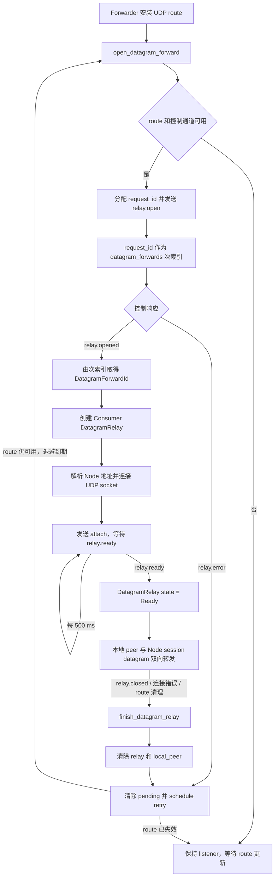

Consumer 的本地 UDP socket 只服务一个本地 peer。首次报文固定来源 IP 和端口；同一 IP 上的程序重启后可改用新的源端口，不同来源 IP 的报文会被丢弃。服务器到来的 payload 只有在已经知道本地 peer 时才能回送。Relay 结束后保留 forward 配置和监听 socket，清除 peer/relay 状态并按客户端 UDP 重试机制重新打开。

### 8.5 节点断线与局部清理

`Forwarder::clear_server(server_id)` 只处理匹配该 ID 的对象：

- 删除该节点的 service routes；
- 取消该节点的 pending stream/UDP open；
- 关闭该节点的 active stream/UDP relay；
- 清除引用该节点的 DatagramForward 当前状态并安排恢复。

其他节点的 routes、pending 和 active 容器保持不变。`server_id` 与 `uuid` 共同标识 Relay，使每个服务器的 Relay 可以独立清理。

### 8.6 数据端点选择

`relay.opened` 和 `relay.offer` 只返回 `data_port`，不返回另一份 data host。Forwarder 使用收到该控制消息时绑定的 ServerRoute：

```text
data endpoint = ServerRoute.host + response.data_port
```

ServerRoute 来自已经完成 mTLS 和 `server.identified` 的控制连接。这样控制消息属于哪个节点，数据连接就回到哪个节点，不会把未经连接上下文校验的 host 字段引入协议。TCP、TLS、UDP 都遵循同一规则。

因此仅把候选第一跳替换成数据 host 不能实现多跳：其他 Node 当前没有该 Relay 的等待状态或 ticket，
服务节点也没有把 Consumer 半边接到上游 Node 的接口。多跳需要新的路径控制与分段数据面，不能只改一次 connect。

## 9. CtrlMessage 控制协议模块

控制通道使用 `WireMessage` 长度帧承载 CBOR 编码的 `CtrlMessage`。消息结构为：

```text
{
  "command": "命令名",
  "params": { ... }
}
```

共享协议库使用 `CtrlCommand` 集中表示所有保留命令。发送方可用枚举构造 `CtrlMessage`，
接收方通过 `type()` 得到枚举并分派，避免在消息构造和分派中散落 command 字面量。`params` 仍是 JSON，
各业务分支只校验自己需要的字段，不建立消息结构、`variant` 或通用 schema/codec 层。

集群 wire 继续把 `source/target` 放在 `params` 中。非保留的普通 cluster command 仍以字符串透传，
`type()` 对它们返回 `Unknown`；`cluster.*` 命令仍由集群握手保留。这一内部收口没有改变
小消息的长度帧、CBOR 或 `{command, params}` wire 格式。

大消息分页统一在 `protocol/inc/message.h` 和 `protocol/src/message.cpp` 中实现：

- `WireMessage::pack` 对不超过 64 KiB 的消息保持原单帧编码；较大消息先完整编码为 CBOR，再按最多 65472 字节拆分。
- 分片帧的 CBOR 根对象为 `{"__fragment": [page_index, page_count, bytes]}`，`bytes` 是 CBOR byte string；每帧仍使用四字节大端长度头，payload 不超过 64 KiB，逻辑消息上限为 16 MiB。
- `TLSChannel::send` 将一条消息的全部帧作为一个队列项连续写入 TCP；每条连接的 `MessageReceiver` 只维护一个组装缓冲和页序计数，无消息 ID、乱序缓存或分页超时。
- 收到第 0 页时开始新组；后续页必须连续且总页数一致。末页到达时仍缺页则丢弃整条消息，保持连接。业务处理器只接收重组后的完整 `CtrlMessage`。
- Node 间转发也先接收完整消息，再修改路由字段并自动重新拆分，不需要业务模块预估内部路由开销。

Node、Agent、Dashboard 需要同步升级；不兼容旧的业务分页字段和大消息解码方式。

### 9.1 身份、服务与查询消息

| 命令 | 方向 | 主要字段 | 含义 |
|---|---|---|---|
| `server.identify` | client → server | 空对象 | 请求节点身份 |
| `server.identified` | server → client | `node_id` | 返回当前节点 ID |
| `service.register` | client → server | `request_id`, `service`, `protocol` | 注册本地服务 |
| `service.ok` | server → client | `request_id`, `service`, `protocol` | 注册成功 |
| `service.error` | server → client | `request_id`, `service`, `protocol`, `reason` | 注册失败 |
| `service.lookup` | client → server | `request_id`, `service`, `protocol` | 从当前集群定位服务 |
| `service.located` | server → client | `request_id`, `service`, `protocol`, `node_id`, `address`, `port` | 返回服务节点控制端点 |
| `service.list` | client → server | `request_id` | 查询本节点注册服务 |
| `service.listed` | server → client | `request_id`, `services` | 返回服务名数组 |
| `server.cluster` | client → server | `request_id` | 从当前节点发起一轮集群状态查询 |
| `server.status.reported` | server → client | `request_id`, `node_id`, `uptime_ms`, `services` | 每个在线节点独立返回完整状态报告 |

服务名长度为 1～64 字节，只允许 `A-Z`、`a-z`、`0-9`、`.`、`_`、`-`。服务名在单个 RelayNode Registry 内唯一；注册和使用的协议必须一致。

### 9.2 Relay 控制消息

| 命令 | 方向 | 主要字段 | 含义 |
|---|---|---|---|
| `relay.open` | Consumer → server | `request_id`, `service`, `protocol` | 请求创建 Relay |
| `relay.opened` | server → Consumer | `request_id`, `service`, `protocol`, `uuid`, `data_port`, `ticket`；UDP 另含 `session_id` | 下发 Consumer 数据连接参数 |
| `relay.offer` | server → Producer | `service`, `protocol`, `uuid`, `data_port`, `ticket`；UDP 另含 `session_id` | 要求 Producer 建立数据连接 |
| `relay.ready` | server → 双方 | `uuid`, `protocol` | 双方 attach 完成 |
| `relay.reject` | Producer → server | `uuid`, `reason` | Producer 无法连接本地目标或数据端口 |
| `relay.cancel` | client → server | `uuid` 或 `request_id` | 取消 Relay 或尚未完成的打开请求 |
| `relay.closed` | server → UDP 双方 | `request_id`, `uuid`, `service`, `protocol`, `reason` | UDP Relay 已关闭；未完成 ready 时也用于释放已收到 offer 的 Producer |
| `relay.error` | server → client | `request_id`, `service`, `protocol`，可选 `uuid`, `reason` | 打开、配对或对端处理失败 |

`request_id` 关联一项请求及响应；`uuid` 标识已创建的 Relay。两者都是非零无符号整数。发送成功不由函数返回值表示，业务状态只由这些协议消息推进。

### 9.3 运行状态查询消息

| 命令 | 响应 | 说明 |
|---|---|---|
| `server.load` | `server.loaded` | 返回 `control_queue_delay_us`、`transfer_tcp_queue_delay_us`、`transfer_udp_queue_delay_us` |
| `server.traffic` | `server.traffic.reported` | 返回本节点当前注册服务的累计流量和实时带宽 |
| `server.cluster` | 每节点一条完整 `server.status.reported` | 通过任意入口按需查询整个集群；协议层透明组装，不发送全局完成消息 |

排队延迟是周期 timer 从计划到期时间到 handler 实际开始执行的延迟。第一次采样前为 `UINT32_MAX`，有效值最大饱和到 `UINT32_MAX - 1`。查询只读已保存快照，不跨 executor 等待实时采样。

流量数组的每项包含 `service`、`protocol`、`rx_bytes`、`tx_bytes`、`rx_bytes_per_second`、`tx_bytes_per_second`。Accessor 端点中 IPv4 使用 `address:port`，IPv6 使用 `[address]:port`。RX 表示 Producer/service 到 Consumer，TX 表示反方向。只统计成功写到对端的应用 payload；不包含控制帧、TLS record、attach 和 UDP 8 字节 session header。带宽按实际采样间隔换算，并以系数 0.5 做 EMA。

`server.load` 和 `server.traffic` 只报告当前节点；`server.cluster` 广播查询，各在线节点把独立完整报告定向发回入口，入口只转发、不聚合或缓存结果。当前所有普通客户端共用客户端证书，因此任意通过 mTLS 的客户端都能请求这些信息，它们不是独立管理员接口。

### 9.4 拓扑与质量消息

| 命令 | 方向 | 主要字段 |
|---|---|---|
| `topology.report` | Node → master（master 本机处理） | `epoch`, `members_version`, `sequence`、三类排队延迟、`links`；来源身份取集群认证 source |
| `topology.query` | client → 入口 → master | `request_id`；入口附加内部会话路由字段 |
| `topology.snapshot` | master → 入口 → client | `request_id`, `epoch`, `snapshot_version`, `created_age_ms`, `nodes`, `links` |

节点条目包含 `node_id`、`address`、`report_age_ms` 和三类排队延迟；缺失或过期报告的年龄和排队值为 null。
有向链路条目包含 `source`、`destination`、长期 `rtt_ms`、`jitter_ms`、`loss_rate`、
`transmitted/received/completed`、`age_ms` 及质量摘要，例如：

```json
"quality": {"cost": 20.0, "confidence": 0.8, "usable": true}
```

摘要严格使用这三个字段。Node、Agent、Dashboard 应统一升级；不维护新旧质量格式混用分支。
`server.status.reported` 的服务状态结构保持独立，拓扑汇总不会改变该报文。大消息由 protocol 在 TCP 连接上透明拆分重组；master 回复经入口转发前校验来源并移除内部路由字段。有效性规则见 7.7.4 节。

## 10. 数据帧与 attach 协议模块

### 10.1 RelayAttach 首帧

TCP、TLS、UDP 使用同一个逻辑首帧：

```text
[4 字节大端 payload 长度][CBOR CtrlMessage payload]
```

payload 是：

```text
{
  "command": "relay.attach",
  "params": {
    "role": 1 | 2,
    "uuid": <non-zero uint64>,
    "ticket": <non-zero uint64>
  }
}
```

`role=1` 是 Producer，`role=2` 是 Consumer。payload 长度必须在 1～64 KiB。TCP/TLS 在 stream 上精确读取一帧；UDP 的一个 datagram 必须完整包含一帧，而且长度字段必须与剩余长度完全一致。

TLS 数据通道先完成 mTLS 握手，再在加密流内发送 attach。TCP 和 UDP 的 attach 位于明文数据通道，但 ticket 只通过已认证控制连接下发。

manager 按 `uuid` 查找 Relay，再验证 ticket 是否属于声明的 role。以下情况会被拒绝：帧或 CBOR 非法、命令错误、Relay 不存在或过期、ticket/role 不匹配、同一 role 重复接入、超过 setup timeout 或容量上限。

`uuid` 是索引，不是认证凭据。每个 role 的 64 位非零 ticket 由 OpenSSL `RAND_bytes` 生成，并在 Relay 销毁时失效。

### 10.2 Stream Relay 建立流程

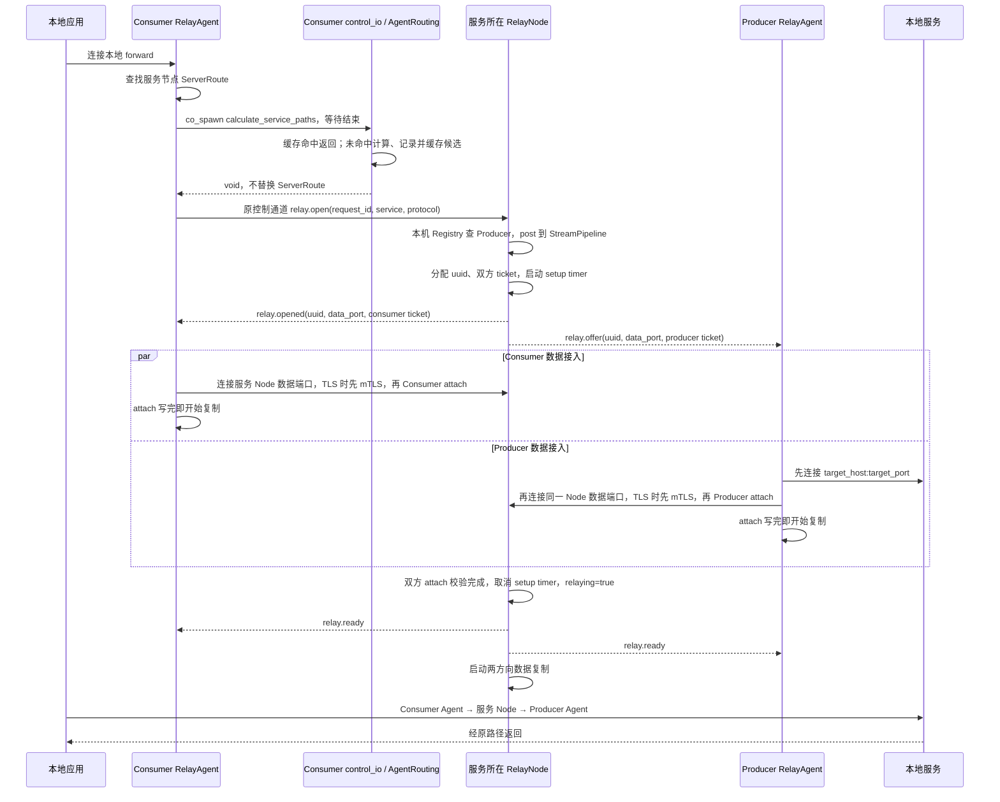

服务器在 `relay.open` 时建立等待中的 Relay 和 setup timer。两侧都 attach 后取消 timer、发出 `relay.ready`
并启动复制。两侧 attach 到达顺序没有要求；Agent 写完 attach 后可先写业务字节，Node 在配对完成前不启动
业务读取与转发，这些字节受 socket 缓冲和传输背压约束，没有额外的 ready 前用户态 payload 队列。
`Forwarder::relay_ready()` 对 TCP/TLS 直接返回，仅 UDP 使用它推进 ready 状态。

StreamPipeline 中一项流式 Relay 的阶段为：

```text
open
  -> Waiting(producer half=null, consumer half=null, setup timer active)
  -> 一侧 attach（保存对应 TCP socket 或 TLS stream）
  -> 两侧 attach（取消 setup timer，设置 relaying=true）
  -> Active（两个方向复制）
  -> Closed（关闭两侧，释放会话弱引用和统计引用）
```

Producer 和 Consumer 获得不同 ticket。attach 顺序没有要求；先到的一侧保存在 Relay 中等待另一侧。`max_setup_connections` 限制尚未解析出有效 uuid/role 的接入 socket，`max_relays` 限制已经由 `relay.open` 创建的 Relay，两者解决的是不同资源耗尽问题。

等待和活动 Relay 都保存在同一个 `relays_` 表中，配对时不会移出该表，容量统计覆盖两种状态。
setup 超时、合法 reject/cancel、控制会话断开等终止等待 Relay 时释放状态和容量，并向 Consumer 发
`relay.error`。无效 attach 只拒绝该接入 socket，不直接销毁仍在等待的 Relay；其余接入仍可在期限内完成。
活动 Relay 在 I/O 结束或控制会话断开时关闭并释放；当前 stream 没有 `relay.closed` 通知，不自动重放或换路。

控制会话和 Relay 互相只保留完成操作所需的所有权。Relay 中的 Producer/Consumer 是 weak 控制会话；
控制会话断开时 ControlRouter 按 session 通知两个 StreamPipeline 和 DatagramMgr 清理，Relay 本身不延长
控制会话生命周期。

### 10.3 DatagramHeader 与 UDP 路由流程

UDP attach 完成后，公网数据报格式为：

```text
[session_id: 8 字节大端序][用户 payload: 0..65499 字节]
```

Producer 和 Consumer 各有不同的随机非零 `session_id`。服务端以 `session_id` 找到 Relay 和方向，校验来源 endpoint，再把头部改写为对端 `session_id` 并发送。客户端校验并剥离头部，本地应用看不到它。

ready 前 payload、未知或为零的 `session_id`、短报文、来源 endpoint 不匹配和超长报文都静默丢弃。只有 8 字节头的报文表示零长度用户 datagram。UDP 不保证可靠、顺序或去重，系统也不缓存 ready 前的数据。

DatagramMgr 为每侧建立 `session_id -> {uuid, side}` 索引。收包时先用 `session_id` 找 binding，再用 `uuid` 找 Relay，最后核对已固定的来源 endpoint。分两次查找使 `session_id` 只负责公网快速路由，Relay 实体仍以统一 `uuid` 管理。Relay 删除时同步删除双方 binding，旧 `session_id` 立即失效。

UDP `relay.open` 可以在 Producer 尚未出现在 DatagramMgr 的 service 表时到达。Relay 使用
`WaitingForProducer -> WaitingForAttach -> Active -> Closing` 显式状态机。`relays_` 是 Relay 的唯一事实
来源；服务注册到达 UDP executor 后，manager 在受 `max_relays` 限制的容器中扫描 service 与
`WaitingForProducer` 状态匹配的 Relay。服务注册是低频控制路径，扫描规模受 `max_relays` 约束；创建、
配对、超时、取消和停止只更新 `relays_`。跨 executor 的异步投递仍保持原有顺序边界。

`service_wait_timeout_ms` 只限制 `WaitingForProducer`，默认 300000 毫秒。Producer 上线后，Relay 转入
`WaitingForAttach` 并立即取消该 timer；`WaitingForAttach` 和 `Active` 在 Node 端均不设时间上限，依靠
`relay.cancel/reject` 或控制连接断开收敛。等待服务超时、取消或控制连接断开都会从 `relays_` 删除 Relay、
删除双方 binding 并释放 `uuid` 和容量，迟到的服务注册不能复活旧 Relay。

Consumer 先打开、Producer 后上线时的完整控制与 attach 流程如下。图中 Producer 在 `relay.open` 到达时
尚未注册；如果服务已经在线，DatagramMgr 会跳过等待阶段直接发送 offer。

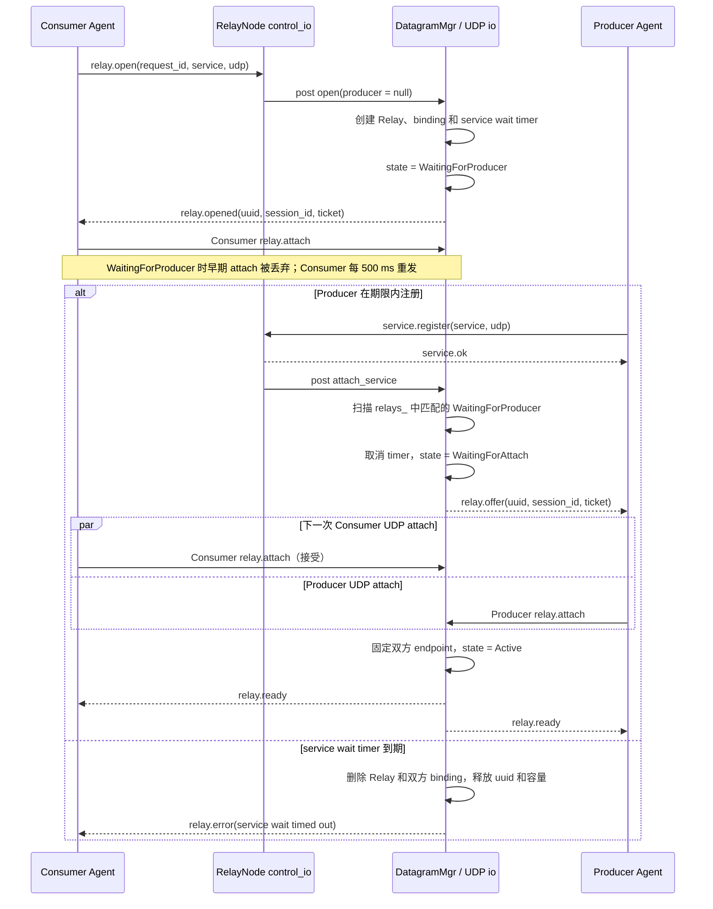

DatagramMgr 对每个公网 UDP datagram 的处理路径如下。attach 与活动数据共用同一个 socket；是否命中
`bindings_` 决定进入数据快路径还是尝试解析 attach。

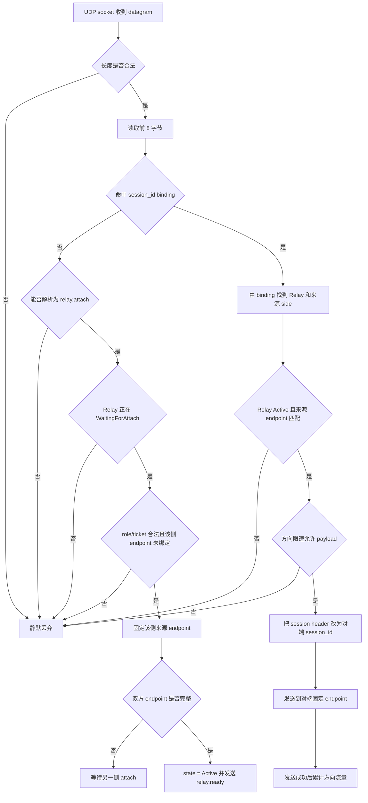

## 11. TCP、TLS 与 UDP 传输实现

`xfr_channel` 是 Agent 和 Node 共用的数据复制模块。它接收已经完成连接、握手和 attach 的 socket，
负责双向复制、限速、流量计数和关闭传播。调用方仍拥有 socket，并负责 Relay 索引和控制消息生命周期。

| 协议 | 公网数据保护 | 转发对象 | 限速行为 | 关闭特点 |
|---|---|---|---|---|
| `tcp` | 明文，attach ticket 鉴权 | TCP byte stream | 等待令牌，形成背压 | 支持 TCP 半关闭排空 |
| `tls` | client 到 server 的 mTLS；server 可见明文 | TLS 解密后的 byte stream | 等待令牌，形成背压 | 任一方向结束后整体关闭 |
| `udp` | 明文，`session_id` 路由 | 完整 datagram | 令牌不足时整包丢弃 | 随控制会话或显式取消释放 |

### 11.1 XfrChannel 复制入口

| 函数 | 使用模块 | 两端类型 | 责任 |
|---|---|---|---|
| `relay_tcp()` | Forwarder、StreamPipeline | TCP ↔ TCP | 双向复制、等待式限速、流量计数和半关闭 |
| `relay_tls(TCP, TLS)` | Forwarder | 本地 TCP ↔ 公网 TLS | 本地明文与数据 TLS stream 双向复制 |
| `relay_tls(TLS, TLS)` | StreamPipeline | Producer TLS ↔ Consumer TLS | 解密后的 payload 复制、限速和流量计数 |
| `relay_udp_connected()` | Forwarder | 本地 UDP ↔ 公网 UDP | 增删 session header，并在两个 connected socket 间逐包转发 |

流式函数内部同时运行两个复制方向。任一方向发生致命错误时取消配对方向；正常 EOF 按对应 transport 的
关闭规则收敛。UDP Node 的逐包路由由 DatagramMgr 直接实现，`relay_udp_connected()` 只用于 Agent 本地
目标与 Node session 之间的转换。

### 11.2 TCP Pipeline

双方和服务器都运行两个异步复制方向。每个方向使用 64 KiB 缓冲区，一次读取后等待对应写入完成，再开始下一次读取，因此不会建立无限增长的用户态缓存。

普通 EOF 使用半关闭：A 读到 EOF 后只对 B 执行 `shutdown(send)`，B 到 A 的方向继续运行并排空。两个方向都结束后再关闭 socket。致命错误和显式取消会关闭双方。

### 11.3 TLS Pipeline

TLS 的复制同样按应用明文字节背压和统计。加密在 RelayAgent 与 RelayNode 之间终止，服务器能看到业务 payload，因此它不是两个客户端之间的端到端加密。需要防止服务器读取内容时，应在业务层继续使用 SSH、HTTPS 等端到端协议。

TLS stream 不使用 TCP 半关闭策略。任一方向遇到 EOF 或错误时取消另一方向，待并发 read/write 收敛后关闭整个 Relay 并执行 TLS shutdown。

### 11.4 UDP Datagram

Consumer 在路由可用后主动打开 UDP Relay，不等待首个本地报文。双方各自创建 connected UDP transfer socket，发送 attach，收到 ready 后转发。

DatagramMgr 逐包完成接收、路由、校验、头部改写和发送。限速只计算 session header 后的用户 payload，令牌不足直接丢弃整包。等待服务受 `service_wait_timeout_ms` 限制；Producer 上线后，无论等待 attach 还是已进入活动状态，Node 均不再计时，而是与双方控制通道生命周期绑定。

## 12. 容量、超时与背压模块

### 12.1 DualIndexMap 状态索引

`DualIndexMap<PrimaryKey, SecondaryKey, Value>` 为控制面和 Forwarder 提供一份值、两条查找路径。主键始终
唯一，次键可配置为唯一或非唯一，并可在对象生命周期的 pending 阶段安装或清除。主要使用关系为：

| 使用者 | 主键 | 次键 | 用途 |
|---|---|---|---|
| RelayAgent `connections_` | connection ID | `node_id` | 按内部连接或已识别节点定位 NodeConnection |
| RelayAgent `service_routes_` | `(service, protocol)` | connection id | 查服务目标，并批量清理断开节点的路由 |
| Forwarder `routes_` | `(service, protocol)` | `server_id` | 数据面选路，并按节点清理全部路由 |
| Forwarder `datagram_forwards_` | DatagramForwardId | pending `request_id` | 长期定位 UDP forward，并把控制响应映射回主键 |
| RegistryMgr `services_` | `(service, protocol)` | `session_id` | 服务查询，并在控制会话断开时批量注销 |

唯一次键查询使用 `find_secondary_entry()` 同时取得主键和值。容器中的 Node 独立分配，rehash 只重建 bucket
链，因此 Value 地址在 erase 前保持稳定；erase 和 `clear()` 同步解除两条索引。每个实例由所属 executor
串行访问，容器本身不承担跨线程同步。

### 12.2 Relay 标识、流量统计与令牌桶

Node 的 TCP、TLS 和 UDP manager 共享线程安全的 `RelayIdAllocator`。分配器记录活动 ID，并在释放后允许
编号复用；三类 manager 因而可以用统一的非零 `uuid` 命名空间处理控制消息。

RegistryMgr 为每项服务创建共享 `ServiceTraffic`。Relay 只保留该统计对象的共享引用，服务注销与正在结束
的 Relay 可以安全交错。`TrafficCounter` 使用原子饱和累加，周期采样把区间字节数换算为速率并计算 EMA。
RX 固定表示 Producer 到 Consumer，TX 表示 Consumer 到 Producer。

`TokenBucket` 按方向独立配置。TCP/TLS 在读到 payload 后等待预约时刻再写入，背压沿 socket 传播；UDP
使用 `try_consume()` 判定整包发送，令牌不足时丢弃该 payload。统计只在成功写入对端后累计。

### 12.3 容量与超时配置

| 配置 | 作用范围 |
|---|---|
| `control.max_connections` | 普通控制会话上限；同时作为 master 集群连接的独立上限 |
| `control.max_services` | 本节点全部注册服务上限 |
| `control.max_services_per_session` | 一条普通控制连接可注册的服务上限 |
| `tcp/tls.max_setup_connections` | 正在读取 attach 的未归属 TCP/TLS socket 上限 |
| `tcp/tls/udp.max_relays` | 对应 manager 的等待和活动 Relay 上限 |
| `tcp/tls.setup_timeout_ms` | 从创建/接受到合法 attach 完成的时间限制 |
| `udp.service_wait_timeout_ms` | Consumer 创建 UDP Relay 后等待 Producer 服务上线的时间限制；默认 300000 毫秒，不限制 attach 和 Active 阶段 |
| `channel.max_queued_messages` | 单条 TLSChannel 的发送队列、ClusterMgr 出站消息队列和 RelayNode 对外集群消息队列容量 |
| `relay.open_timeout_ms` | RelayAgent 的 TCP/TLS Consumer 等待 Relay 打开结果的时间；UDP 不使用此期限 |
| `server.connect_timeout_ms` | RelayAgent 的解析/连接和数据连接超时 |

TCP/TLS 的 `rx/tx_bytes_per_second` 为 0 时不限制；非零时配合对应 burst 值使用等待式令牌桶。UDP 使用同样方向定义，但无法对 datagram 做部分等待，令牌不足就丢包。

TLSChannel 的发送队列满时拒绝本帧、记录原因并直接关闭通道；编码失败、底层 TLS 写失败或业务接收队列满也进入同一关闭边界。系统没有可靠消息队列，不重试单条控制消息，也不会把 `send()` 调用当成成功确认。

## 13. 故障与恢复流程

| 故障 | 当前行为 |
|---|---|
| RelayAgent 初始服务器不可达 | primary 按配置指数退避重连；已知附加节点可独立运行和重连 |
| 某个附加服务器断线 | 只清理该节点的路由和 Relay；其他节点继续工作 |
| 服务尚未发现 | 每 5 秒经 primary 查询；TCP/TLS 新本地连接直接关闭 |
| 服务从节点 A 迁移到 B | A 返回 unavailable/mismatch 后清路由并重新发现 B |
| master 集群端口断线 | slave 每 5 秒重连；各节点已有控制会话和 Relay 继续运行 |
| 重复 `node_id` 或保留值 `all` | master 返回 `cluster.error`，拒绝加入 |
| 普通客户端控制连接断开 | 注销该会话服务，取消相关 Relay |
| 数据一侧未按时 attach | setup timer 清理 Relay 和已到达的一侧 |
| 业务消息发送后断线 | 不保存、不补发、不自动重试；由协议响应和业务超时判断 |
| RelayNode/RelayAgent 停止 | 取消监听、解析、连接、timer 和 Relay，等待所属协程退出 |

系统不包含 master 选举、备用 master、全局服务目录同步、跨节点数据中继、历史消息或恰好一次投递保证。

## 14. 安全边界

- control 和 cluster 通道强制 mTLS；TLS 数据通道也强制 mTLS；
- TCP、UDP 数据 payload 在公网为明文；
- ticket 把数据连接绑定到具体 Relay 和 role，但不替代 TLS 身份认证；
- UDP `session_id` 和固定来源 endpoint 只能阻止简单误路由，不能抵御能监听并伪造同源报文的攻击者；
- 共享客户端证书只证明连接方属于受信任客户端集合，不提供单客户端身份、服务所有者身份或细粒度 ACL；
- 集群成员身份信任 Server CA，`node_id` 是协议声明，不与证书主题绑定；
- `server.load`、`server.traffic`、`server.cluster` 等控制查询对所有通过普通客户端 mTLS 的连接可用。

证书角色、信任根、SAN 和私钥保护措施见 [证书制作与部署](证书制作与部署.md)。

## 15. 生命周期与所有权

实现遵循以下原则：

1. executor 拥有状态，跨域只投递消息；
2. resolver、socket、timer 等只服务于单个连接循环的对象放在协程栈上；
3. manager 不为方便而长期持有活动 channel；观察连接状态时使用 `weak_ptr`；
4. `shared_ptr` 只在异步操作确实需要对象存活时按值跨越 `co_await`；
5. session 的退出负责从 room/registry 移除自身，manager 不额外延长其生命周期；
6. 需要对外提供完成语义的 stop 等待结构化协程结束；StreamPipeline 内部 detached 任务则只在执行期间
   自持对象，取消或超时后自然释放，不另建一套任务状态机。

这些约束让“连接是否仍存在”由实际异步对象生命周期表达，减少重复状态、回调链和悬空引用。

### 15.1 RelayNode 停止流程

`RelayNode::stop()` 是同步收敛接口，由 `control_io`、`transfer_tcp_io`、`transfer_udp_io`、`cluster_data_io` 之外的线程调用。
它通过一次性状态保护执行以下流程：

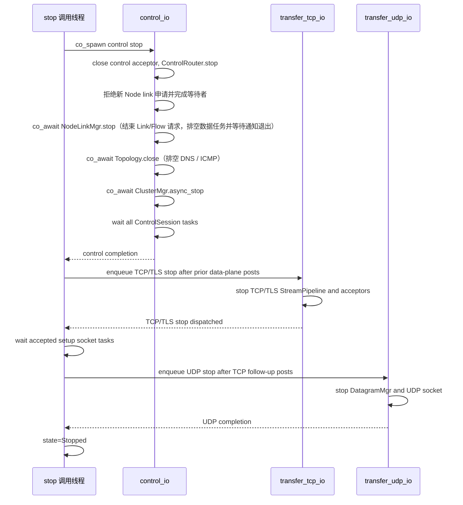

Node 共享数据任务首先在独立 cluster_data_io 中取消并等待退出，再关闭集群控制连接；最后主程序 join 数据线程。其余三个停止阶段分别由对应 executor 执行，外部同步 `stop()` 通过 `use_future` 逐阶段等待。control 侧先让
Registry 停止接受新状态并断开现有普通会话，等待 ClusterMgr 和全部 ControlSession 结束，确保
ControlRouter 不会再产生数据面投递。随后把 TCP/TLS stop 放到 transfer_tcp 队列尾部；此前的 reject/cancel
可能向 UDP 产生后继投递，因此 TCP/TLS 阶段完成后才把 DatagramMgr stop 放到 transfer_udp 队列尾部。
ClusterMgr 首先把自身置为非运行状态，再取消 master accept/slave connect、关闭出站消息队列和全部成员
session 并等待退出。`ClusterMgr::async_stop()` 返回后，RelayNode 关闭提供给外部业务的
`cluster_messages` channel。

TCP/TLS accept 后、首帧解析前的 socket 由各 StreamPipeline 的独立 setup 协程暂时持有，不能只关闭
acceptor 就假定它们消失。每个实例自己的 `pending_sockets_` 记录这部分协程；TCP/TLS 停止阶段在进入
UDP 停止前使用原子 wait 等待它们归零。accept loop 和已进入复制阶段的 Relay 协程按值捕获 Pipeline 的
`shared_ptr`；`stop()`
关闭 acceptor 并取消 Relay 后，这些内部任务自行收敛并释放所有权，不把生命周期转嫁给 ControlRouter。

### 15.2 RelayAgent 停止流程

`RelayAgent::async_stop()` 是唯一的公开停止接口，调用方必须保证它完成后才销毁 Agent 或结束 executor。
一般调用方直接等待该 awaitable；Agent 进程的信号回调则在 `control_io` 上 detached 启动它，避免阻塞
`signal_io` 线程，随后由 `main()` join control/transfer 线程间接等待停止收敛。`main()` 持有的 Agent
`shared_ptr` 在 join 完成前保持有效。重复调用在 `StoppingControl` 或 `StoppingForwarder` 状态等待同一个完成
信号，在 `Stopped` 状态立即返回。尚未启动的 Agent 也走完整停止路径，以释放已构造 Forwarder 持有的
transfer work guard。
停止顺序固定为：

1. control executor 把 Agent 切换为 `StoppingControl`，取消 discovery timer、停止 AgentRouting 探测，并停止所有 NodeConnection；
2. NodeConnection 取消其拥有的 resolver/socket/retry timer，并要求当前 TLSChannel 断开；
3. discovery 协程等待 `AgentRouting::close()` 排空 DNS / ICMP；discovery 和连接协程的 completion handler 递减 control `active_tasks`；
4. control `active_tasks==0` 后，把 Agent 切换为 `StoppingForwarder`，并向 transfer executor 队列尾部启动
   `Forwarder::async_stop()`；
5. Forwarder 切换为 `Stopping`，清除路由，关闭本地 acceptor、UDP socket、open/retry timer、pending 和
   active Relay；所有公开数据面入口和 retry/open 辅助入口在非 Running 状态拒绝新工作；
6. accept、UDP receive、Stream Relay 和 Datagram Relay 协程各自递减 transfer `active_tasks`；归零后释放
   transfer work guard 并完成 Forwarder 停止；
7. control executor 清空连接池和 service routes，把 Agent 切换为 `Stopped` 并唤醒所有停止等待者。

RelayAgent 不靠固定延迟等待关闭。control 任务先完全退出，保证不会再产生新的 transfer 投递，然后才在
transfer 队列尾部关闭 Forwarder；两个 executor 的实际协程计数决定停止完成时刻。

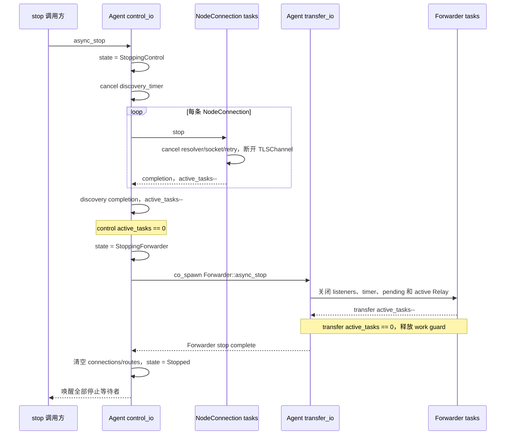

### 15.3 对象所有权关系

| 对象 | 主要所有者 | 对外引用方式 | 结束条件 |
|---|---|---|---|
| RelayNode / RelayAgent | `main()` 的 `shared_ptr` 和必要 completion | 按值跨越顶层异步任务 | stop 完成且线程退出 |
| ClusterMgr | RelayNode 的 `shared_ptr` 成员 | 非拥有的 `RelayNode&` 反向引用 | `async_stop()` 已等待主循环和成员会话退出 |
| ControlRouter | RelayNode 的 `unique_ptr` 成员，且声明在所借用的 manager 之后 | 对 ClusterMgr、StreamPipeline、DatagramMgr 保存非拥有引用 | Registry 停止且控制会话退出；析构先于所借用对象 |
| StreamPipeline / DatagramMgr | RelayNode 的 `shared_ptr` 成员；运行中的内部协程按需自持 | ControlRouter 只保存引用 | stop 关闭入口并取消 Relay，内部协程随后自然退出 |
| TLSChannel | 自己的 run 协程和当前连接协程 | manager/route 使用 `weak_ptr` | 任一读写、心跳、关闭分支结束 |
| ControlSession | 当前 session 协程 | Registry 和 Relay 使用 weak 引用 | 接收循环结束并完成 disconnect |
| ClusterRoom | master accept_loop 协程栈 | ClusterSession 保存引用，且必须先于 room 退出 | accept/delivery 停止并等待 participant 清空 |
| ClusterConnector | slave_loop 协程栈 | ClusterMgr 仅存停止用临时指针 | running=false 且当前操作取消 |
| NodeConnection Operations | NodeConnection 的 `optional` 成员在 run 期间原位拥有 | stop 直接访问同 executor 上的拥有型状态 | 连接循环退出时 scope guard 清空 |
| Topology / AgentRouting | RelayNode / RelayAgent 直接拥有 | 同一 control executor 内调用 | close 已排空刷新与探测任务 |
| ProbeSet / ICMP Session | Topology 或 AgentRouting / ProbeSet 中的 ICMP 实例 | 按值读取评估结果；历史只复制 ProbeState | close 等待 DNS、探测和接收协程退出 |
| RelayNode Stream/Datagram Relay | 对应 StreamPipeline/DatagramMgr 与活动任务 | 控制会话使用 weak 引用 | 错误、取消、超时、断线或 stop |
| RelayAgent StreamRelay | pending 阶段由 `pending_stream_opens_` 强拥有；active 阶段由协程拥有 | active multimap 使用 weak 引用 | 打开失败、传输结束、节点断线或 stop |
| RelayAgent DatagramForward | `datagram_forwards_` 按值拥有 | 主 ID 定位；可选次索引表示 pending request | Forwarder 销毁 |
| RelayAgent DatagramRelay | Producer 由协程拥有；Consumer 由协程和 DatagramForward 拥有 | active multimap 使用 weak 引用；反向只保存 forward ID | 传输结束、节点断线或 stop |

ClusterConnector 仍使用同一 executor 上的非拥有临时指针执行取消，并在栈对象退出前清空；
NodeConnection 已不再保存指向协程栈的裸指针。这样既不悬空引用，也不无条件延长短生命周期异步对象。

## 16. 构建与验证

Debug 构建和完整测试：

```console
cmake -S . -B build -DCMAKE_BUILD_TYPE=Debug -DBUILD_TESTING=ON
cmake --build build --config Debug --parallel 1
ctest --test-dir build -C Debug --output-on-failure
```

路由模块测试集中在 `test/route/`；Agent 路由组装与 Node 拓扑测试分别保留在
`test/agent_routing_test.cpp` 和 `test/topology_test.cpp`。所有相关 CTest 使用 routing 标签，
普通权限和 ICMP 集成可以分别运行：

```console
ctest --test-dir build -C Debug -L routing -LE icmp --output-on-failure
ctest --test-dir build -C Debug -L icmp --output-on-failure
```

| 测试 | 覆盖范围 | 运行条件 |
|---|---|---|
| `link_quality` | 人工时间、三个半衰期、冷启动、稀疏样本、尖峰、失败/恢复、长期运行及摘要解析 | 无网络需求 |
| `routing` | 有向边、多入口、真实节点预算、同成本、孤立入口，随机小图与穷举对拍 | 无网络需求 |
| `probe_set` | DNS 失败重试、目标 revision、解析取消、重复/并发关闭及取消后排空 | 普通 DNS/socket 权限 |
| `agent_routing` | 乱序/缺页/冲突、请求与 epoch、质量变化及“来源报告 14 秒旧，再过 2 秒失效” | 不需要原始 socket 权限 |
| `topology` | Node 报告解析、来源与成员校验、三字段质量和完整快照 | 不需要原始 socket 权限 |
| `probe_integration` | 真实 ICMP、共享 IP、DNS 失败不中断正常目标、历史/发送计数保留、目标变化、推荐路径及关闭 | Linux CAP_NET_RAW / Windows 管理员 |

`probe_integration` 仅在原始 socket 权限不足时返回 77，由 CTest 标为跳过；其他初始化或网络错误必须失败。
人工质量用例验证推荐路径随成本变化；真实测量需在具备上述权限的环境验证，跳过不能替代这部分验收。
`test_icmp` 是手动诊断程序，不注册为 CTest，构建后可运行 `build/test/route/test_icmp 127.0.0.1 4`。
`routing` 生成的图示报告位于 `build/test/route/routing_test_report.html`，测试产物不进入源码或安装包。

主要测试覆盖：

- `tls_channel_mtls`：双向证书、主机名校验、握手失败与通道生命周期；
- `cluster_integration`：ClusterRoom 广播与定向发送、来源、保留/重复 ID、非法命令、成员证书、固定 5 秒重连、无历史回放和停止；
- `links`：共享 TCP/UDP 双向多流、并发复用、master 端点、单次失败与外层重试、凭据/旧 ID、保活失效、epoch/离线、端口差异、监听回滚和停止排空；
- `agent_cluster`：两个节点上的服务同时转发、primary 离线时附加节点恢复、服务迁移、首次目标失败、过期发现响应；
- `relay_protocol`：控制命令枚举映射、自定义命令、三种协议 attach、帧校验、UDP session header
  和限速基础逻辑；
- `relay_integration`：TCP/TLS Relay、ticket/role、半关闭、RelayAgent/RelayNode 完整往返；
- `udp_relay_integration`、`udp_session_routing`：UDP attach、路由、endpoint 固定、丢包边界、重建和统计，
  以及 Producer 延迟/临近超时上线、永不上线、等待中断线、迟到注册不复活和容量恢复；
- `agent_lifecycle`、`agent_reconnect`：重复启动/停止、可等待停止、断线重连取消以及停止后的对象释放。

`benchmark_udp_node` 是独立容量基准，不注册为 CTest。它建立真实 mTLS 控制会话和 UDP Relay，再以原始 UDP socket 测量服务器数据路径。

Dashboard 与部署验证使用 Python 环境中的 Flask、cbor2、Waitress；部署测试仅使用临时目录和 dry-run，
不会修改主机配置或服务。双 Node smoke 启动真实 Node、发布/消费 Agent 与 Dashboard，验证 TCP/TLS、
Slave 入口重启恢复及历史保留；具备 CAP_NET_RAW 时也验证有向质量和推荐路径日志，否则明确跳过相关断言。

```console
python -m unittest discover -s dashboard -p 'test_*.py'
python -m unittest discover -s test -p 'provision_*_test.py'
python -m unittest discover -s test -p 'packaging_test.py'
python test/dashboard_service_smoke.py --build-dir build --two-nodes
```

## 17. 模块源码索引

- [`node/src/main.cpp`](../node/src/main.cpp)：RelayNode 配置入口、TLS context、执行线程和进程信号；
- [`node/src/node_config.cpp`](../node/src/node_config.cpp)：Node 配置解析与字段校验；
- [`node/src/relay_node.cpp`](../node/src/relay_node.cpp)：子系统构造、控制连接接入、执行域协调和停止；
- [`node/src/control_router.cpp`](../node/src/control_router.cpp)：控制命令、服务发现、状态报告和数据面投递；
- [`node/src/pipeline_mgr.cpp`](../node/src/pipeline_mgr.cpp)：TCP/TLS StreamPipeline 模板、transport policy、Relay 配对和流式转发；
- [`node/src/cluster_mgr.cpp`](../node/src/cluster_mgr.cpp)：ClusterRoom、ClusterSession、slave connector 和集群消息路由；
- [`node/src/topology.cpp`](../node/src/topology.cpp)：成员探测、报告校验、master 汇总与完整拓扑快照；
- [`node/src/registry_mgr.cpp`](../node/src/registry_mgr.cpp)：控制会话和本机服务注册；
- [`node/src/datagram_mgr.cpp`](../node/src/datagram_mgr.cpp)：UDP Relay、session 路由和 endpoint 校验；
- [`node/src/app_common.cpp`](../node/src/app_common.cpp)：Relay 标识、服务流量采样和共享 Node 数据结构；
- [`agent/src/main.cpp`](../agent/src/main.cpp)：RelayAgent 配置入口、双执行域线程和进程信号；
- [`agent/src/relay_agent.cpp`](../agent/src/relay_agent.cpp)：服务器连接池、节点身份、重连和服务发现；
- [`agent/src/agent_routing.cpp`](../agent/src/agent_routing.cpp)：拓扑组装、入口探测目标及推荐路径计算；
- [`agent/src/forwarder.cpp`](../agent/src/forwarder.cpp)：本地监听、按服务路由和三种数据通道；
- [`route/src/link_quality.cpp`](../route/src/link_quality.cpp)：三尺度聚合统计、Assessment 与最终边权；
- [`route/src/probe_set.cpp`](../route/src/probe_set.cpp)：DNS、身份映射、ICMP 管理与内存历史；
- [`route/src/icmp.cpp`](../route/src/icmp.cpp)：共享原始 IPv4 socket、探测/接收协程及安全关闭；
- [`route/src/route_graph.cpp`](../route/src/route_graph.cpp)：纯成本图和按真实节点数量分层的多入口搜索；
- [`protocol/src/tls_channel.cpp`](../protocol/src/tls_channel.cpp)：mTLS 握手、收发队列、心跳和通道关闭；
- [`protocol/src/message.cpp`](../protocol/src/message.cpp)：控制命令映射、WireMessage、CtrlMessage、RelayAttach 和
  DatagramHeader；
- [`protocol/src/xfr_channel.cpp`](../protocol/src/xfr_channel.cpp)：TCP/TLS/UDP 双向复制、限速和流量计数；
- [`protocol/inc/dualindex_map.h`](../protocol/inc/dualindex_map.h)：可变次索引、主次键联合查询和批量遍历。
