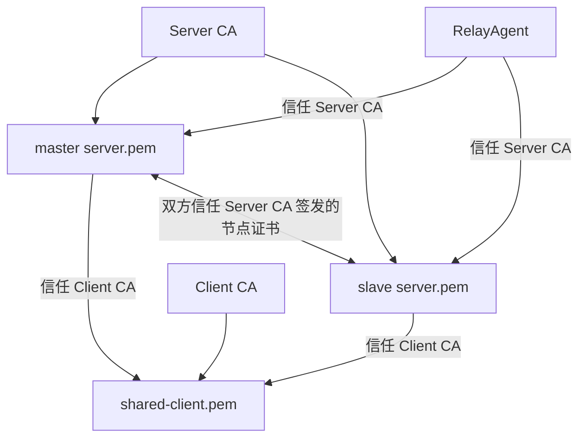
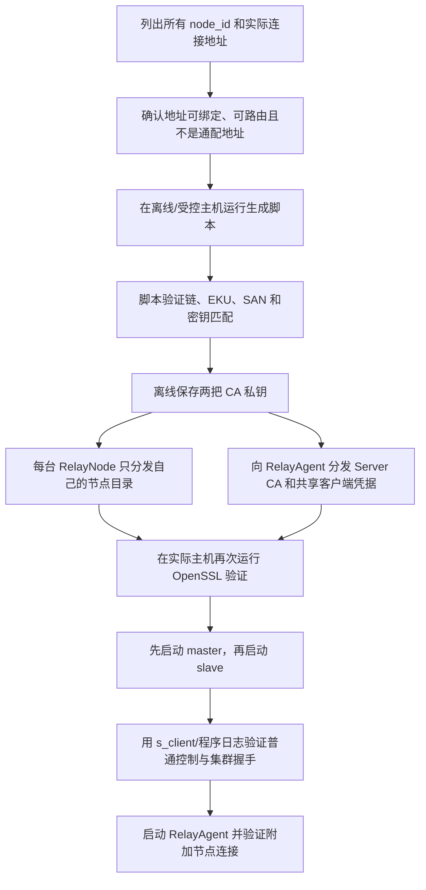

# RelayWeave 证书制作与部署

本文集中说明 RelayWeave 的证书信任模型、名称规划、自动生成、手工签发、文件部署、验证、轮换和常见故障。系统架构、集群服务发现和数据中继见 [RelayWeave 设计](RelayWeave设计.md)；Debian 包安装后的证书目录和服务操作见 [RelayWeave 打包与安装](RelayWeave打包与安装.md)。

## 1. 信任模型

项目使用两套互相独立的 CA：

| CA | 签发对象 | 谁信任它 | 认证用途 |
|---|---|---|---|
| Server CA | 每个 RelayNode 节点自己的叶子证书 | 所有 RelayAgent、所有 RelayNode | 普通客户端验证服务器；slave/master 互验集群成员 |
| Client CA | 普通 RelayAgent 的共享叶子证书 | 所有 RelayNode | 服务器验证普通代理客户端 |

这两个信任域不能混用：

- RelayNode `certificate.ca_file` 必须是 `client-ca.pem`；
- RelayNode `certificate.server_ca_file` 必须是 `server-ca.pem`；
- RelayAgent `certificate.ca_file` 必须是 `server-ca.pem`；
- `server.pem` 和 `shared-client.pem` 是叶子证书，不能代替 CA 信任文件；
- `server-ca.key` 和 `client-ca.key` 只用于签发，不能部署到运行节点。



### 1.1 一台服务器只使用一份节点证书

每个 RelayNode 节点只部署一份 `server.pem/server.key`。这份证书同时承担：

1. 普通客户端控制连接和 TLS 数据连接中的服务端身份；
2. master 集群监听中的服务端身份；
3. slave 连接 master 时的客户端身份。

因此节点证书的 `extendedKeyUsage` 必须同时包含：

```text
TLS Web Server Authentication
TLS Web Client Authentication
```

对应 OpenSSL 配置为 `extendedKeyUsage=serverAuth,clientAuth`。只有 `serverAuth` 的旧证书不能作为 slave 成员证书使用，必须用原 Server CA 重新签发。PEM 文件内容不能直接修改用途。

### 1.2 普通客户端共享证书的边界

当前生成器为所有 RelayAgent 签发同一份 `shared-client.pem/shared-client.key`。它证明连接方持有受 Client CA 信任的客户端凭据，但不能区分具体客户端，也不提供按客户端或服务的 ACL。

共享私钥一旦泄露，应视为全部普通客户端凭据泄露。处理方法见“轮换与泄露处理”。

### 1.3 `node_id` 与证书身份

每个节点证书拥有独立私钥和叶子证书。脚本把 `node_id` 用作目录名和证书 CN，集群协议也由节点声明 `node_id`，但 TLS 验证不把协议 `node_id` 与证书 CN/SAN 绑定。

集群成员资格来自 Server CA 信任；同一时刻重复的 `node_id` 由 master 的加入协议拒绝。不要把 CN 当作客户端连接时的主机名验证依据，实际连接身份由 SAN 决定。

## 2. 规划节点地址和 SAN

生成前先列出每台 RelayNode 会被哪些地址访问。每一个实际用于连接的地址都必须出现在该节点证书 SAN 中。

需要覆盖的地址包括：

- RelayAgent 初始配置的 `server.host`；
- `service.located.address` 返回给 RelayAgent 的服务节点地址，即服务节点配置的 `control.advertise_address`；
- slave 配置中用于连接 master 的 `cluster.address`；
- 同一节点若同时通过公网 IP、内网 IP或域名访问，应全部加入 SAN。

规则：

- 连接值是 IPv4/IPv6 时，使用 `IP:` SAN；
- 连接值是域名时，使用 `DNS:` SAN；
- 把 IP 只写入 CN 或 `DNS:` SAN 不能通过 IP 验证；
- 端口不属于 SAN；
- `0.0.0.0` 和 `::` 是监听通配地址，不应作为客户端目标或证书身份；
- 修改连接地址后，如果新地址不在原证书 SAN 中，需要重新签发节点证书。

例：

| 节点 | `node_id` | 实际访问地址 | 需要的 SAN |
|---|---|---|---|
| master | `master-1` | `proxy.example.com`, `203.0.113.10` | `DNS:proxy.example.com`, `IP:203.0.113.10` |
| slave | `slave-1` | `203.0.113.11` | `IP:203.0.113.11` |

### 2.1 首次上线流程



签发前验证网络地址能避免最常见的部署返工：证书完全正确，但服务发现返回的是客户端不可达的私网地址。签发后仍应在目标主机验证，因为部署过程可能拿错节点目录、权限或旧配置。

### 2.2 地址、配置和证书的对应关系

| 连接 | 发起方使用的地址 | 被验证证书 | 必须匹配的 SAN |
|---|---|---|---|
| RelayAgent → 初始 RelayNode | `server.host` | 初始节点 `server.pem` | `server.host` 的 IP/DNS |
| RelayAgent → 发现到的节点 | `service.located.address` | 目标节点 `server.pem` | located address 的 IP/DNS |
| slave → master | `slave.cluster.address` | master `server.pem` | cluster address 的 IP/DNS |
| master → slave 的证书验证 | 不做主机名连接；验证对端客户端证书用途 | slave `server.pem` | SAN 不参与 node_id 绑定，但证书必须有 `clientAuth` |
| RelayNode → 普通 RelayAgent 的证书验证 | 不做客户端主机名验证 | `shared-client.pem` | 使用 Client CA 和 `clientAuth`，不按 URI 做业务身份映射 |

服务器自己的 `cluster.address` 在 master 角色下是监听地址，在 slave 角色下是目标地址。只有 slave 连接 master 时，这个值参与主机名验证。

## 3. 使用项目脚本生成证书

### 3.1 环境与调用格式

脚本需要 Bash、OpenSSL 和常见 Unix 工具。推荐在 Linux 上从仓库根目录执行：

```console
bash scripts/generate_certificates.sh <output-directory> <node_id=host[,host...]...>
```

生成一个 master 和一个 slave：

```console
bash scripts/generate_certificates.sh /secure/proxy-certificates master-1=203.0.113.10 slave-1=203.0.113.11
```

同一节点包含域名和 IP：

```console
bash scripts/generate_certificates.sh /secure/proxy-certificates master-1=proxy.example.com,203.0.113.10 slave-1=203.0.113.11
```

脚本交互式读取并二次确认 Server CA 和 Client CA 口令，不在命令行参数中暴露口令。自动化环境也可以预先设置 `PROXY_SERVER_CA_PASSWORD` 和 `PROXY_CLIENT_CA_PASSWORD`；应使用部署系统的秘密变量，避免写入 shell 历史、脚本或仓库。

### 3.2 输入检查

脚本在生成前验证：

- 至少提供一个输出目录和一个节点；
- `node_id` 长度为 1～64，首字符为字母或数字，其余可含字母、数字、`.`、`_`、`-`；服务器配置另外禁止使用集群广播保留值 `all`；
- 同一次生成中 `node_id` 不重复；
- 每个节点至少有一个合法 IPv4、IPv6 或 DNS 名称；
- 一个节点的 SAN 地址不重复；
- 地址列表不含空格、空项或多余逗号；
- `openssl` 可在 `PATH` 中找到。

脚本拒绝覆盖目标目录中已有的以下条目：

```text
server-ca.pem
server-ca.key
client-ca.pem
client-ca.key
shared-client.pem
shared-client.key
nodes/
agent/
```

这个规则防止半套新 CA 覆盖旧部署。需要重新生成完整体系时，应明确使用一个新的空输出目录。根目录包含离线 CA 私钥；部署时只分发 `nodes/<node_id>/` 或 `agent/` 子目录。

### 3.3 生成内容

脚本默认生成：

- RSA 3072 位密钥；
- 有效期 3650 天的 Server CA 和 Client CA；
- 有效期 365 天的节点叶子证书和共享客户端证书；
- AES-256-CBC 加密的 CA 私钥；
- 无口令的运行时叶子私钥。

叶子私钥不加口令是因为当前 RelayNode/RelayAgent 没有私钥口令回调，需要无人值守加载。必须依靠文件权限和服务账号保护。

节点证书扩展：

```ini
basicConstraints=critical,CA:FALSE
keyUsage=critical,digitalSignature,keyEncipherment
extendedKeyUsage=serverAuth,clientAuth
subjectKeyIdentifier=hash
authorityKeyIdentifier=keyid,issuer
subjectAltName=<由节点地址生成>
```

普通客户端证书扩展：

```ini
basicConstraints=critical,CA:FALSE
keyUsage=critical,digitalSignature,keyEncipherment
extendedKeyUsage=clientAuth
subjectKeyIdentifier=hash
authorityKeyIdentifier=keyid,issuer
subjectAltName=URI:urn:proxy-client:shared
```

### 3.4 自动验证

生成后脚本自动验证：

- 每个节点证书能按 `sslserver` 用途通过 Server CA 验证；
- 节点的每个 IP/DNS SAN 都能通过名称验证；
- 每个节点证书能按 `sslclient` 用途通过 Server CA 验证；
- 共享客户端证书能按 `sslclient` 用途通过 Client CA 验证；
- 每张叶子证书与对应私钥的公钥完全匹配。

这些验证都在结果移动到目标条目之前完成；验证失败时脚本退出并清理临时工作目录。

### 3.5 输出目录

两个节点的输出结构如下：

```text
proxy-certificates/
  server-ca.pem
  server-ca.key
  client-ca.pem
  client-ca.key
  shared-client.pem
  shared-client.key
  agent/
    server-ca.pem
    client-ca.pem
    shared-client.pem
    shared-client.key
  nodes/
    master-1/
      server-ca.pem
      client-ca.pem
      server.pem
      server.key
    slave-1/
      server-ca.pem
      client-ca.pem
      server.pem
      server.key
```

`nodes/<node_id>/server.pem` 和 `server.key` 对每个节点独立。各节点目录中的 `server-ca.pem` 与根目录 Server CA 相同，`client-ca.pem` 与根目录 Client CA 相同，复制到子目录只是为了让一个目录包含服务器部署所需的全部文件。

`agent/` 是可以安全分发给普通 RelayAgent 的部署目录。里面的 `client-ca.pem` 只供部署工具验证共享客户端证书，不会安装到 Agent。两把 CA 私钥只存在输出根目录，必须留在离线签发机，不能把整个输出根目录复制到运行主机。

## 4. 文件部署

推荐先安装对应 Deb，再使用包内的 `relayweave-provision-node` 或 `relayweave-provision-agent`。部署工具会在覆盖前验证证书链、EKU、可选 SAN 和密钥匹配，将旧文件备份到 `/var/backups/relayweave/`，并以 `0644` 安装证书、以 `0600` 安装私钥。默认不改变服务状态；`--start` 用于首次上线，`--restart` 只重启已经运行的服务。

### 4.1 RelayNode

Node 部署工具调用已安装的同版本 `relayweave-node --check-cluster-config FILE` 验证集群端口。
`cluster.control_port/tcp_port/udp_port` 全部必填，旧 `cluster.port` 不再接受；所有 Node 的数据端口一致。
该预检不读取待安装证书，不会建立监听或连接。

每台服务器只部署自己 `nodes/<node_id>/` 下的四个文件：

| 文件 | 配置字段 | 用途 |
|---|---|---|
| `server.pem` | `certificate.certificate_chain` | 当前节点向普通客户端和集群节点出示的证书链 |
| `server.key` | `certificate.private_key` | 当前节点唯一的叶子私钥 |
| `client-ca.pem` | `certificate.ca_file` | 验证普通 RelayAgent |
| `server-ca.pem` | `certificate.server_ca_file` | 验证集群对端节点 |

配置示例：

```json
{
  "certificate": {
    "server_ca_file": "/etc/relayweave/certs/server-ca.pem",
    "ca_file": "/etc/relayweave/certs/client-ca.pem",
    "certificate_chain": "/etc/relayweave/certs/server.pem",
    "private_key": "/etc/relayweave/certs/server.key"
  }
}
```

RelayNode 建立两个 TLS context：普通控制/TLS 数据 context 使用 Client CA 验证普通客户端；集群 context 使用 Server CA 验证服务器节点。两个 context 加载同一份 `server.pem/server.key`。

安装 master 配置和凭据，并验证证书覆盖所有实际访问地址：

```console
sudo relayweave-provision-node \
  --cert-dir /secure/relayweave/nodes/master-1 \
  --config /secure/relayweave/config/master-1.json \
  --verify-host proxy.example.com \
  --verify-host 203.0.113.10 \
  --start
```

slave 使用自己的 `nodes/<node_id>/` 目录。`--verify-host` 可以重复指定，应覆盖 Agent 使用的 `control.advertise_address`；master 证书还应覆盖 slave 使用的 `cluster.address`。正式写入前可加 `--dry-run`，此时不要求 root，也不会修改文件或服务。

### 4.2 RelayAgent

所有普通 RelayAgent 部署：

| 文件 | 配置字段 | 用途 |
|---|---|---|
| `server-ca.pem` | `certificate.ca_file` | 验证初始服务器和发现到的附加服务器 |
| `shared-client.pem` | `certificate.certificate_chain` | 向 RelayNode 出示普通客户端证书 |
| `shared-client.key` | `certificate.private_key` | 普通客户端私钥 |

配置示例：

```json
{
  "server": {
    "host": "proxy.example.com",
    "port": 18443,
    "connect_timeout_ms": 5000
  },
  "certificate": {
    "ca_file": "/etc/relayweave/certs/server-ca.pem",
    "certificate_chain": "/etc/relayweave/certs/shared-client.pem",
    "private_key": "/etc/relayweave/certs/shared-client.key"
  }
}
```

相对证书路径以配置文件所在目录为基准解析。替换证书、私钥或 CA 后必须重启对应进程。

安装 Agent 配置和凭据：

```console
sudo relayweave-provision-agent \
  --cert-dir /secure/relayweave/agent \
  --config /secure/relayweave/config/agent.json \
  --start
```

Agent 部署目录必须包含 `client-ca.pem` 供安装前验证，但工具只安装 `server-ca.pem`、`shared-client.pem` 和 `shared-client.key`。`--verify-host` 只适用于节点证书；Agent 对服务器地址的验证在实际建立 TLS 连接时完成。

### 4.3 `certificate.server_name`

RelayAgent 的 `certificate.server_name` 是可选字段，只控制 SNI：

- 字段缺省：SNI 使用当前连接地址；
- 空字符串：不发送 SNI；
- 非空字符串：所有服务器连接都使用该值作为 SNI。

主机名验证始终使用实际连接地址：初始连接使用 `server.host`，附加连接使用 `service.located.address`。设置 `server_name` 不会把主机名验证改成该值，也不能修复 SAN 不匹配。

### 4.4 文件权限

部署工具会设置以下 Linux 权限；手工部署时执行：

```console
chmod 600 server.key shared-client.key
chmod 644 server.pem shared-client.pem server-ca.pem client-ca.pem
```

生产环境应让私钥只对运行 RelayNode/RelayAgent 的服务账号可读。Windows 应使用 NTFS ACL 达到同样效果。

部署矩阵：

| 文件 | RelayNode | RelayAgent | 离线签发机 |
|---|---:|---:|---:|
| `server-ca.pem` | 必须 | 必须 | 必须 |
| `server-ca.key` | 否 | 否 | **必须，离线加密保存** |
| 当前节点 `server.pem` | 必须 | 否 | 建议归档 |
| 当前节点 `server.key` | 必须 | 否 | 建议受控备份 |
| `client-ca.pem` | 必须 | 否 | 必须 |
| `client-ca.key` | 否 | 否 | **必须，离线加密保存** |
| `shared-client.pem` | 否 | 必须 | 建议归档 |
| `shared-client.key` | 否 | 必须 | 建议受控备份 |

不要提交生产环境的 `*.key`、`*.csr`、`*.srl`、签发工作目录或证书清单到 Git。

### 4.5 节点文件落地检查

每台 RelayNode 上线前逐项确认：

1. 目录名与配置 `cluster.node_id` 对应，避免把另一节点目录整体复制过来；
2. `server.pem` 由当前部署使用的 `server-ca.pem` 签发；
3. `server.pem` 同时通过 `sslserver` 和 `sslclient` purpose；
4. `server.key` 与 `server.pem` 匹配，并且只有服务账号可读；
5. `client-ca.pem` 是签发普通 `shared-client.pem` 的 CA；
6. 配置四条路径都指向实际文件，相对路径按配置文件目录解析；
7. master 的证书覆盖所有 slave 使用的 master 地址；
8. 每个服务节点的证书覆盖 RelayAgent 最终收到的 located address。

每台 RelayAgent 上线前确认：

1. `server-ca.pem` 能验证集群中全部节点证书，而不只是入口节点；
2. `shared-client.pem` 通过 `sslclient` purpose；
3. 私钥匹配且权限正确；
4. `server.host` 与初始节点 SAN 匹配；
5. 如设置 `certificate.server_name`，理解它只改变 SNI；
6. 主机防火墙允许访问目标节点的 control 和实际使用的数据端口。

## 5. 手工签发

正常首次部署应使用项目脚本。以下命令用于理解签发关系、向现有 CA 增加节点或按现有 CA 续签。

### 5.1 创建 Server CA

```console
openssl genpkey -algorithm RSA -aes-256-cbc -pkeyopt rsa_keygen_bits:3072 -out server-ca.key
openssl req -x509 -new -sha256 -key server-ca.key -days 3650 -out server-ca.pem -subj "/CN=Proxy Server CA" -addext "basicConstraints=critical,CA:TRUE" -addext "keyUsage=critical,keyCertSign,cRLSign" -addext "subjectKeyIdentifier=hash"
```

### 5.2 为服务器节点签发证书

为 `slave-1` 生成独立私钥和 CSR：

```console
openssl genpkey -algorithm RSA -pkeyopt rsa_keygen_bits:3072 -out server.key
openssl req -new -sha256 -key server.key -out server.csr -subj "/CN=slave-1"
```

创建 `server-ext.cnf`。以下示例同时覆盖域名、IPv4 和 IPv6：

```ini
basicConstraints=critical,CA:FALSE
keyUsage=critical,digitalSignature,keyEncipherment
extendedKeyUsage=serverAuth,clientAuth
subjectKeyIdentifier=hash
authorityKeyIdentifier=keyid,issuer
subjectAltName=DNS:slave.example.com,IP:203.0.113.11,IP:2001:db8::11
```

使用现有 Server CA 签发：

```console
openssl x509 -req -in server.csr -CA server-ca.pem -CAkey server-ca.key -CAcreateserial -out server.pem -days 365 -sha256 -extfile server-ext.cnf
```

新增集群节点时必须复用现有 `server-ca.pem/server-ca.key`，并把现有 `client-ca.pem` 部署到新节点。不要重新运行首次生成脚本创建另一套 CA 后混入现有集群。

如果使用中间 CA，`certificate_chain` 应按以下顺序包含：

```text
节点叶子证书
中间 CA 证书 1
中间 CA 证书 2
```

根 CA 由对端作为信任锚单独加载，通常无需附在 chain 文件末尾。

### 5.3 创建 Client CA

```console
openssl genpkey -algorithm RSA -aes-256-cbc -pkeyopt rsa_keygen_bits:3072 -out client-ca.key
openssl req -x509 -new -sha256 -key client-ca.key -days 3650 -out client-ca.pem -subj "/CN=Proxy Client CA" -addext "basicConstraints=critical,CA:TRUE" -addext "keyUsage=critical,keyCertSign,cRLSign" -addext "subjectKeyIdentifier=hash"
```

### 5.4 签发共享客户端证书

```console
openssl genpkey -algorithm RSA -pkeyopt rsa_keygen_bits:3072 -out shared-client.key
openssl req -new -sha256 -key shared-client.key -out shared-client.csr -subj "/CN=Proxy Shared Client"
```

创建 `client-ext.cnf`：

```ini
basicConstraints=critical,CA:FALSE
keyUsage=critical,digitalSignature,keyEncipherment
extendedKeyUsage=clientAuth
subjectKeyIdentifier=hash
authorityKeyIdentifier=keyid,issuer
subjectAltName=URI:urn:proxy-client:shared
```

签发：

```console
openssl x509 -req -in shared-client.csr -CA client-ca.pem -CAkey client-ca.key -CAcreateserial -out shared-client.pem -days 365 -sha256 -extfile client-ext.cnf
```

## 6. 部署前验证

以下命令应在证书目录中运行。

### 6.1 验证链和用途

节点证书必须同时通过服务端和客户端用途：

```console
openssl verify -CAfile server-ca.pem -purpose sslserver nodes/master-1/server.pem
openssl verify -CAfile server-ca.pem -purpose sslclient nodes/master-1/server.pem
```

共享客户端证书：

```console
openssl verify -CAfile client-ca.pem -purpose sslclient shared-client.pem
```

如果第一条成功而节点的 `sslclient` 验证失败，通常是节点证书缺少 `clientAuth`，slave 无法通过 master 的成员认证。

### 6.2 验证 SAN

IP：

```console
openssl verify -CAfile server-ca.pem -purpose sslserver -verify_ip 203.0.113.10 nodes/master-1/server.pem
```

域名：

```console
openssl verify -CAfile server-ca.pem -purpose sslserver -verify_hostname proxy.example.com nodes/master-1/server.pem
```

检查可读信息：

```console
openssl x509 -in nodes/master-1/server.pem -noout -subject -issuer -serial -dates -ext subjectAltName -ext extendedKeyUsage
openssl x509 -in shared-client.pem -noout -subject -issuer -serial -dates -ext extendedKeyUsage
```

### 6.3 验证证书与私钥匹配

同一组的两条命令必须输出相同 SHA-256 摘要：

```console
openssl x509 -in nodes/master-1/server.pem -pubkey -noout | openssl pkey -pubin -outform DER | openssl dgst -sha256
openssl pkey -in nodes/master-1/server.key -pubout -outform DER | openssl dgst -sha256
openssl x509 -in shared-client.pem -pubkey -noout | openssl pkey -pubin -outform DER | openssl dgst -sha256
openssl pkey -in shared-client.key -pubout -outform DER | openssl dgst -sha256
```

### 6.4 从 RelayAgent 主机测试控制端口

IP 目标：

```console
openssl s_client -connect 203.0.113.10:18443 -CAfile server-ca.pem -cert shared-client.pem -key shared-client.key -verify_return_error -verify_ip 203.0.113.10
```

域名目标：

```console
openssl s_client -connect proxy.example.com:18443 -servername proxy.example.com -CAfile server-ca.pem -cert shared-client.pem -key shared-client.key -verify_return_error -verify_hostname proxy.example.com
```

看到 `Verification: OK` 和 `Verify return code: 0 (ok)` 表示证书握手成功。`s_client` 不会发送项目的 CBOR 控制协议，验证完成后可以退出。

### 6.5 测试集群端口

使用另一个节点自己的 `server.pem/server.key` 作为客户端证书连接 master：

```console
openssl s_client -connect 203.0.113.10:18447 -CAfile server-ca.pem -cert nodes/slave-1/server.pem -key nodes/slave-1/server.key -verify_return_error -verify_ip 203.0.113.10
```

握手成功只证明证书层正确。加入集群还需要发送项目的 `cluster.join` 控制帧，因此 `s_client` 不会显示 `cluster.joined`。

## 7. 续期、增加节点和 CA 轮换

### 7.1 叶子证书续期

在到期前使用原 CA 签发新的节点或客户端叶子证书。可以复用叶子私钥，但推荐同时生成新私钥。验证链、用途、SAN 和密钥匹配后，原子替换证书/私钥并重启进程。

节点续期必须保留：

- 实际仍在使用的全部 SAN；
- `serverAuth,clientAuth` 两项 EKU；
- 原 Server CA 信任链，除非正在执行计划内 CA 轮换。

### 7.2 增加服务器节点

1. 在离线签发机上使用现有 Server CA；
2. 为新 `node_id` 生成独立节点私钥；
3. 签发覆盖实际连接地址、同时具有两项 EKU 的节点证书；
4. 部署新节点证书、私钥、现有 `server-ca.pem` 和现有 `client-ca.pem`；
5. 验证 `sslserver`、`sslclient`、SAN 和私钥；
6. 配置唯一 `cluster.node_id` 后启动。

### 7.3 共享客户端私钥泄露

当前未配置 CRL 或 OCSP 在线吊销检查。共享客户端私钥泄露后，可靠处理是：

1. 创建新的 Client CA；
2. 签发新的共享客户端证书；
3. 可在迁移期让服务器 `ca_file` 使用包含新旧 Client CA 的 PEM bundle；
4. 更新并重启所有 RelayAgent；
5. 所有客户端切换后，从服务器信任 bundle 中删除旧 Client CA 并重启服务器。

只重新签发一张仍由旧 Client CA 签名的客户端证书，无法阻止泄露的旧证书继续通过验证。

### 7.4 Server CA 轮换

Server CA 轮换影响全部 RelayNode 节点证书、所有 RelayAgent 的服务器信任和所有节点的集群信任。迁移期间可使用包含新旧 Server CA 的 PEM bundle：

1. 先让 RelayAgent 和 RelayNode 信任新旧 Server CA；
2. 为每个节点部署新 CA 签发的新叶子证书；
3. 确认普通控制、TLS 数据和集群连接全部恢复；
4. 删除旧 Server CA 信任。

### 7.5 轮换顺序为何必须先扩展信任

CA 轮换分成“先让验证方同时信任新旧 CA”“再替换被验证方证书”“最后删除旧 CA”三阶段。如果先替换叶子证书，尚未加载新 CA 的对端会立即报 `unknown ca`。

| 轮换对象 | 第一阶段：扩展信任 | 第二阶段：替换身份 | 第三阶段：收回旧信任 |
|---|---|---|---|
| Client CA | 所有 RelayNode 的 `ca_file` 加入新旧 Client CA | 更新所有 RelayAgent 的共享证书/私钥 | RelayNode 删除旧 Client CA |
| Server CA | 所有 RelayAgent 的 `ca_file`、所有 RelayNode 的 `server_ca_file` 加入新旧 Server CA | 逐节点替换 `server.pem/server.key` | RelayAgent 和 RelayNode 删除旧 Server CA |

节点叶子证书续期且 CA 不变时，无需扩展信任，可以逐节点替换并重启。节点重启会暂时注销其本地服务；客户端在收到 unavailable 或连接断开后重新发现/重连。共享客户端证书替换则需要重启使用它的每个 RelayAgent。

### 7.6 轮换验收

每个阶段完成后都要分别验证：

1. RelayAgent 到 master 的普通控制握手；
2. RelayAgent 到至少一个 slave 的附加控制握手；
3. slave 到 master 的集群握手和 `cluster.joined`；
4. `tls` 协议的数据端口握手；
5. 一个注册在 master、一个注册在 slave 的服务发现和中继；
6. 日志中不存在 `unknown ca`、purpose 或 hostname mismatch。

只测试入口节点不能证明 Server CA 轮换成功，因为附加服务节点使用各自的叶子证书。

## 8. 常见错误排查

### 8.1 `tlsv1 alert unknown ca`

日志显示 alert 的一端通常是接收了对端发来的拒绝通知，需要判断是谁不信任谁。

RelayNode 日志在普通客户端连接期间出现该错误，常见原因是 RelayAgent 不信任服务器：

1. RelayAgent `ca_file` 不是签发当前节点 `server.pem` 的 Server CA；
2. 把 `server.pem` 叶子证书误当作 `server-ca.pem`；
3. 节点没有发送所需中间证书；
4. RelayAgent 实际读取了另一份配置或旧文件；
5. 集群中的部分节点由另一套 Server CA 签发。

RelayAgent 日志在普通控制连接期间出现该错误，常见原因是 RelayNode 不信任普通客户端：

1. RelayNode `ca_file` 不是签发 `shared-client.pem` 的 Client CA；
2. RelayAgent 没有出示证书或私钥不匹配；
3. 共享客户端证书缺少 `clientAuth`；
4. 服务端把 `server_ca_file` 和 `ca_file` 配反。

cluster 连接出现该错误时，检查双方 `server_ca_file` 是否为同一 Server CA，以及 slave 节点证书是否包含 `clientAuth`。普通 Client CA 签发的 `shared-client.pem` 不能作为集群成员证书。

### 8.2 hostname/IP mismatch

这表示证书链可能可信，但连接地址不在节点证书 SAN 中。检查：

- 初始 RelayAgent：`server.host`；
- 附加节点：`service.located.address`，即该节点配置的 `control.advertise_address`；
- slave：`cluster.address`；
- 证书：`openssl x509 -in server.pem -noout -ext subjectAltName`。

不要用 `certificate.server_name` 掩盖问题；它只设置 SNI。应重新签发包含实际 IP/DNS SAN 的节点证书，或改用证书已有且网络可达的地址。

### 8.3 certificate verify failed: unsuitable certificate purpose

- RelayNode 作为服务端失败：节点证书缺少 `serverAuth`；
- slave 作为集群客户端失败：节点证书缺少 `clientAuth`；
- 普通 RelayAgent 失败：共享客户端证书缺少 `clientAuth`。

### 8.4 private key does not match certificate

证书和私钥来自不同签发批次或不同节点。按“验证证书与私钥匹配”比较公钥摘要，然后恢复正确配对。不要把另一节点的 `server.key` 复制过来。

### 8.5 certificate has expired / not yet valid

检查证书有效期和双方系统时间：

```console
openssl x509 -in server.pem -noout -dates
openssl x509 -in shared-client.pem -noout -dates
```

修正系统时间或续签证书后重启进程。

### 8.6 一台节点能连，发现到的另一台不能连

通常不是共享客户端证书问题，而是目标节点的地址、SAN 或 Server CA 不一致：

1. 查看 `service.located.address` 对应的目标地址；
2. 验证该地址能访问目标节点 `control.port` 和相应数据端口；
3. 用 `-verify_ip` 或 `-verify_hostname` 验证目标节点自己的 `server.pem`；
4. 确认目标节点证书由 RelayAgent 当前加载的 Server CA 签发；
5. 确认没有把其他节点的证书/私钥部署到该节点。

## 9. 仓库测试证书

`test/data` 下的证书只用于自动化测试：

- RelayAgent 测试信任文件：`tls_channel_test_ca.pem`；
- RelayNode 测试信任文件：`tls_channel_test_client_ca.pem`；
- 测试客户端叶子：`tls_channel_test_client.pem/.key`；
- 测试服务器叶子：`tls_channel_test_server.pem/.key`。

测试证书只覆盖测试所需名称和回环地址，不能用于公网部署。生产配置应使用 [`scripts/generate_certificates.sh`](../scripts/generate_certificates.sh) 生成的独立证书目录。
